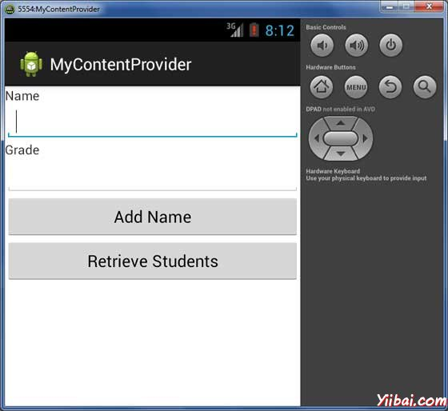
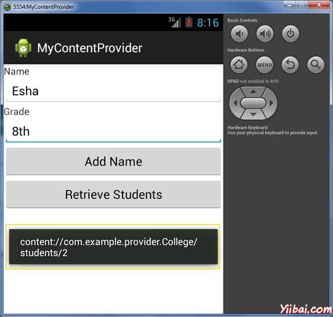
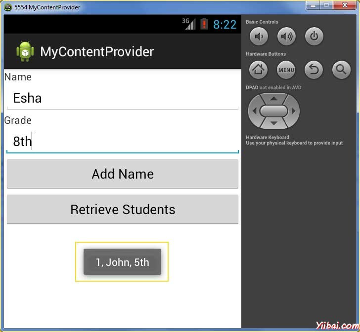

# Android内容提供者 - Android开发教程

内容提供程序（Provider）组件从一个应用到其他请求提供数据。通过 ContentResolver 类的方法这样的请求处理。内容提供程序使用不同的方式来存储数据，并且可以将数据存储在数据库中，文件中，甚至在网络上。

每一个 [Android](http://www.yiibai.com/android/) 应用程序运行在自己的进程保持一个应用程序数据，在另外一个应用程序中隐藏自己的权限。但有时需要在应用程序之间共享数据。这时内容提供程序是非常有用。

内容提供程序将内容集中在一个地方，让许多不同的应用访问。内容提供程序的行非常像数据库，可以对它进行查询，编辑等操作，添加或删除可使用 insert(), update(), delete(), query() 方法。在大多数情况下，这些数据都存储在[SQlite](http://sqlite)数据库。

内容提供程序实施 ContentProvider 类的子类，必须实现了一套标准的 API，使其他应用程序来执行事务。

```
public class MyContentProvider extends  ContentProvider {

}
```

## 内容的URI

要查询内容提供程序，可以指定 URI 形式如以下格式的查询字符串：

```
<prefix>://<authority>/<data_type>/<id>
```

这里是URI的各个部分的细节

| 部分 | 描述 |
| --- | --- |
| prefix | 始终设置内容为 :// |
| authority | 规定内容提供商的名称，例如联系人，浏览器等。对于第三方内容提供商，这可能是完全合格的名称，如 _com.yiibai.statusprovider_ |
| data_type | 表示数据，特定提供程序提供的类型。例如，如果得到所有的联系人的通讯录内容提供程序，那么数据路径URI是这样的 _content://contacts/people_ |
| id | 规定要求的特定记录。例如，如果正在寻找联系人编号为5，在联系人内容提供者中，则URI是这样的 _content://contacts/people/5_. |

## 创建内容提供者

以下是简单的步骤用来创建自己的内容提供者的数量。

*   首先，需要创建一个内容提供者扩展 ContentProvider 基类。

*   其次，需要定义内容提供者用于访问内容的 URI 地址。

*   接下来，需要创建自己的数据库用于保存内容。通常情况下，Android使用SQLite数据库，并且框架需要重写 onCreate() 方法会使用 SQLite开放的 Helper方法来创建或打开提供者数据库。当启动应用程序时，每个内容提供者的onCreate()方法调用处理程序在主应用程序。

*   接下来，必须实现内容提供者查询来执行不同的数据库的具体操作。

*   最后，在activity文件使用&lt;provider&gt;标签注册内容提供者。

下面是需要覆盖内容提供程序类的方法的列表：

*   onCreate() 方法被称为提供者开始。

*   query() 方法接收来自客户端的请求。返回的结果作为一个Cursor对象。

*   insert() 方法插入一条新记录到内容提供者。

*   delete() 方法从内容提供者删除记录。

*   update() 方法从内容提供者更新现有记录。

*   getType() 此方法在给定的URI返回 MIME 类型的数据。

## 示例

这个例子将解释如何创建自己的 ContentProvider。因此按照下面的步骤类似于我们之前创建[Hello World范例](http://www.yiibai.com/android/android_hello_world_example.html)：

| Step | 描述 |
| --- | --- |
| 1 | 使用Eclipse IDE创建Android应用程序，并将它命名为MyContentProviderunder在包com.example.mycontentprovider下并使用空的Activity。 |
| 2 | 修改主要活动文件MainActivity.java增加两个新的方法onClickAddName() 和 onClickRetrieveStudents()。 |
| 3 | 创建一个新的名为StudentsProvider.java的java文件在packagecom.example.mycontentprovider包下，并定义实际提供者和相关方法。 |
| 4 | 使用注册内容提供者在AndroidManifest.xml文件中的&lt;provider.../&gt;标签 |
| 5 | 修改res/layout/activity_main.xml文件的默认内容包括一个小的GUI添加学生记录。 |
| 6 | 在res/values/strings.xml文件中定义所需的常量 |
| 7 | 运行该应用程序启动Android模拟器和验证应用程序所做的修改结果。 |

以下是主活动文件 **src/com.example.mycontentprovider/MainActivity.java** 修改后的内容。这个文件可以包括每个生命周期方法。我们已经增加了两个新方法**onClickAddName()** 和 **onClickRetrieveStudents()** 来处理用户与应用程序交互。

```
package com.example.mycontentprovider;

import android.net.Uri;
import android.os.Bundle;
import android.app.Activity;
import android.content.ContentValues;
import android.content.CursorLoader;
import android.database.Cursor;
import android.view.Menu;
import android.view.View;
import android.widget.EditText;
import android.widget.Toast;

public class MainActivity extends Activity {

   @Override
   protected void onCreate(Bundle savedInstanceState) {
      super.onCreate(savedInstanceState);
      setContentView(R.layout.activity_main);
   }

   @Override
   public boolean onCreateOptionsMenu(Menu menu) {
      getMenuInflater().inflate(R.menu.main, menu);
      return true;
   }

   public void onClickAddName(View view) {
      // Add a new student record
      ContentValues values = new ContentValues();

      values.put(StudentsProvider.NAME,
      ((EditText)findViewById(R.id.txtName)).getText().toString());

      values.put(StudentsProvider.GRADE,
      ((EditText)findViewById(R.id.txtGrade)).getText().toString());

      Uri uri = getContentResolver().insert(
      StudentsProvider.CONTENT_URI, values);

      Toast.makeText(getBaseContext(),
      uri.toString(), Toast.LENGTH_LONG).show();
   }

   public void onClickRetrieveStudents(View view) {
      // Retrieve student records
      String URL = "content://com.example.provider.College/students";
      Uri students = Uri.parse(URL);
      Cursor c = managedQuery(students, null, null, null, "name");
      if (c.moveToFirst()) {
         do{
            Toast.makeText(this,
            c.getString(c.getColumnIndex(StudentsProvider._ID)) +
            ", " +  c.getString(c.getColumnIndex( StudentsProvider.NAME)) +
            ", " + c.getString(c.getColumnIndex( StudentsProvider.GRADE)),
            Toast.LENGTH_SHORT).show();
         } while (c.moveToNext());
      }
   }
}
```

在 com.example.mycontentprovider 包下创建新的 StudentsProvider.java 文件，以下是内容：

```
package com.example.mycontentprovider;

import java.util.HashMap;

import android.content.ContentProvider;
import android.content.ContentUris;
import android.content.ContentValues;
import android.content.Context;
import android.content.UriMatcher;
import android.database.Cursor;
import android.database.SQLException;
import android.database.sqlite.SQLiteDatabase;
import android.database.sqlite.SQLiteOpenHelper;
import android.database.sqlite.SQLiteQueryBuilder;
import android.net.Uri;
import android.text.TextUtils;

public class StudentsProvider extends ContentProvider {

   static final String PROVIDER_NAME = "com.example.provider.College";
   static final String URL = "content://" + PROVIDER_NAME + "/students";
   static final Uri CONTENT_URI = Uri.parse(URL);

   static final String _ID = "_id";
   static final String NAME = "name";
   static final String GRADE = "grade";

   private static HashMap<String, String> STUDENTS_PROJECTION_MAP;

   static final int STUDENTS = 1;
   static final int STUDENT_ID = 2;

   static final UriMatcher uriMatcher;
   static{
      uriMatcher = new UriMatcher(UriMatcher.NO_MATCH);
      uriMatcher.addURI(PROVIDER_NAME, "students", STUDENTS);
      uriMatcher.addURI(PROVIDER_NAME, "students/#", STUDENT_ID);
   }

   /**
    * Database specific constant declarations
    */
   private SQLiteDatabase db;
   static final String DATABASE_NAME = "College";
   static final String STUDENTS_TABLE_NAME = "students";
   static final int DATABASE_VERSION = 1;
   static final String CREATE_DB_TABLE =
      " CREATE TABLE " + STUDENTS_TABLE_NAME +
      " (_id INTEGER PRIMARY KEY AUTOINCREMENT, " +
      " name TEXT NOT NULL, " +
      " grade TEXT NOT NULL);";

   /**
    * Helper class that actually creates and manages
    * the provider's underlying data repository.
    */
   private static class DatabaseHelper extends SQLiteOpenHelper {
       DatabaseHelper(Context context){
          super(context, DATABASE_NAME, null, DATABASE_VERSION);
       }

       @Override
       public void onCreate(SQLiteDatabase db)
       {
          db.execSQL(CREATE_DB_TABLE);
       }

       @Override
       public void onUpgrade(SQLiteDatabase db, int oldVersion,
                             int newVersion) {
          db.execSQL("DROP TABLE IF EXISTS " +  STUDENTS_TABLE_NAME);
          onCreate(db);
       }
   }

   @Override
   public boolean onCreate() {
      Context context = getContext();
      DatabaseHelper dbHelper = new DatabaseHelper(context);
      /**
       * Create a write able database which will trigger its
       * creation if it doesn't already exist.
       */
      db = dbHelper.getWritableDatabase();
      return (db == null)? false:true;
   }

   @Override
   public Uri insert(Uri uri, ContentValues values) {
      /**
       * Add a new student record
       */
      long rowID = db.insert(	STUDENTS_TABLE_NAME, "", values);
      /**
       * If record is added successfully
       */
      if (rowID > 0)
      {
         Uri _uri = ContentUris.withAppendedId(CONTENT_URI, rowID);
         getContext().getContentResolver().notifyChange(_uri, null);
         return _uri;
      }
      throw new SQLException("Failed to add a record into " + uri);
   }

   @Override
   public Cursor query(Uri uri, String[] projection, String selection,
                       String[] selectionArgs, String sortOrder) {

      SQLiteQueryBuilder qb = new SQLiteQueryBuilder();
      qb.setTables(STUDENTS_TABLE_NAME);

      switch (uriMatcher.match(uri)) {
      case STUDENTS:
         qb.setProjectionMap(STUDENTS_PROJECTION_MAP);
         break;
      case STUDENT_ID:
         qb.appendWhere( _ID + "=" + uri.getPathSegments().get(1));
         break;
      default:
         throw new IllegalArgumentException("Unknown URI " + uri);
      }
      if (sortOrder == null || sortOrder == ""){
         /**
          * By default sort on student names
          */
         sortOrder = NAME;
      }
      Cursor c = qb.query(db,	projection,	selection, selectionArgs,
                          null, null, sortOrder);
      /**
       * register to watch a content URI for changes
       */
      c.setNotificationUri(getContext().getContentResolver(), uri);

      return c;
   }

   @Override
   public int delete(Uri uri, String selection, String[] selectionArgs) {
      int count = 0;

      switch (uriMatcher.match(uri)){
      case STUDENTS:
         count = db.delete(STUDENTS_TABLE_NAME, selection, selectionArgs);
         break;
      case STUDENT_ID:
         String id = uri.getPathSegments().get(1);
         count = db.delete( STUDENTS_TABLE_NAME, _ID +  " = " + id +
                (!TextUtils.isEmpty(selection) ? " AND (" +
                selection + ')' : ""), selectionArgs);
         break;
      default:
         throw new IllegalArgumentException("Unknown URI " + uri);
      }

      getContext().getContentResolver().notifyChange(uri, null);
      return count;
   }

   @Override
   public int update(Uri uri, ContentValues values, String selection,
                     String[] selectionArgs) {
      int count = 0;

      switch (uriMatcher.match(uri)){
      case STUDENTS:
         count = db.update(STUDENTS_TABLE_NAME, values,
                 selection, selectionArgs);
         break;
      case STUDENT_ID:
         count = db.update(STUDENTS_TABLE_NAME, values, _ID +
                 " = " + uri.getPathSegments().get(1) +
                 (!TextUtils.isEmpty(selection) ? " AND (" +
                 selection + ')' : ""), selectionArgs);
         break;
      default:
         throw new IllegalArgumentException("Unknown URI " + uri );
      }
      getContext().getContentResolver().notifyChange(uri, null);
      return count;
   }

   @Override
   public String getType(Uri uri) {
      switch (uriMatcher.match(uri)){
      /**
       * Get all student records
       */
      case STUDENTS:
         return "vnd.android.cursor.dir/vnd.example.students";
      /**
       * Get a particular student
       */
      case STUDENT_ID:
         return "vnd.android.cursor.item/vnd.example.students";
      default:
         throw new IllegalArgumentException("Unsupported URI: " + uri);
      }
   }
}
```

以下将 **AndroidManifest.xml** 文件的内容修改。在这里添加了&lt;provider.../&gt;标签，包括内容提供者：

```
<?xml version="1.0" encoding="utf-8"?>
<manifest xmlns:android="http://schemas.android.com/apk/res/android"
    package="com.example.mycontentprovider"
    android:versionCode="1"
    android:versionName="1.0" >

    <uses-sdk
        android:minSdkVersion="8"
        android:targetSdkVersion="17" />

    <application
        android:allowBackup="true"
        android:icon="@drawable/ic_launcher"
        android:label="@string/app_name"
        android:theme="@style/AppTheme" >
        <activity
            android:name="com.example.mycontentprovider.MainActivity"
            android:label="@string/app_name" >
            <intent-filter>
                <action android:name="android.intent.action.MAIN" />
                <category android:name="android.intent.category.LAUNCHER" />
            </intent-filter>
        </activity>
        <provider android:name="StudentsProvider"
           android:authorities="com.example.provider.College">
        </provider>
    </application>

</manifest>
```

以下将** res/layout/activity_main.xml** 文件的内容包括一个按钮来自定义广播意图： 

```
<LinearLayout xmlns:android="http://schemas.android.com/apk/res/android"
    android:layout_width="fill_parent"
    android:layout_height="fill_parent"
    android:orientation="vertical" >
    <TextView
    android:layout_width="fill_parent"
    android:layout_height="wrap_content"
    android:text="Name" />
    <EditText
    android:id="@+id/txtName"
    android:layout_height="wrap_content"
    android:layout_width="fill_parent" />
    <TextView
    android:layout_width="fill_parent"
    android:layout_height="wrap_content"
    android:text="Grade" />
    <EditText
    android:id="@+id/txtGrade"
    android:layout_height="wrap_content"
    android:layout_width="fill_parent" />
    <Button
    android:text="Add Name"
    android:id="@+id/btnAdd"
    android:layout_width="fill_parent"
    android:layout_height="wrap_content"
    android:onClick="onClickAddName" />
    <Button
    android:text="Retrieve Students"
    android:id="@+id/btnRetrieve"
    android:layout_width="fill_parent"
    android:layout_height="wrap_content"
    android:onClick="onClickRetrieveStudents" />
</LinearLayout>
```

确保 **res/values/strings.xml** 文件有以下内容：

```
<?xml version="1.0" encoding="utf-8"?>
<resources>

    <string name="app_name">MyContentProvider</string>
    <string name="action_settings">Settings</string>
    <string name="hello_world">Hello world!</string>

</resources>;
```

现在运行刚刚创建的应用程序 MyContentProvider。假设设置AVD并且已经做好了环境设置。要从Eclipse运行的应用程序，从工具栏打开一个项目的活动文件，并单击“Run”  图标。Eclipse AVD 安装的应用程序后并启动它，如果设置和应用程序没有问题，它会启动显示仿真器窗口（要耐心，可能有点慢，由你计算机的速度决定）：



现在输入学生姓名和年级，最后单击“Add Name”按钮，将增加学生记录到数据库中，ContentProvider URI也一起添加到数据库中，底部显示的记录数，并会闪烁一条消息。此操作使得我们的insert()方法的使用。让我们重复这个过程，我们的内容提供者在数据库中添加一些更多的学生信息。



正在添加记录在数据库中，现在其时间让ContentProvider来给我们这些记录回，所以让我们的单击检索学生按钮，这将获取并显示所有记录这是按照我们执行query()方法。



可以编写活动 MainActivity.java文件提供的回调函数，然后修改用户界面，更新和删除操作按钮添加和读操作以同样的方式，因为我们已经做了更新和删除操作。

通过这种方式，可以使用现有的内容提供者，如地址簿，或不错的面向数据库应用开发，可以使用内容提供者的概念，可以执行所有的数据库操作，如排序读，写，更新和删除上面的例子中解释。
