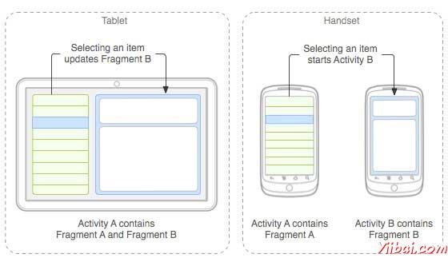
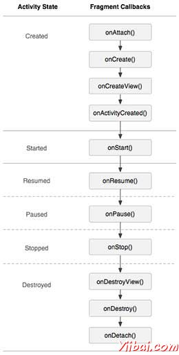
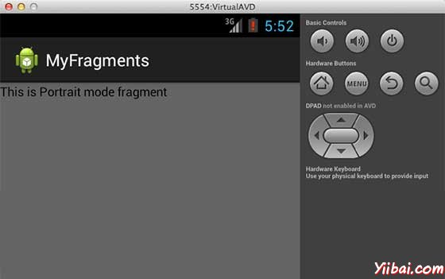
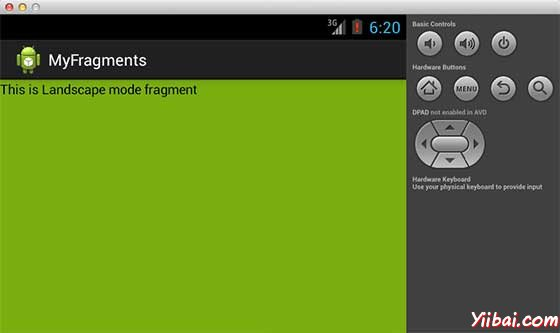

# Android碎片/片段 - Android开发教程

片段(**Fragments**)是一个应用程序的用户界面或行为活动，使活动更加模块化设计，可以放置在一块。一个片段是一种子活动。以下要点有关片段：

*   片段都有自己的布局和规范自己的行为与生命周期回调。

*   可以添加或删除片段在活动而活动运行。

*   可以将多个片段在一个单一的活动，建立一个多窗格UI。

*   片段可用于多种活动。

*   片段的生命周期是密切相关，其主机活动的生命周期，表示当活动暂停时，所有的片段也将停止活动。

*   片段可以实现的行为当没有用户界面组件。

*   片段加入被加入到 Android API 在Honeycomb版本的Android（API版本11）。

创建片段可以扩展**Fragment** 类并在活动的布局文件中声明片段，可以插入到活动布局的一个片段到&lt;fragment&gt;元素。

介绍片段之前，有一个限制，因为可以在一个特定的时间点，屏幕上只显示单个活动。所以不能够分割设备屏幕来分别控制不同部位。但随着引进片段得到了更多的灵活性，并在屏幕上同一时时间可以将一个单一的活动取消限制。现在有一个单一的acitivity ，但每个acitivity 可以包括多个片段，它们有自己的布局，活动和完整的生命周期。

下面是一个典型的例子，两个UI模块定义的片段可以组合成平板电脑的设计的一个活动，这里在手机中设计分离。



应用程序嵌入活动A中两个片段，在一个平板大小的设备上运行。然而在手机大小的屏幕上，有两个片段有足够的空间，所以Activity A包括片段物品的清单，当用户选择一篇文章时，它开始使用Activity B，包括阅读第二片段的文章。 

## 片段生命周期

Android 的碎片有自己的生命周期，非常相似 Android 中的 Activity 。本节主要阐述其生命周期在不同阶段。

| **阶段 I: **当被创建了一个片段，它通过以下状态：

*   onAttach()

*   onCreate()

*   onCreateView()

*   onActivityCreated()

**阶段 II: **当片段变得可见，它通过这些状态：

*   onStart()

*   onResume()

**阶段 III: **当碎片进入后台模式，它通过这些状态：

*   onPaused()

*   onStop()

**阶段 IV:** 当片段被破坏，它通过以下状态：

*   onPaused()

*   onStop()

*   onDestroyView()

*   onDestroy()

*   onDetach()

 |  |

## 如何使用碎片？

这里演示简单的步骤来创建碎片：

*   首先，要决定有多少碎片要在活动中要使用。例如，要使用两个片段处理设备的横向和纵向模式。

*   在下一页的碎片数量的基础上，创建类将扩展 **_Fragment _**类。上述片段类的回调函数。可以根据要求覆盖所有的功能。

*   对应每一个片段，需要在XML文件中创建布局。这些文件将根据布局来定义碎片。

*   最后修改活动文件替换片段，根据需要来定义实际的逻辑。

这里是重要的 覆盖在**_Fragment _**类的方法，如下列表：

*   onCreate() 系统调用时创建片段。初始化片段要保留暂停或停止时的片段，然后恢复其它组成部分。

*   onCreateView() 当片段第一次绘制用户界面时，系统调用这个回调。要绘制一个UI为片段，必须返回一个 View 组件，此方法是片段的根布局。返回空片段不提供一个UI。

*   onPause() 系统调用此方法，作为第一次指示用户离开此片段。这通常是提交更改操作，持久化时间超过当前用户会话时间。

## 例子

下面的这个例子将解释如何创建片段 - _Fragments_。在这里将创建两个片段并且当其中一个使用的设备是在横向模式下，另一个片段将被用在纵向模式下。按照下面的步骤类似于在前面创建的Hello World范例：

| 步骤 | 描述 |
| --- | --- |
| 1 | 使用Eclipse IDE创建Android应用程序，并将其命名为MyFragments在一个包com.example.myfragments下 ，使用空活动。 |
| 2 | 主要活动文件MainActivity.java的代码修改为如下。在这里将检查设备的方向并在不同的片段之间进行切换。 |
| 3 | 在 com.example.myfragments包下创建两个java文件PM_Fragment.java和LM_Fragement.java来定义片段以及相关方法。 |
| 4 | 创建布局文件 **res/layout/lm_fragment.xml** 并布局定义这两个片段。 |
| 5 | 修改 **res/layout/activity_main.xml** 文件的默认内容，以包括两个片段。 |
| 6 | 在 **res/values/strings.xml**文件中定义所需的常量 |
| 7 | 运行该应用程序启动 Android 模拟器来验证应用程序所做的修改结果。 |

以下是主要活动文件的内容 **src/com.example.mycontentprovider/MainActivity.java **修改

```
package com.example.myfragments;

import android.os.Bundle;
import android.app.Activity;
import android.app.FragmentManager;
import android.app.FragmentTransaction;
import android.content.res.Configuration;
import android.view.WindowManager;

public class MainActivity extends Activity {

   @Override
   protected void onCreate(Bundle savedInstanceState) {
      super.onCreate(savedInstanceState);

      Configuration config = getResources().getConfiguration();

      FragmentManager fragmentManager = getFragmentManager();
      FragmentTransaction fragmentTransaction = 
      fragmentManager.beginTransaction();

      /**
      * Check the device orientation and act accordingly
      */
      if (config.orientation == Configuration.ORIENTATION_LANDSCAPE) {
         /**
         * Landscape mode of the device
         */
         LM_Fragment ls_fragment = new LM_Fragment();
         fragmentTransaction.replace(android.R.id.content, ls_fragment);
      }else{
         /**
         * Portrait mode of the device
         */
         PM_Fragment pm_fragment = new PM_Fragment();
         fragmentTransaction.replace(android.R.id.content, pm_fragment);
      }
      fragmentTransaction.commit();
   }

}
```

创建两个的片段文件LM_Fragement.java 和 PM_Fragment.java在com.example.mycontentprovider 包下。

以下是LM_Fragement.java文件的内容 ：

```
package com.example.myfragments;

import android.app.Fragment;
import android.os.Bundle;
import android.view.LayoutInflater;
import android.view.View;
import android.view.ViewGroup;

public class LM_Fragment extends Fragment{
   @Override
   public View onCreateView(LayoutInflater inflater,
      ViewGroup container, Bundle savedInstanceState) {
      /**
       * Inflate the layout for this fragment
       */
      return inflater.inflate(
      R.layout.lm_fragment, container, false);
   }
}
```

下面是 PM_Fragement.java 文件的内容:

```
package com.example.myfragments;

import android.app.Fragment;
import android.os.Bundle;
import android.view.LayoutInflater;
import android.view.View;
import android.view.ViewGroup;

public class PM_Fragment extends Fragment{
   @Override
   public View onCreateView(LayoutInflater inflater,
      ViewGroup container, Bundle savedInstanceState) {
      /**
       * Inflate the layout for this fragment
       */
      return inflater.inflate(
      R.layout.pm_fragment, container, false);
   }
}
```

创建两个布局文件 **lm_fragement.xml** 和 **pm_fragment.xml** 在目录 res/layout 下。 

以下是 **lm_fragement.xml** 文件的内容：

```
<?xml version="1.0" encoding="utf-8"?>
   <LinearLayout
   xmlns:android="http://schemas.android.com/apk/res/android"
   android:orientation="vertical"
   android:layout_width="fill_parent"
   android:layout_height="fill_parent"
   android:background="#7bae16">

   <TextView
   android:layout_width="fill_parent"
   android:layout_height="wrap_content"
   android:text="@string/landscape_message"
   android:textColor="#000000"
   android:textSize="20px" />

<!-- More GUI components go here  -->

</LinearLayout>
```

以下是 **pm_fragment.xml **文件的内容：

```
<?xml version="1.0" encoding="utf-8"?>
   <LinearLayout
   xmlns:android="http://schemas.android.com/apk/res/android"
   android:orientation="horizontal"
   android:layout_width="fill_parent"
   android:layout_height="fill_parent"
   android:background="#666666">

   <TextView
   android:layout_width="fill_parent"
   android:layout_height="wrap_content"
   android:text="@string/portrait_message"
   android:textColor="#000000"
   android:textSize="20px" />

<!-- More GUI components go here  -->

</LinearLayout>
```

下面 **res/layout/activity_main.xm**l 文件的内容，其中包括片段：

```
<?xml version="1.0" encoding="utf-8"?>
<LinearLayout xmlns:android="http://schemas.android.com/apk/res/android"
    xmlns:tools="http://schemas.android.com/tools"
    android:layout_width="fill_parent"
    android:layout_height="fill_parent"
    android:orientation="horizontal">

   <fragment
   android:name="com.example.fragments"
   android:id="@+id/lm_fragment"
   android:layout_weight="1"
   android:layout_width="0dp"
   android:layout_height="match_parent" />

   <fragment
   android:name="com.example.fragments"
   android:id="@+id/pm_fragment"
   android:layout_weight="2"
   android:layout_width="0dp"
   android:layout_height="match_parent" />

</LinearLayout>
```

确保 **res/values/strings.xml** 文件有以下内容： 

```
<?xml version="1.0" encoding="utf-8"?>
<resources>

    <string name="app_name">MyFragments</string>
    <string name="action_settings">Settings</string>
    <string name="hello_world">Hello world!</string>
    <string name="landscape_message">This is Landscape mode fragment
    </string>
    <string name="portrait_message">This is Portrait mode fragment
    </string>

</resources>
```

现在试着来运行 MyFragments 刚刚创建的应用程序。假设创建AVD，同时做好了环境设置。要从Eclipse运行应用程序，首先打开一个项目的活动文件，从工具栏上单击“Run” 图标。 Eclipse AVD 安装应用程序，并启动它，如果设置和应用都没有问题，它会显示仿真器窗口，看到如下窗口，点击"MENU" 按钮。可能需要点耐心，因为它可能需要一段时间（[易百教程](http://www.yiibai.com/)提示：取决于你的电脑速度了）：



要改变模式，模拟器的屏幕，可以做以下操作：

*   fn+control+F11 Mac上改变的风景，图像，反之亦然。

*   ctrl+F11 在Windows.

*   ctrl+F11 在 Linux.

改变了模式以后，能够看到的图形用户界面，如下已经实现了横向模式：



这样就可以使用相同的活动，但不同的GUI要通过不同的片段。根据要求可以使用不同类型的GUI组件来创建不同的GUI。

 