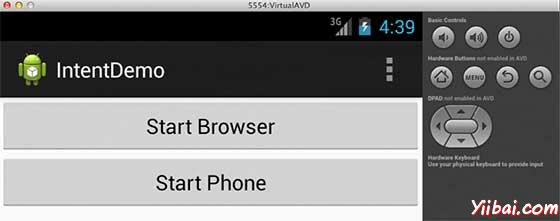
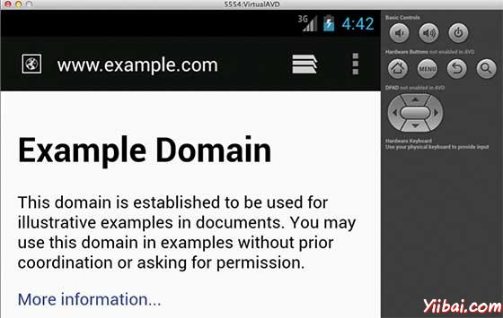
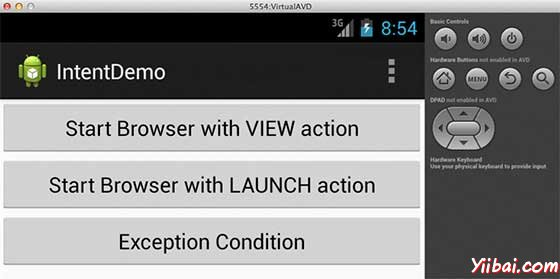
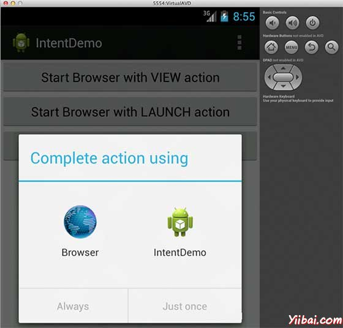
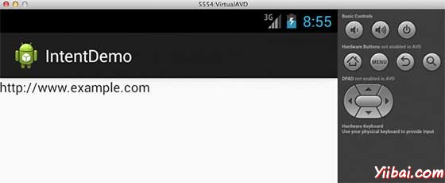
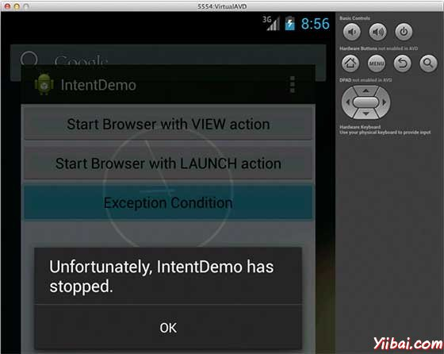

# Android Intent过滤器 - Android开发教程

Android Intent 是承载一个意图，即对象。将消息从一个组件传到另一个组件，在应用程序或应用程序之外。Intent 之间沟通信息的任何应用程序的三个核心组件 - 活动，服务和广播接收器。

&gt; 意图本身是一个Intent对象，是一种被动的数据结构保持将要执行的动作的抽象描述。

例如，让我们假设有一个Activity ，需要启动电子邮件客户端和发送电子邮件，使用Android设备。为了达到这个目的，Activity会随着适当选择器，一个ACTION_SEND发送到 Android Intent 解析器。指定的选择器提供适当的接口供用户选择如何发送电子邮件数据。

例如，有一个Activity ，需要在 Android 设备上用Web浏览器打开网址。为了达到这个目的Activity将发送ACTION_WEB_SEARCH Intent 到Android Intent 解析器，并在Web浏览器中打开给定的URL。Intent 解析器解析通过一个活动列表，并选择一个最合适的 Intent ，在这种情况下，就是Web浏览器活动。Intent通过网页解析后，网页浏览器启动 Web 浏览器活动。

分开机制对于每种类型的组件提供意图，如：活动，服务和广播接收器。

| S.N. | 方法& 描述 |
| --- | --- |
| 1 | **Context.startActivity()** 
Intent对象传递给此方法来启动一个新的活动或获得现有活动来做一些新的东西。 |
| 2 | **Context.startService()** 
Intent对象传递给此方法来启动服务或提供新的指令到一个持续的服务。 |
| 3 | **Context.sendBroadcast()** 
Intent对象传递给这个方法消息给所有感兴趣的广播接收器。 |

## Intent对象

Intent对象是成捆的信息，这些信息所使用的组件，它接收的意图和Android系统中的信息。

Intent对象可以基于它是什么交流或要执行，包含以下组件：

### 动作

强制Intent对象是一个字符串，命名要执行操作或广播意图，正在发生的动作和报告。动作在很大程度上决定意图对象的其余部分的结构如何。Intent类定义了一些动作常数对应不同的意图。下面列出的是 [Android Intent标准动作](http://www.yiibai.com/android/android_intent_standard_actions.html)

动作在一个Intent对象的 setAction() 方法可以设置，通过 getAction() 方法读取。

### 数据

要采取动作的数据的URI和该数据的MIME类型。例如，如果动作字段ACTION_EDIT，在数据字段将包含要显示的编辑的文档的URI。

setData()方法指定数据仅作为URI的setType()指定它只能作为一个MIME类型，和setDataAndType()指定它作为一个URI和MIME类型。读取的URI由getData()和getType()。

操作/数据对的一些例子是：

| S.N. | 动作/数据对和说明 |
| --- | --- |
| 1 | **ACTION_VIEW content://contacts/people/1** 
显示有关其标识符为“1”的人的信息。 |
| 2 | **ACTION_DIAL content://contacts/people/1** 
显示电话拨号程序已填充的人。 |
| 3 | **ACTION_VIEW tel:123** 
显示电话拨号程序已填充的给定数。 |
| 4 | **ACTION_DIAL tel:123** 
显示电话拨号程序已填充的给定数。 |
| 5 | **ACTION_EDIT content://contacts/people/1** 
编辑有关其标识符为“1”的人的信息。 |
| 6 | **ACTION_VIEW content://contacts/people/** 
显示人的列表，用户可以浏览。 |

### 类别

类别是 Intent 对象一个可选部分，这是一个字符串，其中包含应该处理这个 Intent 组件的附加信息。 addCategory()方法将类别添加到 Intent对象，removeCategory() 删除一个类别，GetCategories() 得到当前在对象的所有类别集合。下面是 [Android意图标准类别](http://www.yiibai.com/android/android_intent_standard_categories.html) 列表。

要查看详细的 Intent过滤器可在下一小节，了解如何使用类别，选择合适的活动对应的意图。

### 附加设备

这是键-值对，可了解更多传递组件处理 intent 的信息。额外内容设置和读取使用 putExtras() 和 getExtras() 方法。这里是一个 Android intent 标准额外数据列表。

### 标志位

这些标志是Intent对象可选部分，并指示Android系统如何启动一个活动以及如何对待它在启动后等等。

### 组件名称

可选字段是一个 android 组件名称的活动，服务或BroadcastReceiver类对象。如果它没有被设置，Android使用Intent 对象的信息，找到一个合适的目标，Intent 对象传递到指定类的一个实例。

组件名称由setComponent()，setClass()设置，由 setClassName()和 getComponent()读取。

## Intents类型

有以下两种类型的意图支持到 Android 4.1版本

### 显式意图

显示意图指定目标组件的名称，通常用于应用程序内部消息 - 比如一个活动启动从​​服务或启动一个组活动。例如：

```
// Explicit Intent by specifying its class name
Intent i = new Intent(this, TargetActivity.class);
i.putExtra("Key1", "ABC");
i.putExtra("Key2", "123");

// Starts TargetActivity
startActivity(i);
```

### 隐式意图

这些意图由其的名字指定目标组件，它们通常用于应用程序内部消息 - 例如一个活动启动一个附属服务或启动一个姐妹的活动。例如：

```
// Implicit Intent by specifying a URI
Intent i = new Intent(Intent.ACTION_VIEW, 
Uri.parse("http://www.example.com"));

// Starts Implicit Activity
startActivity(i); 
```

目标组件接收的意图可以使用getExtras()方法来获得组件发送额外的数据源。例如：

```
// Get bundle object at appropriate place in your code
Bundle extras = getIntent().getExtras();

// Extract data using passed keys
String value1 = extras.getString("Key1");
String value2 = extras.getString("Key2");
```

## 例子

下面的例子展示了Android意图的功能，启动各种 Android 的内置应用。

| 步骤 | 描述 |
| --- | --- |
| 1 | 使用Eclipse IDE创建Android应用程序，并将其命名为IntentDemo在com.example.intentdemo包下。在创建这个项目，请确保目标SDK并编译在Android SDK的最新版本为使用更高级别的API。 |
| 2 | 修改 src/MainActivity.java 文件，并添加代码来定义相应的两个按钮，即两个监听器。启动浏览器，并打开电话。 |
| 3 | 修改布局XML文件res/layout/activity_main.xml添加三个按钮的设置为线性布局。 |
| 4 | 修改 res/values/strings.xml 中定义所需的常量值 |
| 5 | 运行该应用程序启动Android模拟器来验证应用程序所做的修改结果。 |

以下是修改主要活动文件 **src/com.example.intentdemo/MainActivity.java** 的内容：

```
package com.example.intentdemo;

import android.net.Uri;
import android.os.Bundle;
import android.app.Activity;
import android.content.Intent;
import android.view.Menu;
import android.view.View;
import android.widget.Button;

public class MainActivity extends Activity {

   @Override
   protected void onCreate(Bundle savedInstanceState) {
      super.onCreate(savedInstanceState);
      setContentView(R.layout.activity_main);

      Button startBrowser = (Button) findViewById(R.id.start_browser);
      startBrowser.setOnClickListener(new View.OnClickListener() {
         public void onClick(View view) {
            Intent i = new Intent(android.content.Intent.ACTION_VIEW, 
            Uri.parse("http://www.example.com"));
            startActivity(i);
         }
      });
      Button startPhone = (Button) findViewById(R.id.start_phone);
      startPhone.setOnClickListener(new View.OnClickListener() {
         public void onClick(View view) {
            Intent i = new Intent(android.content.Intent.ACTION_VIEW, 
            Uri.parse("tel:9510300000"));
            startActivity(i);
         }
      });
   }  
   @Override
   public boolean onCreateOptionsMenu(Menu menu) {
      // Inflate the menu; this adds items to the action 
      // bar if it is present.
      getMenuInflater().inflate(R.menu.main, menu);
      return true;
   }

}
```

下面是 res/layout/activity_main.xml 文件的内容：

```
<LinearLayout xmlns:android="http://schemas.android.com/apk/res/android"
   android:layout_width="fill_parent"
   android:layout_height="fill_parent"
   android:orientation="vertical" >

   <Button android:id="@+id/start_browser"
   android:layout_width="fill_parent"
   android:layout_height="wrap_content"
   android:text="@string/start_browser"/>

   <Button android:id="@+id/start_phone"
   android:layout_width="fill_parent"
   android:layout_height="wrap_content"
   android:text="@string/start_phone" />

</LinearLayout>
```

下面 res/values/strings.xm 定义两个新的常量的内容：

```
<?xml version="1.0" encoding="utf-8"?>
<resources>

    <string name="app_name">IntentDemo</string>
    <string name="action_settings">Settings</string>
    <string name="hello_world">Hello world!</string>
    <string name="start_browser">Start Browser</string>
    <string name="start_phone">Start Phone</string>

</resources>
```

以下是 **AndroidManifest.xml** 文件的默认内容：

```
<?xml version="1.0" encoding="utf-8"?>
<manifest xmlns:android="http://schemas.android.com/apk/res/android"
    package="com.example.intentdemo"
    android:versionCode="1"
    android:versionName="1.0" >

    <uses-sdk
        android:minSdkVersion="8"
        android:targetSdkVersion="17" />

    <application
        android:allowBackup="true"
        android:icon="@drawable/ic_launcher"
        android:label="@string/app_name"
        android:theme="@style/AppTheme" >
        <activity
            android:name="com.example.intentdemo.MainActivity"
            android:label="@string/app_name" >
            <intent-filter>
                <action android:name="android.intent.action.MAIN" />

                <category android:name="android.intent.category.LAUNCHER" />
            </intent-filter>
        </activity>
    </application>

</manifest>
```

现在运行 IntentDemo应用程序。假设创建AVD同时做正确的环境设置。要从Eclipse运行的应用程序，打开一个项目的活动文件，并 从工具栏上单击“**Run**” 图标。 Eclipse AVD安装的应用程序，并启动它，如果一切都设置和应用没有问题，它会显示以下模拟器窗口：



现在点击开始浏览按钮，这将启动一个浏览器配置并显示 **http://www.example.com** 如下所示：



类似的方式，可以启动手机界面使用开始电话按钮，这允许拨打已经给定的电话号码。

## Intent过滤器

上面已经看到了意图如何用来调用一个活动。 Android操作系统使用过滤器来查明活动，服务和广播接收器能够处理指定的一组动作，类别。使用 &lt;intent-filter&gt; 元素在 manifest 文件中，列出了动作，类别和数据类型相关联的活动，服务或广播接收器。

以下是 AndroidManifest.xml 文件中的一部分，指定活动 com.example.intentdemo.CustomActivity 的两个动作，类和数据，下面是可以调用的一个例子：

```
<activity android:name=".CustomActivity"
   android:label="@string/app_name">
   <intent-filter>
      <action android:name="android.intent.action.VIEW" />
      <action android:name="com.example.intentdemo.LAUNCH" />
      <category android:name="android.intent.category.DEFAULT" />
      <data android:scheme="http" />
   </intent-filter>
</activity>
```

活动的定义是随着上面提到的过滤器，活动将使用 **android.intent.action.VIEW** 或 **com.example.intentdemo.LAUNCH** 动作提供其类别来调用这个活动，否则使用**android.intent.category.DEFAULT**。

&lt;data&gt; 元素活动被称为指定数据类型，上面的例子中自定义活动的数据以 "http://" 开始

有可能在只是一个意图的情况下，可以通过一个以上的活动或服务的过滤器，用户可能会被要求指定激活哪个组件。可以发现如果没有指定目标，则会引发异常。

以下测试 Android 检查在调用活动前：

*   如上图所示，但这个列表不能为空，可能会列出多个过滤器&lt;intent-filter&gt;动作，一个过滤器必须至少包含一个&lt;action&gt;元素，否则会阻止所有意图。如果有一个以上的动作列出，那么Android将尝试匹配在调用活动之前所提到的其中一个动作。

*   过滤器&lt;intent-filter&gt;可能列出零个，一个或一个以上。如果没有类被提到，Android也能通过这个测试，但如果超过一个类提到通过类的测试意图，在过滤器中，每一个类中的Intent对象必须符合一个类。

*   每个&lt;data&gt;元素可以指定一个URI和数据类型（MIME媒体类型）。单独的属性，如方案，主机，端口和路径URI的每个部分。同时包含URI和数据类型的一个Intent对象通过测试，只有当它的类型在过滤器列出的类型相匹配数据类型的一部分。

## 例子

下面是修改上面例子的一个例子。在这里将看到 Android 如何解决冲突，如果一个意图调用定义了两个活动，接下来如何调用自定义活动使用一个过滤器，第三个是一个在例外情况下，如果 Android 不提交适当的活动意图定义。

| 步骤 | 描述 |
| --- | --- |
| 1 | 使用Eclipse IDE创建 _Android _应用程序，并将其命名为 _IntentDemo_ 在一个包_com.example.intentdemo_下。在创建这个项目前，确保目标SDK编译在Android SDK的最新版本或使用更高级别的API。 |
| 2 | 修改 _src/MainActivity.java_ 文件，并添加代码来定义相应的布局文件中定义了三个按钮的监听器。 |
| 3 | 添加一个新的 src/CustomActivity.java 文件，将由不同的意图来调用一个自定义的活动。 |
| 4 | 修改布局XML文件res/layout/activity_main.xml 添加三个按钮的线性布局。 |
| 5 | 添加一个布局XML文件res/layout/custom_view.xml，在其中添加一个简单的&lt;TextView&gt;来显示通过意图传递的数据。 |
| 6 | 修改 _res/values/strings.xml_ 定义所需的常量值 |
| 7 | 修改 AndroidManifest.xml 添加 &lt;intent-filter&gt; 定义规则，来自定义意图调用活动。 |
| 8 | 运行该应用程序启动Android模拟器，并确认在应用修改变化的结果。 |

以下是内容是修改了主要活动文件 _src/com.example.intentdemo/MainActivity.java._

```
package com.example.intentdemo;

import android.net.Uri;
import android.os.Bundle;
import android.app.Activity;
import android.content.Intent;
import android.view.Menu;
import android.view.View;
import android.widget.Button;

public class MainActivity extends Activity {

   @Override
   protected void onCreate(Bundle savedInstanceState) {
      super.onCreate(savedInstanceState);
      setContentView(R.layout.activity_main);

      // First intent to use ACTION_VIEW action with correct data
      Button startBrowser_a = (Button) findViewById(R.id.start_browser_a);
      startBrowser_a.setOnClickListener(new View.OnClickListener() {
         public void onClick(View view) {
            Intent i = new Intent(android.content.Intent.ACTION_VIEW, 
            Uri.parse("http://www.example.com"));
            startActivity(i);
         }
      });

      // Second intent to use LAUNCH action with correct data
      Button startBrowser_b = (Button) findViewById(R.id.start_browser_b);
      startBrowser_b.setOnClickListener(new View.OnClickListener() {
         public void onClick(View view) {
            Intent i = new Intent("com.example.intentdemo.LAUNCH", 
            Uri.parse("http://www.example.com"));
            startActivity(i);
         }
      });

      // Third intent to use LAUNCH action with incorrect data
      Button startBrowser_c = (Button) findViewById(R.id.start_browser_c);
      startBrowser_c.setOnClickListener(new View.OnClickListener() {
         public void onClick(View view) {
            Intent i = new Intent("com.example.intentdemo.LAUNCH", 
            Uri.parse("https://www.example.com"));
            startActivity(i);
         }
      });

   }

   @Override
   public boolean onCreateOptionsMenu(Menu menu) {
   // Inflate the menu; this adds items to the 
   // action bar if it is present.
   getMenuInflater().inflate(R.menu.main, menu);
   return true;
   }

}
```

以下是修改的主要活动文件的内容 _src/com.example.intentdemo/CustomActivity.java._

```
package com.example.intentdemo;

import android.app.Activity;
import android.net.Uri;
import android.os.Bundle;
import android.widget.TextView;

public class CustomActivity extends Activity {
   @Override
   public void onCreate(Bundle savedInstanceState) {
      super.onCreate(savedInstanceState);
      setContentView(R.layout.custom_view);

      TextView label = (TextView) findViewById(R.id.show_data);

      Uri url = getIntent().getData();
      label.setText(url.toString());
   }

}
```

以下是 _res/layout/activity_main.xml _文件的内容:

```
<LinearLayout xmlns:android="http://schemas.android.com/apk/res/android"
   android:layout_width="fill_parent"
   android:layout_height="fill_parent"
   android:orientation="vertical" >

   <Button android:id="@+id/start_browser_a"
   android:layout_width="fill_parent"
   android:layout_height="wrap_content"
   android:text="@string/start_browser_a"/>

   <Button android:id="@+id/start_browser_b"
   android:layout_width="fill_parent"
   android:layout_height="wrap_content"
   android:text="@string/start_browser_b"/>

   <Button android:id="@+id/start_browser_c"
   android:layout_width="fill_parent"
   android:layout_height="wrap_content"
   android:text="@string/start_browser_c"/>

</LinearLayout>
```

下面是 res/layout/custom_view.xml 文件的内容：

```
<?xml version="1.0" encoding="utf-8"?>
<LinearLayout xmlns:android="http://schemas.android.com/apk/res/android"
    android:orientation="vertical"
    android:layout_width="fill_parent"
    android:layout_height="fill_parent"    >

   <TextView android:id="@+id/show_data"
   android:layout_width="fill_parent"
   android:layout_height="400dp"/>

</LinearLayout>
```

下面 res/values/strings.xml 文件内容中定义两个新的常量： 

```
<?xml version="1.0" encoding="utf-8"?>
<resources>

    <string name="app_name">IntentDemo</string>
    <string name="action_settings">Settings</string>
    <string name="hello_world">Hello world!</string>
    <string name="start_browser_a">Start Browser with VIEW action</string>
    <string name="start_browser_b">Start Browser with LAUNCH action</string>
    <string name="start_browser_c">Exception Condition</string>

</resources>
```

以下是 AndroidManifest.xml 文件的默认内容：

```
<?xml version="1.0" encoding="utf-8"?>
<manifest xmlns:android="http://schemas.android.com/apk/res/android"
    package="com.example.intentdemo"
    android:versionCode="1"
    android:versionName="1.0" >

    <uses-sdk
        android:minSdkVersion="8"
        android:targetSdkVersion="17" />
    <application
        android:allowBackup="true"
        android:icon="@drawable/ic_launcher"
        android:label="@string/app_name"
        android:theme="@style/AppTheme" >
        <activity
            android:name="com.example.intentdemo.MainActivity"
            android:label="@string/app_name" >
            <intent-filter>
                <action android:name="android.intent.action.MAIN" />

                <category android:name="android.intent.category.LAUNCHER" />
            </intent-filter>
        </activity>
        <activity android:name="com.example.intentdemo.CustomActivity" 
            android:label="@string/app_name">
           <intent-filter>
              <action android:name="android.intent.action.VIEW" />
              <action android:name="com.example.intentdemo.LAUNCH" />
              <category android:name="android.intent.category.DEFAULT" />
              <data android:scheme="http" />
           </intent-filter>
        </activity>
    </application>

</manifest>
```

要运行IntentDemo应用程序。假设创建了AVD并设置了环境。要从 Eclipse 运行应用程序，打开一个项目的活动文件，从工具栏上单击“Run”  图标。 Eclipse AVD安装的应用程序并启动它，如果一切设置和应用都没有问题，它会显示以下模拟器窗口：



现在,开始第一个按钮“Start Browser with VIEW Action”。这里定义了自定义活动过滤器“android.intent.action.VIEW”，并且已经有一个默认的活动，由Android启动Web浏览器视图定义动作，所以android 显示以下两个选项来选择要启动的活动。



现在，如果选择浏览器，那么Android将启动网页浏览器并打开 example.com 网站，但如果选择“IndentDemo”选项，那么Android将启动CustomActivity什么也不做，只不过是捕捉传递的数据，并显示在文本视图如下：



现在使用“后退”按钮，并点击“Start Browser with LAUNCH Action”按钮，这里 Android 应用过滤器来选择定义活动，只需启动自定义活动，再次显示以下画面：


同样，返回使用“后退”按钮，并点击“Exception Condition”按钮，在这里Android试图找出一个有效的过滤器，对于给定intent，它没有找到一个有效活动定义，因为在这个时候，已经数据使用HTTPS，而不是HTTP，虽然是一个正确的动作，但是Android抛出一个异常，并显示以下画面：

   