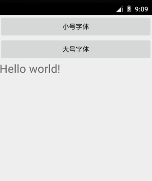
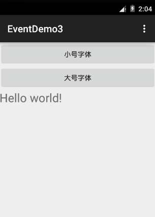

# Android事件处理 - Android开发教程

事件是一种有用来收集用户与应用程序互动数据的互动组件，如按键或触摸屏等放置事件，因为每个事件从Android框架维护事件队列先入先出（FIFO）基础上的队列。可以在程序中捕获这些事件，按要求并采取适当的动作。

有以下三个概念涉及到Android事件管理：

*   事件监听器: 主要涉及建立一个Android的GUI视图类，View类提供了一些事件监听器。事件监听器是对象接收通知在事件发生时。

*   事件监听器注册: 事件注册事件处理程序被注册了事件侦听器的过程，使该处理调用的事件侦听器触发事件。

*   事件处理程序: 当一个事件发生时，已注册的事件和事件监听器，事件监听器调用事件处理程序，这是实际处理事件的方法。

## 事件侦听器和事件处理程序

| 事件处理程序 | 事件监听器说明 |
| --- | --- |
| onClick() | **OnClickListener()** 当用户点击任意或触摸或焦点事件像按钮，文字，图片等，将使用onClick()事件处理程序来处理任何部件的事件 |
| onLongClick() | **OnLongClickListener()** 当用户点击或触摸或焦点事件像按钮，文本，图像等，为1秒以上的任何插件时被调用。使用onLongClick()事件处理程序来处理这样的事件 |
| onFocusChange() | **OnFocusChangeListener()** 当控件失去焦点时被调用。用户进入离开视图项目。使用onFocusChange()事件处理程序来处理这样的事件 |
| onKey() | **OnFocusChangeListener()** 当用户焦点并按下或释放装置上的硬件键时被调用。将使用onKey()事件处理程序来处理这样的事件 |
| onTouch() | **OnTouchListener()** 当用户按下该键时及释放键，或在屏幕上的任何移动手势时被调用。使用onTouch()事件处理程序来处理这样的事件 |
| onMenuItemClick() | **OnMenuItemClickListener()** 当用户选择一个菜单项时被调用。使用onMenuItemClick()事件处理程序来处理这样的事件 |

还有更多可用作为View类如：OnHoverListener，OnDragListener 等，应用程序可能需要一部分的事件侦听器。因此，建议参考官方Android应用程序开发文档，开发一个复杂的应用程序。

## 注册事件监听器：

事件注册事件处理程序被注册事件侦听器的过程，使处理时调用事件侦听器处理事件。虽然有一些方法注册可以任何事件的事件侦听器，但要列出只前3种方式，可以根据实际情况使用。

*   使用匿名内部类

*   Activity 活动类实现Listener接口

*   使用布局文件 activity_main.xml 直接指定事件处理程序（方法）

下面将提供三种情景的详细的例子：

## 事件处理举例

### 使用匿名内部类的事件监听器注册

在这里，将创建一个匿名的执行监听，如果每个类只有一个单控制器，将参数传递给事件处理程序。在这种方法中的事件处理方法可以访问私有数据的活动。没有提及需要调用到活动。

但是，如果声明一个以上处理程序的控制器，剪切和粘贴代码的处理程序和处理程序的代码很长，代码更难维护。

以下是简单的步骤来展示我们将如何利用独立的 Listener类 注册并捕获点击（click）事件。类似的方式，可以实现所需的任何其他事件类型的侦听。

| 步骤 | 描述 |
| --- | --- |
| 1 | 使用Android Studio创建一个Android应用程序项目，将其命名为：EventDemo |
| 2 | 修改 src/MainActivity.java 程序文件，以添加 click事件侦听器并处理程序定义的两个按钮 |
| 3 | 修改 _res/layout/activity_main.xml_ 文件的默认内容包括Android的UI控件 |
| 4 | 定义_res/values/strings.xml _文件所需的常量 |
| 5 | 运行该应用程序启动Android模拟器并验证应用程序所做的修改结果 |

以下是主 activity 文件src/com.yiibai.eventdemo/MainActivity.java 的内容。这个文件可以包括每个生命周期的根本方法。

```
package com.yiibai.eventdemo;

import android.os.Bundle;
import android.app.Activity;
import android.view.Menu;
import android.view.View;
import android.widget.Button;
import android.widget.TextView;

public class MainActivity extends Activity {

    @Override
    protected void onCreate(Bundle savedInstanceState) {
        super.onCreate(savedInstanceState);
        setContentView(R.layout.activity_main);

        //--- find both the buttons---
        Button sButton = (Button) findViewById(R.id.button_s);
        Button lButton = (Button) findViewById(R.id.button_l);

        // -- register click event with first button ---
        sButton.setOnClickListener(new View.OnClickListener() {
           public void onClick(View v) {
               // --- find the text view --
               TextView txtView = (TextView) findViewById(R.id.text_id);
               // -- change text size --
               txtView.setTextSize(14);
           }
        });

        // -- register click event with second button ---
        lButton.setOnClickListener(new View.OnClickListener() {
           public void onClick(View v) {
               // --- find the text view --
               TextView txtView = (TextView) findViewById(R.id.text_id);
               // -- change text size --
               txtView.setTextSize(24);
           }
        });
    }

    @Override
    public boolean onCreateOptionsMenu(Menu menu) {
        getMenuInflater().inflate(R.menu.main, menu);
        return true;
    }

}
```

下面是 _**res/layout/activity_main.xml**_ 文件的内容：

```
<?xml version="1.0" encoding="utf-8"?>
<LinearLayout xmlns:android="http://schemas.android.com/apk/res/android"
   android:layout_width="fill_parent"
   android:layout_height="fill_parent"
   android:orientation="vertical" >

    <Button 
    android:id="@+id/button_s"
    android:layout_height="wrap_content" 
    android:layout_width="match_parent" 
    android:text="@string/button_small"/>

    <Button 
    android:id="@+id/button_l"
    android:layout_height="wrap_content" 
    android:layout_width="match_parent" 
    android:text="@string/button_large"/>

    <TextView
    android:id="@+id/text_id"
    android:layout_width="wrap_content"
    android:layout_height="wrap_content"
    android:capitalize="characters"
    android:text="@string/hello_world" />

</LinearLayout>
```

以下文件 _**res/values/strings.xml** _定义了两个新的常量:

```
<?xml version="1.0" encoding="utf-8"?>
<resources>

    <string name="app_name">EventDemo - yiibai.com</string>
    <string name="action_settings">Settings</string>
    <string name="hello_world">Hello world!</string>
   <string name="button_small">小号字体</string>
   <string name="button_large">大号字体</string>

</resources>
```

以下是 _**AndroidManifest.xml**_ 文件的默认内容：

```
<?xml version="1.0" encoding="utf-8"?>
<manifest xmlns:android="http://schemas.android.com/apk/res/android"
    package="com.yiibai.guidemo"
    android:versionCode="1"
    android:versionName="1.0" >

    <uses-sdk
        android:minSdkVersion="8"
        android:targetSdkVersion="17" />

    <application
        android:allowBackup="true"
        android:icon="@drawable/ic_launcher"
        android:label="@string/app_name"
        android:theme="@style/AppTheme" >
        <activity
            android:name="com.yiibai.guidemo.MainActivity"
            android:label="@string/app_name" >
            <intent-filter>
                <action android:name="android.intent.action.MAIN" />

                <category android:name="android.intent.category.LAUNCHER" />
            </intent-filter>
        </activity>
    </application>

</manifest>
```

我们尝试运行EventDemo 应用程序。AVD安装的应用程序，并启动它，如果一切设置和应用都没有问题，它会显示以下模拟器窗口：


现在尝试一下，会看到两个按钮逐一的Hello World文本，字体会发生变化，对每次点击事件发生，因为注册的click事件处理方法被调用。 以上代码下载：[http://pan.baidu.com/s/1hqrIjx6](http://pan.baidu.com/s/1hqrIjx6)  

### 注册使用活动实现监听器接口

在这里，activity类实现Listener接口方法处理主活动，然后调用setOnClickListener（this）程序。

如果应用程序只有一个单一的控件这种方法是很好的，但需要做进一步的编程检查控制生成的事件（监听器类型）。第二不能将参数传递到监听器，多个控件时不能起作用。

下面是简单的步骤来展示如何实现Listener类注册并捕获click事件。类似的方式，可以实现所需的任何其他事件类型的监听。

| 步骤 | 描述 |
| --- | --- |
| 1 | 我们需要创建一个Android应用程序 ：EventDemo2 |
| 2 | 修改 src/MainActivity.java 文件的内容，以添加click事件侦听器和处理程序定义的两个按钮 |
| 3 | 上一个例子中的 res/layout/activity_main.xml 文件不用做任何改变，它仍将如上图所示。 |
| 4 | _上一个例子中的 res/values/strings.xml _文件不做任何变化，如上图所示。 |
| 5 | 运行该应用程序启动Android模拟器并验证应用程序所做的修改结果。 |

以下是主活动活动文件 src/com.yiibai.eventdemo2/MainActivity.java 的内容。这个文件可以包括每个生命周期基础方法。

```
package com.example.eventdemo;

import android.os.Bundle;
import android.app.Activity;
import android.view.Menu;
import android.view.View;
import android.view.View.OnClickListener;
import android.widget.Button;
import android.widget.TextView;

public class MainActivity extends Activity implements OnClickListener {

    @Override
    protected void onCreate(Bundle savedInstanceState) {
        super.onCreate(savedInstanceState);
        setContentView(R.layout.activity_main);

        //--- find both the buttons---
        Button sButton = (Button) findViewById(R.id.button_s);
        Button lButton = (Button) findViewById(R.id.button_l);

        // -- register click event with first button ---
        sButton.setOnClickListener(this);
        // -- register click event with second button ---
        lButton.setOnClickListener(this);
    }

    //--- Implement the OnClickListener callback
    public void onClick(View v) {
       if(v.getId() == R.id.button_s)
       { 
            // --- find the text view --
            TextView txtView = (TextView) findViewById(R.id.text_id);
            // -- change text size --
            txtView.setTextSize(14);
            return;
       }
       if(v.getId() == R.id.button_l)
       { 
            // --- find the text view --
            TextView txtView = (TextView) findViewById(R.id.text_id);
            // -- change text size --
            txtView.setTextSize(24);
            return;
       }
    }

    @Override
    public boolean onCreateOptionsMenu(Menu menu) {
        getMenuInflater().inflate(R.menu.main, menu);
        return true;
    }

}
```

我们尝试运行EventDemo2 应用程序。AVD安装的应用程序，并启动它，如果一切设置和应用都没有问题，它会显示以下模拟器窗口：



现在尝试一下，会看到两个按钮被点击后 "Hello World" 文本字体会发生变化，对每次点击事件，注册的 click 事件处理方法被调用。 上面例子程序代码下载地址：[http://pan.baidu.com/s/1i3pEvpr](http://pan.baidu.com/s/1i3pEvpr)  

### 使用布局文件ACTIVITY_MAIN.XML注册

在这里事件处理程序Activity类没有实现监听器接口，也没有注册任何侦听器方法。相反使用布局文件（activity_main.xml），通过android:onClick属性指定的处理程序方法click事件。可以控制​​不同的点击事件不同的控制，通过不同的事件处理方法。 

事件处理程序方法必须有一个返回类型为void，并作为一个参数来检视。方法名称可以是任意的，主类不需要实现任何特定的接口。

这种方法不会允许将参数传递给监听器，Android开发人员将很难知道哪种方法处理程序控制，需要到activity_main.xml文件查看才能知道。其次，不能处理除click事件外的任何其他事件。

以下是简单的步骤来展示如何能利用布局main.xml文件注册并捕获click事件。

| 步骤 | 描述 |
| --- | --- |
| 1 | 创建一个Android应用程序项目：_EventDemo3_. |
| 2 | 修改_src/MainActivity.java_文件，以添加定义两个按钮的click事件侦听器和处理程序 |
| 3 | 修改布局文件 _res/layout/activity_main.xml_，指定这两个按钮的事件处理程序 |
| 4 | 文件 _res/values/strings.xml_ 不用做修改，使用上面的例子中的内容就可以 |
| 5 | 运行该应用程序启动Android模拟器并验证应用程序所做的修改结果。 |

以下是修改主活动文件src/com.yiibai.eventdemo/MainActivity.java的内容。这个文件可以包括每个生命周期的基本方法。

```
package com.example.eventdemo;

import android.os.Bundle;
import android.app.Activity;
import android.view.Menu;
import android.view.View;
import android.widget.Button;
import android.widget.TextView;

public class MainActivity extends Activity{

    @Override
    protected void onCreate(Bundle savedInstanceState) {
        super.onCreate(savedInstanceState);
        setContentView(R.layout.activity_main);
    }

    //--- Implement the event handler for the first button.
    public void doSmall(View v)  {
       // --- find the text view --
       TextView txtView = (TextView) findViewById(R.id.text_id);
       // -- change text size --
       txtView.setTextSize(14);
       return;
   }
   //--- Implement the event handler for the second button.
   public void doLarge(View v)  {
       // --- find the text view --
       TextView txtView = (TextView) findViewById(R.id.text_id);
       // -- change text size --
       txtView.setTextSize(24);
       return;
   }

    @Override
    public boolean onCreateOptionsMenu(Menu menu) {
        getMenuInflater().inflate(R.menu.main, menu);
        return true;
    }

}
```

将以下的 res/layout/activity_main.xml 文件的内容。在这里，我们必须给这两个按钮添加 android:onClick="methodName" ，这将注册给定的方法名，以添加单击事件处理程序。

```
<?xml version="1.0" encoding="utf-8"?>
<LinearLayout xmlns:android="http://schemas.android.com/apk/res/android"
   android:layout_width="fill_parent"
   android:layout_height="fill_parent"
   android:orientation="vertical" >

    <Button 
    android:id="@+id/button_s"
    android:layout_height="wrap_content" 
    android:layout_width="match_parent" 
    android:text="@string/button_small"
    android:onClick="doSmall"/>

    <Button 
    android:id="@+id/button_l"
    android:layout_height="wrap_content" 
    android:layout_width="match_parent" 
    android:text="@string/button_large"
    android:onClick="doLarge"/>

    <TextView
    android:id="@+id/text_id"
    android:layout_width="wrap_content"
    android:layout_height="wrap_content"
    android:capitalize="characters"
    android:text="@string/hello_world" />

</LinearLayout>
```

我们尝试运行EventDemo3 应用程序。AVD上安装的应用程序，并启动它，如果一切设置和应用都没有问题，它会显示以下模拟器窗口：



现在尝试一下，会看到两个按钮的 Hello World文本的字体会发生变化，对每次点击事件，注册的click事件处理方法被调用。 以上代码下载地下：[http://pan.baidu.com/s/1nthyBDR](http://pan.baidu.com/s/1nthyBDR)

 