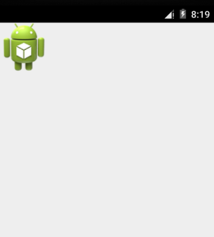
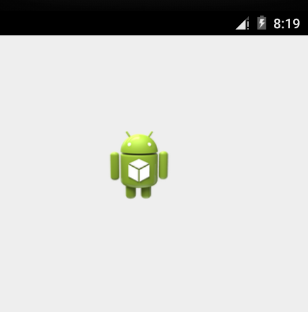

# Android拖放 - Android开发教程

Android 拖/放框架允许用户将数据从一个View到另一个视图在当前布局中使用图形化的拖放动作。该框架包括以下三个重要组成部分，支持拖放功能：

*   拖动事件类

*   拖动监听器

*   辅助方法和类

## 拖放过程

基本上有四个步骤，在拖放过程或状态：

*   **开始：**此事件发生时开始拖动布局中的一个项目，应用类的tartDrag()方法来告诉系统启动拖动。startDrag()方法的参数提供被拖动的数据，这些是数据的元数据和一个回调用于绘制的拖动阴影。

    该系统首先通过回调应用程序，以获得一个拖阴影的响应。然后显示在设备上的拖影。

    接下来，系统会发送拖曳事件动作类型ACTION_DRAG_STARTED在当前布局中的所有视图对象拖动事件监听器注册。

    若要继续接收拖动事件，其中包括一个可能的放事件，一个拖事件侦听器必须返回true，如果拖动事件侦听器返回false，那么它不会收到拖动事件当前的操作，直到系统发送一个动作类型的拖曳事件ACTION_DRAG_ENDED。

*   **继续：**用户可以继续拖动。系统发送ACTION_DRAG_ENTERED动作，其次注册拖动事件侦听器的视图中拖动点进入ACTION_DRAG_LOCATION动作。响应该事件监听器可以选择改变其对象的外观或可以凸显其观点反应。用户移动拖动视图的边框阴影外拖曳事件侦听器接收ACTION_DRAG_EXITED动作。

*   **拖动：**用户释放拖动的项目视图的边框内。该系统发送对象的侦听器拖动事件使用动作类型ACTION_DROP。

*   **结果：**操作类型ACTION_DROP之后，系统发出一个操作类型ACTION_DRAG_ENDED表示拖动操作结束的拖动事件。

## DragEvent 类

dragEvent代表一个事件，就会由系统送出拖放操作过程中在不同的时间。这个类提供了一些常量和重要的方法在使用拖/放过程。

### 常量

以下是所有常量作为部分 dragEvent 类整数。

| S.N. | 常量说明 |
| --- | --- |
| 1 | **ACTION_DRAG_STARTED** 拖放操作的开始的信号 |
| 2 | **ACTION_DRAG_ENTERED** 一种视图拖动点已进入视图的边框的信号 |
| 3 | **ACTION_DRAG_LOCATION** 发送到ACTION_DRAG_ENTERED后的视图，如果拖影依然是查看对象的边框内 |
| 4 | **ACTION_DRAG_EXITED** 信号的用户移动拖动阴影视图的边框之外 |
| 5 | **ACTION_DROP** 信号到View用户发布了拖影，而阻力点就是视图的边框内 |
| 6 | **ACTION_DRAG_ENDED** 视图拖放操作已经结束信号 |

### 方法

以下是作为部分的 dragEvent 类提供一些重要的和最常用的方法。

| S.N. | 常量说明 |
| --- | --- |
| 1 | **int getAction()** 检查此事件的动作值 |
| 2 | **ClipData getClipData()** 返回对象到系统调用ClipData()发送作为到startDrag一部分部分 |
| 3 | **ClipDescription getClipDescription()** 返回包含在ClipData的ClipDescription对象 |
| 4 | **boolean getResult()** 返回拖放操作的结果的指示 |
| 5 | **float getX()** 获取阻力的X坐标点 |
| 6 | **float getY()** 获取阻力的Y坐标点 |
| 7 | **String toString()** 返回DragEvent对象的字符串表示 |

## 监听拖放事件

如果想要的任何布局内视图响应拖动事件，那么视图要么实现 View.OnDragListener 或者设置 onDragEvent(DragEvent) 回调方法。当系统调用的方法或监听器，它传递给上述 dragEvent 对象。可以查看对象的监听器和一个回调方法。如果发生这种情况，系统首先调用监听器，然后定义回调监听器返回true。

组合 onDragEvent(DragEvent)方法 和 View.OnDragListener，类似于 onTouchEvent() 和 View.OnTouchListener 使用在旧版本 Android 触摸事件的组合。 

## 开始拖动事件

开始创建ClipData和移动数据ClipData.Item。作为ClipDataobject 的一部分提供的元数据被存储在ClipDescription内ClipData对象。对于拖放操作，并不代表数据移动，可能想使用空（null）而不是实际的对象。

下一步，可以扩展 View.DragShadowBuilder 创建一个拖动视图，或者使用 View.DragShadowBuilder(View) 创建一个默认的大小相同的View参数传递给它的拖影，触摸拖动阴影点集中在拖影。

## 示例

下面的例子显示了一个简单的拖放示例中使用View.setOnLongClickListener() 事件侦听器和 View.OnDragEventListener().函数。 

| 步骤 | 描述 |
| --- | --- |
| 1 | 使用Android Studio创建Android应用程序，并将它命名为：DragNDropDemo。在创建这个项目，确保目标SDK和编译在Android SDK的最新版本或使用更高级别的API。 |
| 2 | 修改 _src/MainActivity.java _文件，并添加定义事件侦听器的代码，以及一个回调方法，在这个例子中使用Logo图像 |
| 3 | 复制图片logo.png到_res/drawable-* _文件夹。可以使用的情况下，要为他们提供了不同的设备有不同的分辨率的图像 |
| 4 | 修改布局文件 _res/layout/activity_main.xml _l定义logo图片的默认视图 |
| 5 | 运行该应用程序启动 Android模拟器并验证应用程序所做的修改结果。 |

以下是修改主活动文件** _src/com.yiibai.dragndropdemo/MainActivity.java _**。这个文件可以包括每个生命周期基本方法。

```
package com.yiibai.dragndropdemo;

import android.os.Bundle;
import android.app.Activity;
import android.content.ClipData;
import android.content.ClipDescription;
import android.util.Log;
import android.view.DragEvent;
import android.view.View;
import android.view.View.DragShadowBuilder;
import android.view.View.OnDragListener;
import android.widget.*;

public class MainActivity extends Activity{
   ImageView ima;
   private static final String IMAGEVIEW_TAG = "Android Logo";
   String msg;

   private android.widget.RelativeLayout.LayoutParams layoutParams;

   @Override
   public void onCreate(Bundle savedInstanceState) {
      super.onCreate(savedInstanceState);
      setContentView(R.layout.activity_main);

      ima = (ImageView)findViewById(R.id.iv_logo);
      // Sets the tag
      ima.setTag(IMAGEVIEW_TAG);

      ima.setOnLongClickListener(new View.OnLongClickListener() {
         @Override
         public boolean onLongClick(View v) {
            ClipData.Item item = new ClipData.Item((CharSequence)v.getTag());

            String[] mimeTypes = {ClipDescription.MIMETYPE_TEXT_PLAIN};
            ClipData dragData = new ClipData(v.getTag().toString(), 
            mimeTypes, item);

            // Instantiates the drag shadow builder.
            View.DragShadowBuilder myShadow = new DragShadowBuilder(ima);

            // Starts the drag
            v.startDrag(dragData,  // the data to be dragged
            myShadow,  // the drag shadow builder
            null,      // no need to use local data
            0          // flags (not currently used, set to 0)
            );
            return true;
         }
      });

      // Create and set the drag event listener for the View
      ima.setOnDragListener( new OnDragListener(){
         @Override
         public boolean onDrag(View v,  DragEvent event){
         RelativeLayout.LayoutParams layoutParams = (RelativeLayout.LayoutParams) v.getLayoutParams();
         switch(event.getAction())                   
         {
            case DragEvent.ACTION_DRAG_STARTED:
               layoutParams = (RelativeLayout.LayoutParams) 
               v.getLayoutParams();
               Log.d(msg, "Action is DragEvent.ACTION_DRAG_STARTED");
               // Do nothing
               break;
            case DragEvent.ACTION_DRAG_ENTERED:
               Log.d(msg, "Action is DragEvent.ACTION_DRAG_ENTERED");
               int x_cord = (int) event.getX();
               int y_cord = (int) event.getY();  
               break;
            case DragEvent.ACTION_DRAG_EXITED :
               Log.d(msg, "Action is DragEvent.ACTION_DRAG_EXITED");
               x_cord = (int) event.getX();
               y_cord = (int) event.getY();
               layoutParams.leftMargin = x_cord;
               layoutParams.topMargin = y_cord;
               v.setLayoutParams(layoutParams);
               break;
            case DragEvent.ACTION_DRAG_LOCATION  :
               Log.d(msg, "Action is DragEvent.ACTION_DRAG_LOCATION");
               x_cord = (int) event.getX();
               y_cord = (int) event.getY();
               break;
            case DragEvent.ACTION_DRAG_ENDED   :
               Log.d(msg, "Action is DragEvent.ACTION_DRAG_ENDED");
               // Do nothing
               break;
            case DragEvent.ACTION_DROP:
               Log.d(msg, "ACTION_DROP event");
               // Do nothing
               break;
            default: break;
            }
            return true;
         }
      });
   }
}
```

下面是 **res/layout/activity_main.xml **文件的内容：

```
<?xml version="1.0" encoding="utf-8"?>
<RelativeLayout xmlns:android="http://schemas.android.com/apk/res/android"
    android:id="@+id/container"
    android:layout_width="fill_parent"
    android:layout_height="fill_parent"
    android:orientation="vertical" >

    <ImageView
		android:id="@+id/iv_logo" 
    	android:layout_width="wrap_content" 
    	android:layout_height="wrap_content"
    	android:src="@drawable/logo"
    	android:contentDescription="@string/drag_drop"  />

</RelativeLayout>
```

下面文件 res/values/strings.xml 的内容中定义两个新的常量：

```
<?xml version="1.0" encoding="utf-8"?>
<resources>

    <string name="app_name">DragNDropDemo</string>
    <string name="action_settings">Settings</string>
    <string name="hello_world">Hello world!</string>
    <string name="drag_drop">Click on the image to drag and drop</string>

</resources>
```

以下是 **AndroidManifest.xml** 文件的默认内容：

```
<?xml version="1.0" encoding="utf-8"?>
<manifest xmlns:android="http://schemas.android.com/apk/res/android"
    package="com.yiibai.guidemo"
    android:versionCode="1"
    android:versionName="1.0" >

    <uses-sdk
        android:minSdkVersion="16"
        android:targetSdkVersion="17" />

    <application
        android:allowBackup="true"
        android:icon="@drawable/ic_launcher"
        android:label="@string/app_name"
        android:theme="@style/AppTheme" >
        <activity
            android:name="com.yiibai.guidemo.MainActivity"
            android:label="@string/app_name" >
            <intent-filter>
                <action android:name="android.intent.action.MAIN" />

                <category android:name="android.intent.category.LAUNCHER" />
            </intent-filter>
        </activity>
    </application>

</manifest>
```

我们尝试运行 DragNDropDemo 应用程序。AVD安装的应用程序，并启动它，如果一切设置和应用都没有问题，它会显示以下模拟器窗口： 



现在长时间点击显示Android的标志，会看到标志图像经过1秒长的点击它，开始拖动图像的时候移动了一点。可以拖动它在屏幕上，并把它放在一个新的位置。

以下代码下载：[http://pan.baidu.com/s/1eQIQIjw](http://pan.baidu.com/s/1eQIQIjw) 