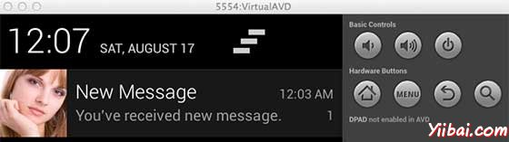

# Android通知 - Android开发教程

Android的Toast 类提供了一个方便的方式来显示用户的警告信息，但这些警告不是持久性的，这意味着警告闪烁在屏幕上几秒钟后就消失了。

对于特别重要的要提供给用户的消息，需要有更持久性的方法。 Anotification是一种消息可以显示在设备的顶部的通知栏或状态栏中。


要看到通知的细节，选择图标显示通知抽屉里有详细的有关通知。模拟器虚拟设备工作，按一下向下拖动状态栏将它展开，将显示详细信息如下。这将是64 sp高的普通视图。



上述扩大的形式可以放到一个大的视图，有关通知的更多细节。可以添加最多六行的通知。下面的截图显示了这样的通知。


## 创建和发送通知

使用简单的方法来创建一个通知。按照以下步骤在应用程序创建一个通知：

### 第1步 - 创建通知生成器

作为第一步创建一个通知构造器，使用NotificationCompat.Builder.build()。使用通知Builder来设置属性，如各种通知其小型和大型图标，标题，优先级等。

```
NotificationCompat.Builder mBuilder = new NotificationCompat.Builder(this)
```

### 第2步 - 设置通知属性

在创建Builder对象之后，可以按要求使用生成器创建通知对象。这是强制性的，以至少下列设置：

*   一个小图标，由 setSmallIcon() 设置

*   一个标题，由setContentTitle() 设置

*   详细内容由 setContentText() 设置

```
mBuilder.setSmallIcon(R.drawable.notification_icon);
mBuilder.setContentTitle("Notification Alert, Click Me!");
mBuilder.setContentText("Hi, This is Android Notification Detail!");
```

通知有很多可选的属性，可以设置。要更多地了解它们，请参考 NotificationCompat.Builder 文档。

### 第3步 - 动作附加

这是一个可选的部分，并要求如果要附加一个动作的通知。动作可以让用户直接从通知到应用程序中的活动，在那里它们可以在一个或多个事件，或做进一步的工作。

动作定义通过PendingIntent 在应用程序中的活动意图。要关联PendingIntent 手势请调用适当NotificationCompat.Builder 方法。例如，如果想开始活动，当用户点击通知文本通知抽屉 PendingIntent 调用setContentIntent()。

PendingIntent对象表示应用程序的执行一个动作，在以后的时间里查看应用程序是否正在运行。

堆栈builder对象将包含一个人工后退堆栈活动。确保向后导航的活动在应用程序的主屏幕。

```
Intent resultIntent = new Intent(this, ResultActivity.class);
TaskStackBuilder stackBuilder = TaskStackBuilder.create(this);
stackBuilder.addParentStack(ResultActivity.class);

// Adds the Intent that starts the Activity to the top of the stack
stackBuilder.addNextIntent(resultIntent);
PendingIntent resultPendingIntent =
        stackBuilder.getPendingIntent(
            0,
            PendingIntent.FLAG_UPDATE_CURRENT
        );
mBuilder.setContentIntent(resultPendingIntent);
```

### 第4步 - 发出通知

最后，调用NotificationManager.notify() 发送通知，通知对象传递到系统。通知之前，确保调用NotificationCompat.Builder.build()方法生成器对象。这种方法结合了所有的选择，设置并返回一个新的Notificationobject。

```
NotificationManager mNotificationManager =
    (NotificationManager) getSystemService(Context.NOTIFICATION_SERVICE);

// notificationID allows you to update the notification later on.
mNotificationManager.notify(notificationID, mBuilder.build());
```

## NotificationCompat.Builder类

NotificationCompat.Builder类可以更容易控制标志，以及帮助构建典型通知布局。以下是 NotificationCompat.Builder类的一些重要的和最常用的方法的一部分。

| S.N. | 常量& 描述 |
| --- | --- |
| 1 | **Notification build()** 
结合所有已设置的选项，并返回一个新的 Notification 对象 |
| 2 | **NotificationCompat.Builder setAutoCancel (boolean autoCancel)** 
设置此标志将使它以便当用户点击它在面板中的通知被自动取消 |
| 3 | **NotificationCompat.Builder setContent (RemoteViews views)** 
提供定制RemoteViews使用来代替标准之一 |
| 4 | **NotificationCompat.Builder setContentInfo (CharSequence info)** 
设置大文本的通知的右侧 |
| 5 | **NotificationCompat.Builder setContentIntent (PendingIntent intent)** 
提供一个PendingIntent通知被点击时发出 |
| 6 | **NotificationCompat.Builder setContentText (CharSequence text)** 
设置通知的文本（第二行），在一个标准的通知 |
| 7 | **NotificationCompat.Builder setContentTitle (CharSequence title)** 
设置通知的文本（第一行），在一个标准的通知 |
| 8 | **NotificationCompat.Builder setDefaults (int defaults)** 
设置将要使用的默认通知选项 |
| 9 | **NotificationCompat.Builder setLargeIcon (Bitmap icon)** 
设置显示在自动收报机和通知大图标 |
| 10 | **NotificationCompat.Builder setNumber (int number)** 
在通知的右侧设置大的数字 |
| 11 | **NotificationCompat.Builder setOngoing (boolean ongoing)** 
设置这是否是一个持续的通知 |
| 12 | **NotificationCompat.Builder setSmallIcon (int icon)** 
设置小图标在通知使用布局 |
| 13 | **NotificationCompat.Builder setStyle (NotificationCompat.Style style)** 
在构建时应用添加丰富的通知样式 |
| 14 | **NotificationCompat.Builder setTicker (CharSequence tickerText)** 
设置在第一个通知到达时显示在状态栏中的文本 |
| 15 | **NotificationCompat.Builder setVibrate (long[] pattern)** 
设置振动模式的使用 |
| 16 | **NotificationCompat.Builder setWhen (long when)** 
设置该事件发生的时间。在面板的通知是由这个时间进行排序 |

## 示例

以下示例显示 Android 的通知功能，NotificationCompat.Builder类已在Android4.1中引入。

| 步骤 | 描述 |
| --- | --- |
| 1 | 使用Android Studio创建一个Android应用程序，并将它命名为：NotificationDemounder。在创建这个项目时确保目标SDK和编译在Android SDK的最新版本或更高级别的API。 |
| 2 | 修改 _src/MainActivity.java _文件，并添加定义三种方法startNotification()，cancelNotification()和updateNotification()，以涵盖与Android的通知的最大功能的代码。 |
| 3 | 创建一个新的src/NotificationView.java，这将被用于显示新的布局作为新的活动将被启动的一部分，当用户将点击通知 |
| 4 | 复制图片woman.png在RES/ drawable-*文件夹，这个图片将被用作通知图标。可以使用的情况下，要为他们提供了不同的设备有不同的分辨率的图片 |
| 5 | 修改布局XML文件 _res/layout/activity_main.xml_ 添加三个按钮的线性布局 |
| 6 | 创建一个新的布局XML文件 _res/layout/notification.xml_。这将被用来作为布局文件为新的活动，将启动时用户将点击任何通知 |
| 7 | 修改 _res/values/strings.xml_  中定义所需的恒定值 |
| 8 | 运行该应用程序时启动Android模拟器并验证应用程序所做的修改结果 |

以下是修改主要活动文件src/com.yiibai.notificationdemo/MainActivity.java 的内容。这个文件可以包括每个生命周期基本方法。

```
package com.example.notificationdemo;

import android.os.Bundle;
import android.app.Activity;
import android.app.NotificationManager;
import android.app.PendingIntent;
import android.app.TaskStackBuilder;
import android.content.Context;
import android.content.Intent;
import android.support.v4.app.NotificationCompat;
import android.util.Log;
import android.view.View;
import android.widget.Button;

public class MainActivity extends Activity {
   private NotificationManager mNotificationManager;
   private int notificationID = 100;
   private int numMessages = 0;

   protected void onCreate(Bundle savedInstanceState) {
      super.onCreate(savedInstanceState);
      setContentView(R.layout.activity_main);

      Button startBtn = (Button) findViewById(R.id.start);
      startBtn.setOnClickListener(new View.OnClickListener() {
         public void onClick(View view) {
            displayNotification();
         }
      });

      Button cancelBtn = (Button) findViewById(R.id.cancel);
      cancelBtn.setOnClickListener(new View.OnClickListener() {
         public void onClick(View view) {
            cancelNotification();
         }
      });

      Button updateBtn = (Button) findViewById(R.id.update);
      updateBtn.setOnClickListener(new View.OnClickListener() {
         public void onClick(View view) {
            updateNotification();
         }
      });
   }
   protected void displayNotification() {
      Log.i("Start", "notification");

      /* Invoking the default notification service */
      NotificationCompat.Builder  mBuilder = 
      new NotificationCompat.Builder(this);	

      mBuilder.setContentTitle("New Message");
      mBuilder.setContentText("You've received new message.");
      mBuilder.setTicker("New Message Alert!");
      mBuilder.setSmallIcon(R.drawable.woman);

      /* Increase notification number every time a new notification arrives */
      mBuilder.setNumber(++numMessages);

      /* Creates an explicit intent for an Activity in your app */
      Intent resultIntent = new Intent(this, NotificationView.class);

      TaskStackBuilder stackBuilder = TaskStackBuilder.create(this);
      stackBuilder.addParentStack(NotificationView.class);

      /* Adds the Intent that starts the Activity to the top of the stack */
      stackBuilder.addNextIntent(resultIntent);
      PendingIntent resultPendingIntent =
         stackBuilder.getPendingIntent(
            0,
            PendingIntent.FLAG_UPDATE_CURRENT
         );

      mBuilder.setContentIntent(resultPendingIntent);

      mNotificationManager =
      (NotificationManager) getSystemService(Context.NOTIFICATION_SERVICE);

      /* notificationID allows you to update the notification later on. */
      mNotificationManager.notify(notificationID, mBuilder.build());
   }

   protected void cancelNotification() {
      Log.i("Cancel", "notification");
      mNotificationManager.cancel(notificationID);
   }

   protected void updateNotification() {
      Log.i("Update", "notification");

      /* Invoking the default notification service */
      NotificationCompat.Builder  mBuilder = 
      new NotificationCompat.Builder(this);	

      mBuilder.setContentTitle("Updated Message");
      mBuilder.setContentText("You've got updated message.");
      mBuilder.setTicker("Updated Message Alert!");
      mBuilder.setSmallIcon(R.drawable.woman);

     /* Increase notification number every time a new notification arrives */
      mBuilder.setNumber(++numMessages);

      /* Creates an explicit intent for an Activity in your app */
      Intent resultIntent = new Intent(this, NotificationView.class);

      TaskStackBuilder stackBuilder = TaskStackBuilder.create(this);
      stackBuilder.addParentStack(NotificationView.class);

      /* Adds the Intent that starts the Activity to the top of the stack */
      stackBuilder.addNextIntent(resultIntent);
      PendingIntent resultPendingIntent =
         stackBuilder.getPendingIntent(
            0,
            PendingIntent.FLAG_UPDATE_CURRENT
         );

      mBuilder.setContentIntent(resultPendingIntent);

      mNotificationManager =
      (NotificationManager) getSystemService(Context.NOTIFICATION_SERVICE);

      /* Update the existing notification using same notification ID */
      mNotificationManager.notify(notificationID, mBuilder.build());
   }
}
```

以下是修改的主活动文件的内容 src/com.yiibai.notificationdemo/NotificationView.java.

```
package com.example.notificationdemo;

import android.os.Bundle;
import android.app.Activity;

public class NotificationView extends Activity{
   @Override
   public void onCreate(Bundle savedInstanceState)
   {
      super.onCreate(savedInstanceState);
      setContentView(R.layout.notification);
   }

}
```

下面文件 res/layout/activity_main.xml 的内容如下:

```
<LinearLayout xmlns:android="http://schemas.android.com/apk/res/android"
   android:layout_width="fill_parent"
   android:layout_height="fill_parent"
   android:orientation="vertical" >

   <Button android:id="@+id/start"
   android:layout_width="fill_parent"
   android:layout_height="wrap_content"
   android:text="@string/start_note"/>

   <Button android:id="@+id/cancel"
   android:layout_width="fill_parent"
   android:layout_height="wrap_content"
   android:text="@string/cancel_note" />

   <Button android:id="@+id/update"
   android:layout_width="fill_parent"
   android:layout_height="wrap_content"
   android:text="@string/update_note" />

</LinearLayout>
```

下面是 res/layout/notification.xml 文件的内容： 

```
<?xml version="1.0" encoding="utf-8"?>
<LinearLayout xmlns:android="http://schemas.android.com/apk/res/android"
    android:orientation="vertical"
    android:layout_width="fill_parent"
    android:layout_height="fill_parent"    >
   <TextView
   android:layout_width="fill_parent"
   android:layout_height="400dp"
   android:text="Hi, Your Detailed notification view goes here...." />
</LinearLayout>
```

下面文件 res/values/strings.xml 的内容中定义两个新的常量：

```
<?xml version="1.0" encoding="utf-8"?>
<resources>

    <string name="app_name">NotificationDemo</string>
    <string name="action_settings">Settings</string>
    <string name="hello_world">Hello world!</string>
    <string name="start_note">Start Notification</string>
    <string name="cancel_note">Cancel Notification</string>
    <string name="update_note">Update Notification</string>

</resources>
```

下面是 AndroidManifest.xml 文件的内容：

```
<?xml version="1.0" encoding="utf-8"?>
<manifest xmlns:android="http://schemas.android.com/apk/res/android"
    package="com.yiibai.notificationdemo"
    android:versionCode="1"
    android:versionName="1.0" >

    <uses-sdk
        android:minSdkVersion="17"
        android:targetSdkVersion="17" />

    <application
        android:allowBackup="true"
        android:icon="@drawable/ic_launcher"
        android:label="@string/app_name"
        android:theme="@style/AppTheme" >
        <activity
            android:name="com.yiibai.notificationdemo.MainActivity"
            android:label="@string/app_name" >
            <intent-filter>
                <action android:name="android.intent.action.MAIN" />

                <category android:name="android.intent.category.LAUNCHER" />
            </intent-filter>
        </activity>
        <activity android:name=".NotificationView"
             android:label="Details of notification"
             android:parentActivityName=".MainActivity">
       <meta-data
        android:name="android.support.PARENT_ACTIVITY"
        android:value=".MainActivity"/>
        </activity>
    </application>

</manifest>
```

我们尝试运行NotificationDemo 应用程序。AVD安装的应用程序，并启动它，如果一切设置和应用都没有问题，它会显示以下模拟器窗口：


现在单击“Start Notification”通知按钮，会看到在上面的一条消息“New Message Alert!”将短暂显示后，将有下面的屏幕左上角有一个小图标。


现在，让我们展开视图，长按小图标，一秒钟后它会显示日期信息，这是时间的时候，应该释放鼠标拖动状态栏的情况下。会看到状态栏将扩大，会得到以下画面：


现在，让我们尝试在图像上点击图标，这将启动新的活动，已设置使用的意图，将有以下屏幕：


接下来，可以点击“Detail of notification”，将带回到主屏幕，可以尝试使用更新通知按钮，将更新现有的通知和数量将增加1，但如果发送通知，新的通知ID会继续增加在堆栈中，会看到他们在屏幕上单独列示。

## 图查看大图通知

下面的代码片断演示了如何改变的通知，上面代码中创建使用收件箱大视图样式。要更新 displayNotification() 方法来显示这个功能：

```
   protected void displayNotification() {
      Log.i("Start", "notification");

      /* Invoking the default notification service */
      NotificationCompat.Builder  mBuilder = 
      new NotificationCompat.Builder(this);	

      mBuilder.setContentTitle("New Message");
      mBuilder.setContentText("You've received new message.");
      mBuilder.setTicker("New Message Alert!");
      mBuilder.setSmallIcon(R.drawable.woman);

      /* Increase notification number every time a new notification arrives */
      mBuilder.setNumber(++numMessages);

      /* Add Big View Specific Configuration */
      NotificationCompat.InboxStyle inboxStyle =
             new NotificationCompat.InboxStyle();

      String[] events = new String[6];
      events[0] = new String("This is first line....");
      events[1] = new String("This is second line...");
      events[2] = new String("This is third line...");
      events[3] = new String("This is 4th line...");
      events[4] = new String("This is 5th line...");
      events[5] = new String("This is 6th line...");

      // Sets a title for the Inbox style big view
      inboxStyle.setBigContentTitle("Big Title Details:");
      // Moves events into the big view
      for (int i=0; i < events.length; i++) {

         inboxStyle.addLine(events[i]);
      }
      mBuilder.setStyle(inboxStyle);

      /* Creates an explicit intent for an Activity in your app */
      Intent resultIntent = new Intent(this, NotificationView.class);

      TaskStackBuilder stackBuilder = TaskStackBuilder.create(this);
      stackBuilder.addParentStack(NotificationView.class);

      /* Adds the Intent that starts the Activity to the top of the stack */
      stackBuilder.addNextIntent(resultIntent);
      PendingIntent resultPendingIntent =
         stackBuilder.getPendingIntent(
            0,
            PendingIntent.FLAG_UPDATE_CURRENT
         );

      mBuilder.setContentIntent(resultPendingIntent);

      mNotificationManager =
      (NotificationManager) getSystemService(Context.NOTIFICATION_SERVICE);

      /* notificationID allows you to update the notification later on. */
      mNotificationManager.notify(notificationID, mBuilder.build());
   }
```

现在，如果尝试运行应用程序，然后会发现下面的结果视图的扩展形式：

   