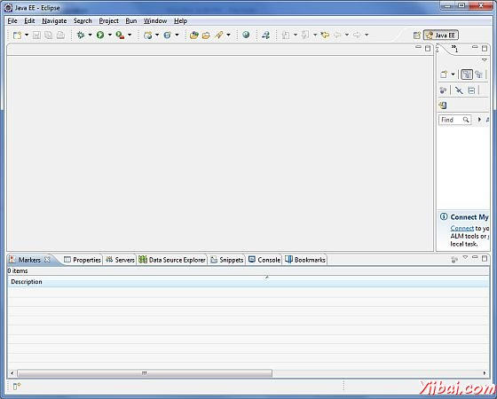

# Android 开发环境配置 - Android开发教程

Android 应用程序开发可以用以下操作系统开发：

*   Microsoft Windows XP或更高版本。

*   Mac OS X10.5.8或更高版本（英特尔芯片）。

*   包括GNU C库2.7或更高版本的Linux系统。

第二是开发Android应用程序所需的所有工具都是免费的，可以从网上下载。以下是软件的列表，开始 Android 应用程序编程需要用到。

*   Java JDK5 或 JDK6

*   Android SDK

*   Eclipse IDE for Java Developers (optional)

*   Android Development Tools (ADT) Eclipse Plugin (optional)

这里最后两个组件是可选的，如果正在使用Windows这些组件容易获得，都是基于Java应用程序开发。因此，让我们来看看如何进行设置所需的环境。 **注：**如果你觉得以下步骤比较复杂，那么可以直接使用 android 开发软件集成包：adt-bundle-windows （自行搜索）

## 第1步 - 安装Java开发工具包（JDK）

可以下载最新版本的Java JDK，从Oracle的Java网站：[Java SE下载](http://www.oracle.com/technetwork/java/javase/downloads/index.html)。安装下载的JDK文件，按照给定的说明来安装和配置设置。最后设置PATH和JAVA_HOME环境变量来引用该目录包含javac和java，通常分别为 java_install_dir/bin 和 java_install_dir。

如果运行的是Windows，把JDK安装在C:jdk1.6.0_15，在 C:autoexec.bat 文件添加以下内容：

```
set PATH=C:jdk1.6.0_15in;%PATH%
set JAVA_HOME=C:jdk1.6.0_15
```

另外，也可以右键单击“我的电脑”，选择“属性”=》”高级“=》“环境变量”，按下“确定”按钮，然后会更新 PATH 值。

在Linux上，如果SDK安装在 /usr/local/jdk1.6.0_15，如果使用的是C shell，把下面的代码到 .cshrc文件。

```
setenv PATH /usr/local/jdk1.6.0_15/bin:$PATH
setenv JAVA_HOME /usr/local/jdk1.6.0_15
```

另外，如果使用[Eclipse](http://www.yiibai.com/eclipse) 集成开发环境（IDE），那么它会自动知道已安装Java。

## 第2步 - 安装Android SDK

可以下载最新版本的Android SDK，从Android 官方网站：[Android SDK下载](http://developer.android.com/sdk/index.html)。如果Windows机器上安装SDK，那么会发现一个installer_rXX windows.exe文件，只需下载并运行这个EXE将推出Android SDK工具安装向导来指导整个的安装，所以只要按照指示安装。最后，必须在机器上安装Android SDK 工具。

本教程使用的是 Windows 7操作系统环境。

因此，让我们打开 Android SDK 管理器中的选项，所有程序“&gt;”Android SDK 工具&gt; SDK管理器，这会给定下面的窗口：


打开 SDK管理器后，它需要点时间来安装其他所需的软件包。默认情况下，它会列出共7个要安装的软件包，但建议选择为 Android SDK 文档和SDK包的样例代码，以减少安装时间。下一步点击安装包按钮继续进行，这将显示以下对话框：


如果同意安装所有软件包，请选择接受所有的单选按钮，并继续进行通过单击“Installbutton”。现在，让SDK管理器自己工作，等待直到所有的包都安装。这可能需要一些时间，这取决于您的互联网连接。所有的包都安装完成后，SDK管理器可以关闭，使用右上方的交叉按钮。

## 第3步 - 安装Eclipse IDE

所有的例子已经写在本教程中使用的是Eclipse IDE。所以建议机器上安装最新版本的Eclipse。

安装Eclipse IDE，[http://www.eclipse.org/downloads/](http://www.eclipse.org/downloads/)下载最新的Eclipse二进制文件。下载安装：解压二进制分发到一个方便的位置。例如，在 C:eclipse，或 /usr/local/eclipse 在 Linux并适当设置PATH 变量。

Eclipse可以启动Windows机器上执行以下命令，或者可以简单地双击 eclipse.exe

```
 %C:eclipseeclipse.exe
```

Eclipse可以启动Linux机器上执行以下命令：

```
$/usr/local/eclipse/eclipse
```

成功启动后，如果一切正常，那么它应显示以下结果：



## 第4步 - 安装Android开发工具（ADT）插件

这个步骤将设置 Android 开发工具Eclipse插件。让我们开始打开 Eclipse，然后选择 **Help &gt; Software Updates &gt; Install New Software"**。这将显示以下对话。


现在，使用"**Add** "按钮来添加名称和ADT插件的位置 https://dl-ssl.google.com/android/eclipse/ 。然后单击“确定”添加这个位置，只要单击“OK ”按钮，添加这个位置时，Eclipse开始搜索插件在给定的位置，最后列出找到的插件。


现在，选择列出的所有插件使用"**Select All**"按钮，并单击“**Next** ”按钮，将引导提前安装Android开发工具和其他所需的插件。

## 第5步 - 创建Android虚拟设备

为了测试Android应用程序，需要一个虚拟的 Android设备。所以，在我们开始之前，在代码创建一个Android 虚拟设备。打开 Android AVD管理使用Eclipse菜单选项 **Window &gt; AVD Manager&gt;**将启动 Android AVD管理。使用“**New**”按钮，创建一个新的Android虚拟设备，并输入以下信息，然后点击"**Create AVD**"按钮。


如果AVD创建成功，这意味着Android应用程序开发环境已经配置完成。使用右上角的十字按钮关闭此窗口。最好重新启动计算机，一旦完成了这最后一步，就可以准备进行第一个 Android例子了，但在此之前，我们将看到Android应用开发相关的一些比较重要的概念。

 