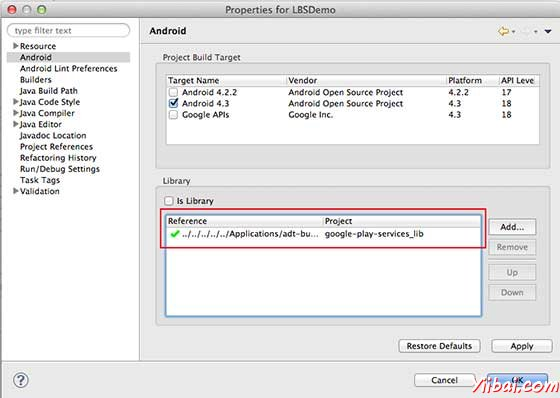
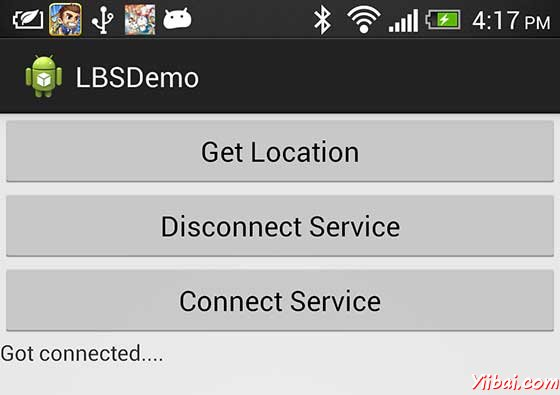
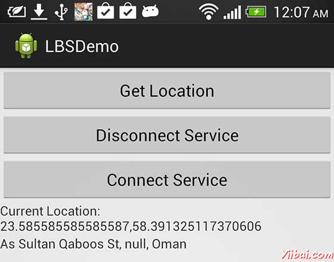

# Android基于位置服务 - Android开发教程

Android 的位置API，很容易让创建位置感知的应用程序，而不需要把重点放在相关定位技术细节。这在谷歌服务的帮助下有利于应用程序添加位置感知，自动定位跟踪，地理和活动识别成为可能。

本教程介绍了如何使用位置服务在应用程序来获取当前的位置，得到周期性位置更新，查找地址等

## Location 对象

Location对象代表一个地理位置可包括纬度，经度，时间戳和其它信息，如重力，高度和速度。有以下重要的方法在使用Location对象位置的具体信息：

| S.N. | 方法和说明 |
| --- | --- |
| 1 | **float distanceTo(Location dest)** 
返回在这个位置，并在给定的位置之间大致距离（单位：米） |
| 2 | **float getAccuracy()** 
得到这个位置的估计精度，以米为单位 |
| 3 | **double getAltitude()** 
（如果可用）获取的高度，如：海拔（单位：米） |
| 4 | **float getBearing()** 
获取轴承，以度为单位 |
| 5 | **double getLatitude()** 
获得纬度，单位为度 |
| 6 | **double getLongitude()**
得到经度，单位为度 |
| 7 | **float getSpeed()** 
获取速度（如果可用），在地上以米/秒 |
| 8 | **boolean hasAccuracy()** 
如果此位置有一个精确度 |
| 9 | **boolean hasAltitude()** 
True - 如果此位置有一个高度 |
| 10 | **boolean hasBearing()** 
True 如果该位置有一个支撑 |
| 11 | **boolean hasSpeed()** 
True如果这个位置有一个速度 |
| 12 | **void reset()** 
清除单元内容 |
| 13 | **void setAccuracy(float accuracy)** 
设置此位置的估计精度（米） |
| 14 | **void setAltitude(double altitude)** 
设置海拔高度（米） |
| 15 | **void setBearing(float bearing)** 
设置支承，以度为单位 |
| 16 | **void setLatitude(double latitude)** 
设置的纬度，单位为度 |
| 17 | **void setLongitude(double longitude)** 
设置的经度，单位为度 |
| 18 | **void setSpeed(float speed)** 
设置速度，在地上以米/秒 |
| 19 | **String toString()** 
返回包含此对象的简洁，可读的描述字符串信息 |

## 当前位置

要获得目前的位置，需要创建一个位置的 LocationClient 对象，将它连接到位置服务使用connect()方法，然后调用其 getLastLocation() 方法。此方法返回最近的位置Location对象的形式：其中包含纬度和经度坐标和其他信息，如上面所述。要在活动中有基于位置的功能，将需要实现两个接口：

*   GooglePlayServicesClient.ConnectionCallbacks

*   GooglePlayServicesClient.OnConnectionFailedListener

这些接口提供了以下重要的，需要在活动类实现回调方法：

| S.N. | 回调方法及说明 |
| --- | --- |
| 1 | **abstract void onConnected(Bundle connectionHint)** 
这个回调方法被调用时，位置服务是成功连接到客户端的位置。将使用connect()方法来连接到客户端的位置 |
| 2 | **abstract void onDisconnected()** 
当客户端断开这个回调方法被调用。将使用disconnect()方法从位置客户端断开连接 |
| 3 | **abstract void onConnectionFailed(ConnectionResult result)** 
这个回调方法被调用时，有客户端连接到服务的错误 |

&gt; 应该创在建客户活动类onCreate()方法中调用猎取位置，然后将其连接在onStart()，让位置服务维持目前的位置，而活动是完全可见。断开客户端onStop()方法，这样应用程序是不可见的，位置服务不是维持在目前的位置。这在很大程度上有助于节省电池电量。

## 获取更新位置

如果愿意的位置更新，那么除了上面提到的接口，需要实现LocationListener 接口，该接口提供了以下回调方法，需要在活动类实现：

| S.N. | 回调方法说明 |
| --- | --- |
| 1 | **abstract void onLocationChanged(Location location)** 
此回调方法用于从LocationClient接收通知时的位置发生了变化 |

## 位置服务质量

LocationRequest对象的位置从LocationClient更新服务质量（QoS），setter方法​​可以用它来处理QoS。

| S.N. | 方法 & 描述 |
| --- | --- |
| 1 | **setExpirationDuration(long millis)** 
设置此请求的时间，以毫秒为单位 |
| 2 | **setExpirationTime(long millis)** 
自启动设置请求过期时间，单位为毫秒 |
| 3 | **setFastestInterval(long millis)** 
明确设置最快的时间间隔位置更新，以毫秒为单位 |
| 4 | **setInterval(long millis)** 
设置为主动位置更新，以毫秒为单位所需的时间间隔 |
| 5 | **setNumUpdates(int numUpdates)** 
设置的位置更新次数 |
| 6 | **setPriority(int priority)** 
设置请求的优先级 |

例如，如果应用需要较准确位置，它应该创建一个位置请求 setPriority(int) 设置 PRIORITY_HIGH_ACCURACY和setInterval(long) 为5秒。还可以使用更大的间隔和/或其他优先如PRIORITY_LOW_POWER 要求“城市” 的级别精度或PRIORITY_BALANCED_POWER_ACCURACY为“块”级别的精度。

&gt; 活动应该考虑删除在所有位置请求进入后台时（例如 onPause()），或者至少交换请求到一个更大的间隔和降低质量以节省电力消耗。

## 显示位置地址

Location对象可以使用 Geocoder.getFromLocation() 方法来获得一个地址，对于一个给定的纬度和经度。这种方法是同步的，可能要花很长的时间来完成其工作，所以应该调用AsyncTask类的 doInBackground() 方法。

AsyncTask必须要使用的子类和子类会覆盖 doInBackground（Params....）方法中执行任务UI线程上的后台计算完成后，当 onPostExecute(Result) 方法被调用显示结果。还有一个更重要的方法在AyncTask  execute(Params... params)，此方法使用指定的参数执行任务。

检查下面的例子中，我们如何使用 AynchTask 在任何 Android 应用程序完成工作的主要任务，而不会干扰后台。

## 示例

下面的示例演示如何在实际使用位置服务在应用程序来获取当前位置、等效地址等等。这个例子中，需要实际配备最新的 Android OS 移动设备，否则仿真器可能无法正常工作。

### 安装谷歌播放服务SDK

在继续之前有位置在Android应用程序的支持，NEET设置谷歌播放服务SDK使用以下简单的步骤：

| 步骤 | 描述 |
| --- | --- |
| 1 | 启动SDK管理器

*   在Eclipse（使用ADT），选择 Window &gt; Android SDK Manager

*   在Windows中，双击SDK Manager.exe 请通过在Android SDK目录的根目录

*   在Mac或Linux打开一个终端并导航到工具/目录下在Android SDK目录下，然后执行Android SDK

 |
| 2 | 搜索**Google Play services**从给定的软件包列表服务选项下的**Extra** ，如果没有安装它，那么进行安装。在谷歌Play业务SDK是在保存在Android SDK环境_&lt;android-sdk&gt;/extras/google/google_play_services/_ |
| 3 | 复制库项目在_&lt;android-sdk&gt;/extras/google/google_play_services/libproject/google-play-services_lib/_到维护Android应用项目的位置。如果使用的是Eclipse，导入库项目到工作区。点击 **File &gt; Import**, 选择 **Android &gt; Existing Android Code** 到工作区, 并浏览到 _&lt;android-sdk&gt;/extras/google/google_play_services/libproject/_, 库项目将其导入 |

### 创建Android应用程序

| 步骤 | 描述 |
| --- | --- |
| 1 | 使用Eclipse IDE创建Android应用程序，并将其命名为：LBSDemo，在创建这个项目时请确保目标SDK 编译在Android SDK的最新版本或使用更高级别的API |
| 2 | 添加 **Google Play**服务库中的项目按照以下给出简单的步骤 |
| 3 | 修改 _src/MainActivity.java _文件，并添加所需的代码如下所示采取获取当前位置和它的等效转交地址 |
| 4 | 修改布局XML文件_res/layout/activity_main.xml _添加所有GUI组件，其中包括三个按钮和两个文本视图来显示位置/地址 |
| 5 | 修改_res/values/strings.xml_定义所需的常量值 |
| 6 | 修改  _AndroidManifest.xml _如下所示 |
| 7 | 运行该应用程序启动Android模拟器和验证应用程序所做的修改结果 |

让我们在项目中添加引用谷歌Play服务。右键单击该项目，并选择Build Path &gt; Configure Build Path &gt; Android &gt;，然后单击“Add ”按钮，将显示要添加的谷歌Play service_liboption，只要双击就可以了，这将增加所需的库的引用，将有窗口如下所示： 



以下是内容的修改主活动文件 src/com.yiibai.lbsdemo/MainActivity.java

```
package com.example.lbsdemo;

import java.io.IOException;
import java.util.List;
import java.util.Locale;

import com.google.android.gms.common.ConnectionResult;
import com.google.android.gms.common.GooglePlayServicesClient;
import com.google.android.gms.location.LocationClient;

import android.content.Context;
import android.location.Address;
import android.location.Geocoder;
import android.location.Location;
import android.os.AsyncTask;
import android.os.Bundle;
import android.support.v4.app.FragmentActivity;

import android.util.Log;
import android.view.View;
import android.widget.Button;
import android.widget.TextView;
import android.widget.Toast;

public class MainActivity extends FragmentActivity implements
GooglePlayServicesClient.ConnectionCallbacks,
GooglePlayServicesClient.OnConnectionFailedListener
{
   LocationClient mLocationClient;
   private TextView addressLabel;
   private TextView locationLabel;
   private Button getLocationBtn;
   private Button disconnectBtn;
   private Button connectBtn;

   @Override
   protected void onCreate(Bundle savedInstanceState) {
      super.onCreate(savedInstanceState);
      setContentView(R.layout.activity_main);

      locationLabel = (TextView) findViewById(R.id.locationLabel);
      addressLabel = (TextView) findViewById(R.id.addressLabel);
      getLocationBtn = (Button) findViewById(R.id.getLocation);

      getLocationBtn.setOnClickListener(new View.OnClickListener() {
         public void onClick(View view) {
            displayCurrentLocation();
         }
      });
      disconnectBtn = (Button) findViewById(R.id.disconnect);  
      disconnectBtn.setOnClickListener(new View.OnClickListener() {
         public void onClick(View view) {
            mLocationClient.disconnect();
            locationLabel.setText("Got disconnected....");
         }
      });
      connectBtn = (Button) findViewById(R.id.connect);  
      connectBtn.setOnClickListener(new View.OnClickListener() {
         public void onClick(View view) {
            mLocationClient.connect();
            locationLabel.setText("Got connected....");
         }
      });	
      // Create the LocationRequest object
      mLocationClient = new LocationClient(this, this, this);	
   }	
   @Override
   protected void onStart() {
      super.onStart();
      // Connect the client.
      mLocationClient.connect();
      locationLabel.setText("Got connected....");
   }
   @Override
   protected void onStop() {
      // Disconnect the client.
      mLocationClient.disconnect();
      super.onStop();
      locationLabel.setText("Got disconnected....");
   }
   @Override
   public void onConnected(Bundle dataBundle) {
      // Display the connection status
      Toast.makeText(this, "Connected", Toast.LENGTH_SHORT).show();
   }
   @Override
   public void onDisconnected() {
      // Display the connection status
      Toast.makeText(this, "Disconnected. Please re-connect.",
      Toast.LENGTH_SHORT).show();
   }
   @Override
   public void onConnectionFailed(ConnectionResult connectionResult) {
      // Display the error code on failure
      Toast.makeText(this, "Connection Failure : " + 
      connectionResult.getErrorCode(),
      Toast.LENGTH_SHORT).show();
   }
   public void displayCurrentLocation() {
      // Get the current location's latitude & longitude
      Location currentLocation = mLocationClient.getLastLocation();
      String msg = "Current Location: " +
      Double.toString(currentLocation.getLatitude()) + "," +
      Double.toString(currentLocation.getLongitude());

      // Display the current location in the UI
      locationLabel.setText(msg);

      // To display the current address in the UI
      (new GetAddressTask(this)).execute(currentLocation);
   }
   /*
    * Following is a subclass of AsyncTask which has been used to get
    * address corresponding to the given latitude & longitude.
    */
   private class GetAddressTask extends AsyncTask<Location, Void, String>{
      Context mContext;
      public GetAddressTask(Context context) {
         super();
         mContext = context;
      }

      /*
       * When the task finishes, onPostExecute() displays the address. 
       */
      @Override
      protected void onPostExecute(String address) {
         // Display the current address in the UI
         addressLabel.setText(address);
      }
      @Override
      protected String doInBackground(Location... params) {
         Geocoder geocoder =
         new Geocoder(mContext, Locale.getDefault());
         // Get the current location from the input parameter list
         Location loc = params[0];
         // Create a list to contain the result address
         List<Address> addresses = null;
         try {
            addresses = geocoder.getFromLocation(loc.getLatitude(),
            loc.getLongitude(), 1);
         } catch (IOException e1) {
            Log.e("LocationSampleActivity", 
            "IO Exception in getFromLocation()");
            e1.printStackTrace();
            return ("IO Exception trying to get address");
         } catch (IllegalArgumentException e2) {
            // Error message to post in the log
            String errorString = "Illegal arguments " +
            Double.toString(loc.getLatitude()) +
            " , " +
            Double.toString(loc.getLongitude()) +
            " passed to address service";
            Log.e("LocationSampleActivity", errorString);
            e2.printStackTrace();
            return errorString;
         }
         // If the reverse geocode returned an address
         if (addresses != null && addresses.size() > 0) {
            // Get the first address
            Address address = addresses.get(0);
            /*
            * Format the first line of address (if available),
            * city, and country name.
            */
            String addressText = String.format(
            "%s, %s, %s",
            // If there's a street address, add it
            address.getMaxAddressLineIndex() > 0 ?
            address.getAddressLine(0) : "",
            // Locality is usually a city
            address.getLocality(),
            // The country of the address
            address.getCountryName());
            // Return the text
            return addressText;
         } else {
            return "No address found";
         }
      }
   }// AsyncTask class
}
```

Following will be the content of res/layout/activity_main.xml file:

```
<LinearLayout xmlns:android="http://schemas.android.com/apk/res/android"
   android:layout_width="fill_parent"
   android:layout_height="fill_parent"
   android:orientation="vertical" >

   <Button android:id="@+id/getLocation"
   android:layout_width="fill_parent"
   android:layout_height="wrap_content"
   android:text="@string/get_location"/>

   <Button android:id="@+id/disconnect"
   android:layout_width="fill_parent"
   android:layout_height="wrap_content"
   android:text="@string/disconnect"/>

   <Button android:id="@+id/connect"
   android:layout_width="fill_parent"
   android:layout_height="wrap_content"
   android:text="@string/connect"/>

    <TextView
   android:id="@+id/locationLabel"
   android:layout_width="wrap_content"
   android:layout_height="wrap_content"/>

   <TextView
   android:id="@+id/addressLabel"
   android:layout_width="wrap_content"
   android:layout_height="wrap_content"/>

</LinearLayout>
```

下面文件 res/values/strings.xml 内容中定义两个新的常量：

```
<?xml version="1.0" encoding="utf-8"?>
<resources>

    <string name="app_name">LBSDemo</string>
    <string name="action_settings">Settings</string>
    <string name="hello_world">Hello world!</string>
    <string name="get_location">Get Location</string>
    <string name="disconnect">Disconnect Service</string>
    <string name="connect">Connect Service</string>
</resources>
```

以下是 AndroidManifest.xml 文件中默认的内容：

```
<?xml version="1.0" encoding="utf-8"?>
<manifest xmlns:android="http://schemas.android.com/apk/res/android"
    package="com.yiibai.lbsdemo"
    android:versionCode="1"
    android:versionName="1.0" >

    <uses-sdk
        android:minSdkVersion="8"
        android:targetSdkVersion="17" />
   <uses-permission android:name="android.permission.ACCESS_COARSE_LOCATION"/>

    <application
        android:allowBackup="true"
        android:icon="@drawable/ic_launcher"
        android:label="@string/app_name"
        android:theme="@style/AppTheme" >
        <activity
            android:name="com.yiibai.lbsdemo.MainActivity"
            android:label="@string/app_name" >
            <intent-filter>
                <action android:name="android.intent.action.MAIN" />

                <category android:name="android.intent.category.LAUNCHER" />
            </intent-filter>
        </activity>
    </application>

</manifest>
```

我们尝试运行LBSDemo应用程序。 Eclipse AVD安装的应用程序，并启动它，如果一切设置和应用都没有问题，它会显示以下模拟器窗口： 


选择移动设备作为一个选项，然后检查移动设备，这将显示以下画面：



现在看到的位置选择位置“按钮，将显示位置信息如下：



可以尝试断开位置，客户端使用服务，然后断开连接使用连接服务按钮，还可以修改位置更新，如上所述，可查阅 Android官方文档。

 