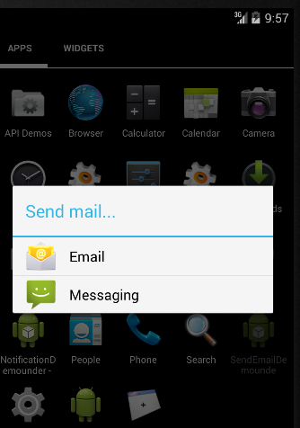

# Android发送电子邮件 - Android开发教程

在前面已经学会了 Android 的意图(Intent)，这是落实意图，即一个对象。来自一个部件的消息传递到另一个组件使用 - 在应用程序或应用程序之外。

因此这里不需要从头开始，因为它们已经可以像 Gmail 和 K9mail 开发电子邮件客户端。但需要从 Android 应用程序发送的电子邮件，编写一个活动Activity，使用Android设备发送电子邮件需要启动电子邮件客户端并发送电子邮件。为了这个目的，活动将伴随着相应的数据负载一个ACTION_SEND发送到 Android 意图解析器。指定选择器提供适当的接口供用户选择如何发送电子邮件数据。

以下部分说明 Intent 对象发送电子邮件。

## Intent 对象 - 动作发送电子邮件

使用ACTION_SEND 的动作启动 Android 设备上安装一个电子邮件客户端。以下是简单的语法创建一个Intent 用ACTION_SEND动作

```
Intent emailIntent = new Intent(Intent.ACTION_SEND);
```

## Intent 对象 - 数据/发送电子邮件的类型

要发送电子邮件，需要指定mailto：URI使用 setData() 方法并且数据类型是text/plain使用settype()方法如下：

```
emailIntent.setData(Uri.parse("mailto:"));
emailIntent.setType("text/plain");
```

## Intent 对象- 附加发送电子邮件

Android已经内置支持TO, SUBJECT, CC, TEXT等域，可以在附加 Intent 之前发送到目标的电子邮件客户端的Intent。可以使用额外的字段后电子邮件：

| S.N. | 额外数据 & 描述 |
| --- | --- |
| 1 | **EXTRA_BCC** 
 String[] 持有应密件复制电子邮件地址 |
| 2 | **EXTRA_CC** 
String[] 持有复制电子邮件地址 |
| 3 | **EXTRA_EMAIL** 
String[] 持有应递送到电子邮件地址 |
| 4 | **EXTRA_HTML_TEXT** 
与该意图相关联的常数字符串，使用 ACTION_SEND 替代 EXTRA_TEXT 为 HTML 格式的文本 |
| 5 | **EXTRA_SUBJECT** 
常量字符串持有一条消息的所需主题行 |
| 6 | **EXTRA_TEXT** 
与该意图相关联的CharSequence常量，具有ACTION_SEND用来提供文字数据被发送 |
| 7 | **EXTRA_TITLE** 
一个CharSequence对话框的标题，提供给用户在ACTION_CHOOSER使用时 |

下面是一个例子展示如何分配额外的数据到 intent

```
emailIntent.putExtra(Intent.EXTRA_EMAIL  , new String[]{"recipient@example.com"});
emailIntent.putExtra(Intent.EXTRA_SUBJECT, "subject of email");
emailIntent.putExtra(Intent.EXTRA_TEXT   , "body of email");
```

## 示例

下面的示例演示如何在实际使用Intent对象启动电子邮件客户端发送电子邮件给定的收件人。要测试这个例子，需要实际配备了最新的Android OS的移动设备，否则仿真器可能无法正常工作。其次，需要在您的设备上安装一个电子邮件客户端，如 Gmail 或 K9mail

| 步骤 | 描述 |
| --- | --- |
| 1 | 使用Android Studio创建Android应用程序，并将它命名为SendEmailDemounde。创建这个项目，确保目标SDK并编译在Android SDK为最新版本以及使用更高级别的API |
| 2 | 修改 src/MainActivity.java 文件，并添加所需的代码，以发送电子邮件 |
| 3 | 修改所需的布局XML文件_res/layout/activity_main.xml_ 添加GUI组件。这里添加一个简单的按钮，启动电子邮件客户端 |
| 4 | 修改_res/values/strings.xml_定义所需的常量值 |
| 5 | 修改 AndroidManifest.xml 如下所示 |
| 6 | 运行该应用程序启动 Android模拟器并验证应用程序所做的修改结果。 |

以下是修改的主活动文件的内容 src/com.yiibai.sendemaildemo/MainActivity.java.

```
package com.example.sendemaildemo;

import android.net.Uri;
import android.os.Bundle;
import android.app.Activity;
import android.content.Intent;
import android.util.Log;
import android.view.Menu;
import android.view.View;
import android.widget.Button;
import android.widget.Toast;

public class MainActivity extends Activity {

   @Override
   protected void onCreate(Bundle savedInstanceState) {
      super.onCreate(savedInstanceState);
      setContentView(R.layout.activity_main);

      Button startBtn = (Button) findViewById(R.id.sendEmail);
      startBtn.setOnClickListener(new View.OnClickListener() {
         public void onClick(View view) {
         sendEmail();
      }
   });

   }
   protected void sendEmail() {
      Log.i("Send email", "");

      String[] TO = {"amrood.admin@gmail.com"};
      String[] CC = {"mcmohd@gmail.com"};
      Intent emailIntent = new Intent(Intent.ACTION_SEND);
      emailIntent.setData(Uri.parse("mailto:"));
      emailIntent.setType("text/plain");

      emailIntent.putExtra(Intent.EXTRA_EMAIL, TO);
      emailIntent.putExtra(Intent.EXTRA_CC, CC);
      emailIntent.putExtra(Intent.EXTRA_SUBJECT, "Your subject");
      emailIntent.putExtra(Intent.EXTRA_TEXT, "Email message goes here");

      try {
         startActivity(Intent.createChooser(emailIntent, "Send mail..."));
         finish();
         Log.i("Finished sending email...", "");
      } catch (android.content.ActivityNotFoundException ex) {
         Toast.makeText(MainActivity.this, 
         "There is no email client installed.", Toast.LENGTH_SHORT).show();
      }
   }
   @Override
   public boolean onCreateOptionsMenu(Menu menu) {
      // Inflate the menu; this adds items to the action bar if it is present.
      getMenuInflater().inflate(R.menu.main, menu);
      return true;
   }
}
```

下面是文件 res/layout/activity_main.xml  的内容：

```
<LinearLayout xmlns:android="http://schemas.android.com/apk/res/android"
   android:layout_width="fill_parent"
   android:layout_height="fill_parent"
   android:orientation="vertical" >

   <Button android:id="@+id/sendEmail"
   android:layout_width="fill_parent"
   android:layout_height="wrap_content"
   android:text="@string/compose_email"/>

</LinearLayout>
```

下面文件 res/values/strings.xml 的内容中定义两个新的常量：

```
<?xml version="1.0" encoding="utf-8"?>
<resources>

    <string name="app_name">SendEmailDemo</string>
    <string name="hello_world">Hello world!</string>
    <string name="action_settings">Settings</string>
    <string name="compose_email">Compose Email</string>

</resources>
```

以下是文件 AndroidManifest.xml 默认的内容：

```
<?xml version="1.0" encoding="utf-8"?>
<manifest xmlns:android="http://schemas.android.com/apk/res/android"
    package="com.yiibai.sendemaildemo"
    android:versionCode="1"
    android:versionName="1.0" >

    <uses-sdk
        android:minSdkVersion="8"
        android:targetSdkVersion="17" />

    <application
        android:allowBackup="true"
        android:icon="@drawable/ic_launcher"
        android:label="@string/app_name"
        android:theme="@style/AppTheme" >
        <activity
            android:name="com.yiibai.sendemaildemo.MainActivity"
            android:label="@string/app_name" >
            <intent-filter>
                <action android:name="android.intent.action.MAIN" />

                <category android:name="android.intent.category.LAUNCHER" />
            </intent-filter>
        </activity>
    </application>
</manifest>
```

我们尝试运行SendEmailDemo 应用程序。Eclipse AVD安装的应用程序，并启动它，如果一切设置和应用都没有问题，它会显示以下模拟器窗口： 


选择移动设备作为一个选项，然后检查移动设备，这将显示以下画面：


现在使用Compose Email“按钮，列出了所有已安装的电子邮件客户端。从列表中，可以选择其中的电子邮件客户端发送电子邮件。要使用Gmail客户端发送电子邮件，将所有提供的默认值的字段，如下图所示。在这里，From：将默认的电子邮件ID，已经为Android设备注册。 

 选择 “email"后，如果没有配置帐号信息，则提示配置帐号信息： 

可以修改默认字段，最后使用“send email ”按钮（标有红色矩形）提到的收件人发送电子邮件。 代码下载地下：[http://pan.baidu.com/s/1qW2X0hm](http://pan.baidu.com/s/1qW2X0hm)

 