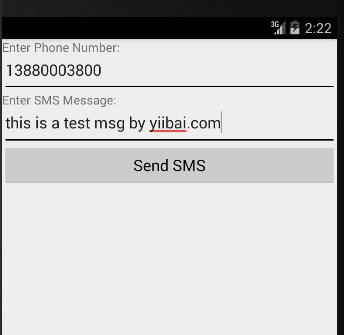
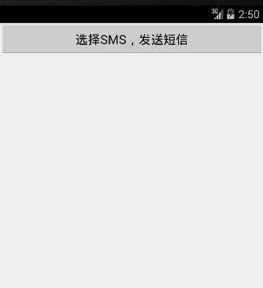
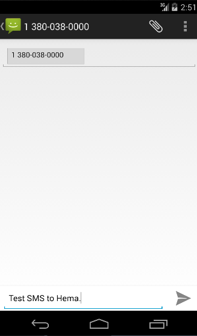

# Android发送短信/SMS - Android开发教程

有以下两种方式来使用 Android 设备发送短信：

*   使用 SmsManager 发送短信

*   使用内置 Intent 发送短信

## 使用SmsManager 发送短信

SmsManager管理，例如在给定的移动设备将数据发送到的SMS操作。可以创建此对象调用静态方法SmsManager.getDefault() 如下：

```
SmsManager smsManager = SmsManager.getDefault();
```

创建 SmsManager 对象之后，可以使用 sendDataMessage() 方法指定的手机号码发送短信，如下：

```
smsManager.sendTextMessage("phoneNo", null, "SMS text", null, null);
```

除了上述方法外，SmsManager类可供选择的其他几个重要的函数。下面列出了这些方法：

| S.N. | 方法和说明 |
| --- | --- |
| 1 | **ArrayList&lt;String&gt; divideMessage(String text)** 这个方法把一个消息文本分成几个片段，最大不能大于短信大小 |
| 2 | **static SmsManager getDefault()** 这个方法被用来获取 SmsManager 的默认实例 |
| 3 | **void sendDataMessage(String destinationAddress, String scAddress, short destinationPort, byte[] data, PendingIntent sentIntent, PendingIntent deliveryIntent)** 这个方法被用来发送一个基于数据 SMS 到特定的应用程序的端口 |
| 4 | **void sendMultipartTextMessage(String destinationAddress, String scAddress, ArrayList&lt;String&gt; parts, ArrayList&lt;PendingIntent&gt; sentIntents, ArrayList&lt;PendingIntent&gt; deliveryIntents)** 发送一个基于多部分文本短信 |
| 5 | **void sendTextMessage(String destinationAddress, String scAddress, String text, PendingIntent sentIntent, PendingIntent deliveryIntent)** 发送基于文本的短信 |

## 示例

下面的示例演示如何在实际中使用 SmsManager 对象给定的手机号码发送短信。

> 要尝试这个例子中，需要实际配备了最新 Android OS 的移动设备，否则仿真器可能无法正常工作。

| 步骤 | 描述 |
| --- | --- |
| 1 | 使用Android Studio 创建Android应用程序，并将它命名为SendSMSDemounder。在创建这个项目，确保目标 SDK 编译在Android SDK 的最新版本或使用更高级别的API |
| 2 | 修改 _src/MainActivity.java _文件，并添加所需的代码以发送短信 |
| 3 | 修改所需的布局XML文件 _res/layout/activity_main.xml_ 添加任何GUI组件。加入了一个简单的GUI以输入手机号码并短信发送，以及一个简单的按钮发送短信。 |
| 4 | 修改 _res/values/strings.xml _定义所需的常量值 |
| 5 | 修改  _AndroidManifest.xml_  如下所示 |
| 6 | 运行该应用程序启动Android模拟器并验证应用程序所做的修改结果。 |

以下是修改的主活动文件 src/com.yiibai.sendsmsdemo/MainActivity.java 的内容

```
package com.example.sendsmsdemo;

import android.os.Bundle;
import android.app.Activity;
import android.telephony.SmsManager;
import android.util.Log;
import android.view.Menu;
import android.view.View;
import android.widget.Button;
import android.widget.EditText;
import android.widget.Toast;

public class MainActivity extends Activity {

   Button sendBtn;
   EditText txtphoneNo;
   EditText txtMessage;

   @Override
   protected void onCreate(Bundle savedInstanceState) {
      super.onCreate(savedInstanceState);
      setContentView(R.layout.activity_main);

      sendBtn = (Button) findViewById(R.id.btnSendSMS);
      txtphoneNo = (EditText) findViewById(R.id.editTextPhoneNo);
      txtMessage = (EditText) findViewById(R.id.editTextSMS);

      sendBtn.setOnClickListener(new View.OnClickListener() {
         public void onClick(View view) {
            sendSMSMessage();
         }
      });

   }
   protected void sendSMSMessage() {
      Log.i("Send SMS", "");

      String phoneNo = txtphoneNo.getText().toString();
      String message = txtMessage.getText().toString();

      try {
         SmsManager smsManager = SmsManager.getDefault();
         smsManager.sendTextMessage(phoneNo, null, message, null, null);
         Toast.makeText(getApplicationContext(), "SMS sent.",
         Toast.LENGTH_LONG).show();
      } catch (Exception e) {
         Toast.makeText(getApplicationContext(),
         "SMS faild, please try again.",
         Toast.LENGTH_LONG).show();
         e.printStackTrace();
      }
   }
   @Override
   public boolean onCreateOptionsMenu(Menu menu) {
      // Inflate the menu; this adds items to the action bar if it is present.
      getMenuInflater().inflate(R.menu.main, menu);
      return true;
   }
}
```

下面是 **res/layout/activity_main.xml** 文件的内容：

```
<LinearLayout xmlns:android="http://schemas.android.com/apk/res/android"
android:layout_width="fill_parent"
android:layout_height="fill_parent"
android:orientation="vertical" >

   <TextView
   android:id="@+id/textViewPhoneNo"
   android:layout_width="wrap_content"
   android:layout_height="wrap_content"
   android:text="@string/phone_label" />

   <EditText
   android:id="@+id/editTextPhoneNo"
   android:layout_width="fill_parent"
   android:layout_height="wrap_content"
   android:inputType="phone"/>

   <TextView
   android:id="@+id/textViewMessage"
   android:layout_width="wrap_content"
   android:layout_height="wrap_content"
   android:text="@string/sms_label" />

   <EditText
   android:id="@+id/editTextSMS"
   android:layout_width="fill_parent"
   android:layout_height="wrap_content"
   android:inputType="textMultiLine"/>

   <Button android:id="@+id/btnSendSMS"
   android:layout_width="fill_parent"
   android:layout_height="wrap_content"
   android:text="@string/send_sms_label"/>

</LinearLayout>
```

下面文件 res/values/strings.xml 的内容中定义两个新的常量：

```
<?xml version="1.0" encoding="utf-8"?>
<resources>

    <string name="app_name">SendSMSDemo</string>
    <string name="action_settings">Settings</string>
    <string name="hello_world">Hello world!</string>
    <string name="phone_label">Enter Phone Number:</string>
    <string name="sms_label">Enter SMS Message:</string>
    <string name="send_sms_label">Send SMS</string>

</resources>
```

以下是**AndroidManifest.xml** 文件的默认内容：

```
<?xml version="1.0" encoding="utf-8"?>
<manifest xmlns:android="http://schemas.android.com/apk/res/android"
    package="com.yiibai.sendsmsdemo"
    android:versionCode="1"
    android:versionName="1.0" >

    <uses-sdk
        android:minSdkVersion="8"
        android:targetSdkVersion="17" />
    <uses-permission android:name="android.permission.SEND_SMS" />

    <application
        android:allowBackup="true"
        android:icon="@drawable/ic_launcher"
        android:label="@string/app_name"
        android:theme="@style/AppTheme" >
        <activity
            android:name="com.yiibai.sendsmsdemo.MainActivity"
            android:label="@string/app_name" >
            <intent-filter>
                <action android:name="android.intent.action.MAIN" />

                <category android:name="android.intent.category.LAUNCHER" />
            </intent-filter>
        </activity>
    </application>

</manifest>
```

我们尝试运行 SendSMSDemo 应用程序。Eclipse的AVD上安装的应用程序，并启动它，如果一切的设置和应用代码都没有问题，它会显示以下模拟器窗口： 


选择移动设备作为一个选项，然后检查移动设备，这将显示以下画面：



现在可以输入手机号码及文本消息并发送。最后点击"Send SMS"按钮发送短信。请确保GSM连接工作正常，以及提供正确的短信收件人。

可以把一些短信用逗号分隔，在程序中把它解析为一个数组的字符串，最后可以使用一个循环来发送消息给所有给定的手机号码。下一节将学习如何使用现有的 SMS 客户端发送短信。

## 使用内置Intent发送短信

发送短信通过调用Android内置短信功能，可以使用Android的Intent。以下部分说明使用 Intent 对象发送短信的功能。

## Intent对象 - 发送短信动作

使用ACTION_VIEW 动作启动 Android 设备上安装 SMS 客户端。以下是简单的语法来创建一个 Intent 来使用 ACTION_VIEW 动作

```
Intent smsIntent = new Intent(Intent.ACTION_VIEW);
```

## Intent对象 - 数据/发送短信类型

要发送的短信需要使用SetData()方法指定 smsto: 作为URI和数据类型将使用 setType() 方法如下vnd.android-dir/mms-sms： 

```
smsIntent.setData(Uri.parse("smsto:"));
smsIntent.setType("vnd.android-dir/mms-sms");
```

## Intent 对象- 附加发送短信

Android已经内置支持添加电话号码和短信发送短信如下：

```
smsIntent.putExtra("address"  , new String("0123456789;3393993300"));
smsIntent.putExtra("sms_body"  , "Test SMS to Angilla");
```

> 这里address 和sms_body是大小写敏感的，应以小字符指定。可以指定一个以上的号码在单串，但由分号（;) 隔开。

## 示例

下面的示例演示如何在实际使用Intent对象启动SMS客户端发送短信给定的收件人。

> 要尝试这个例子中，需要实际配备了最新的 Android OS的移动设备，否则仿真器可能无法正常工作。

| 步骤 | 描述 |
| --- | --- |
| 1 | 使用Android Studio创建Android应用程序，并将它命名为SendSMSDemounder，创建这个项目，确保目标 SDK编译在Android SDK的最新版本或使用更高级别的API。 |
| 2 | 修改_src/MainActivity.java_文件，并添加所需的代码，以发送短信。 |
| 3 | 修改所需的布局XML文件 _res/layout/activity_main.xml_  添加任何GUI组件。添加一个简单的按钮用来触发启动SMS客户端。 |
| 4 | 修改 _res/values/strings.xml_ 定义所需的常量值 |
| 5 | 修改 AndroidManifest.xml 如下所示 |
| 6 | 运行该应用程序启动Android模拟器并验证应用程序所做的修改结果。 |

以下是修改主活动文件 src/com.yiibai.sendsmsdemo/MainActivity.java 的内容

```
package com.example.sendsmsdemo;

import android.net.Uri;
import android.os.Bundle;
import android.app.Activity;
import android.content.Intent;
import android.util.Log;
import android.view.Menu;
import android.view.View;
import android.widget.Button;
import android.widget.Toast;

public class MainActivity extends Activity {

   @Override
   protected void onCreate(Bundle savedInstanceState) {
      super.onCreate(savedInstanceState);
      setContentView(R.layout.activity_main);

      Button startBtn = (Button) findViewById(R.id.sendSMS);
      startBtn.setOnClickListener(new View.OnClickListener() {
         public void onClick(View view) {
         sendSMS();
      }
   });

   }
   protected void sendSMS() {
      Log.i("Send SMS", "");

      Intent smsIntent = new Intent(Intent.ACTION_VIEW);
      smsIntent.setData(Uri.parse("smsto:"));
      smsIntent.setType("vnd.android-dir/mms-sms");

      smsIntent.putExtra("address"  , new String ("0123456789"));
      smsIntent.putExtra("sms_body"  , "Test SMS to Angilla");
      try {
         startActivity(smsIntent);
         finish();
         Log.i("Finished sending SMS...", "");
      } catch (android.content.ActivityNotFoundException ex) {
         Toast.makeText(MainActivity.this, 
         "SMS faild, please try again later.", Toast.LENGTH_SHORT).show();
      }
   }
   @Override
   public boolean onCreateOptionsMenu(Menu menu) {
      // Inflate the menu; this adds items to the action bar if it is present.
      getMenuInflater().inflate(R.menu.main, menu);
      return true;
   }
}
```

下面是 **res/layout/activity_main.xml** 文件的内容：

```
<LinearLayout xmlns:android="http://schemas.android.com/apk/res/android"
   android:layout_width="fill_parent"
   android:layout_height="fill_parent"
   android:orientation="vertical" >

   <Button android:id="@+id/sendSMS"
   android:layout_width="fill_parent"
   android:layout_height="wrap_content"
   android:text="@string/compose_sms"/>

</LinearLayout>
```

下面文件 res/values/strings.xml 的内容中定义两个新的常量：

```
<?xml version="1.0" encoding="utf-8"?>
<resources>

    <string name="app_name">SendSMSDemo</string>
    <string name="hello_world">Hello world!</string>
    <string name="action_settings">Settings</string>
    <string name="compose_sms">Compose SMS</string>

</resources>
```

以下是**AndroidManifest.xml** 文件的默认内容：

```
<?xml version="1.0" encoding="utf-8"?>
<manifest xmlns:android="http://schemas.android.com/apk/res/android"
    package="com.yiibai.sendsmsdemo"
    android:versionCode="1"
    android:versionName="1.0" >

    <uses-sdk
        android:minSdkVersion="8"
        android:targetSdkVersion="17" />

    <application
        android:allowBackup="true"
        android:icon="@drawable/ic_launcher"
        android:label="@string/app_name"
        android:theme="@style/AppTheme" >
        <activity
            android:name="com.yiibai.sendsmsdemo.MainActivity"
            android:label="@string/app_name" >
            <intent-filter>
                <action android:name="android.intent.action.MAIN" />

                <category android:name="android.intent.category.LAUNCHER" />
            </intent-filter>
        </activity>
    </application>
</manifest>
```

我们尝试运行 SendSMSDemo 应用程序。 Eclipse AVD安装的应用程序，并启动它，如果一切设置和应用都没有问题，它会显示以下模拟器窗口： 


选择移动设备作为一个选项，然后检查移动设备，这将显示以下画面：



现在使用Compose SMS“按钮推出Android内置的SMS客户端，如下图所示：



可以修改默认字段最后使用发送短信按钮（标有红色矩形）提到收件人发送短信。 以上示例代码下载：[http://pan.baidu.com/s/1c0Ah508](http://pan.baidu.com/s/1c0Ah508)

 