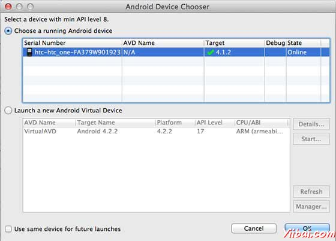

# Android拨打电话 - Android开发教程

每一个Android设备特别是手机都提供一个拨打电话功能，但仍然需要编写一个应用程序，给用户一个选择使用硬编码的电话号码拨打电话。

本章列出了一个简单的步骤来创建一个应用程序，它可以用来拨打电话。使用 Android 的 Intent 通过调用Android内置的电话通话功能。以下部分说明 Intent 对象的拨打电话功能 。

## Intent 对象 - 操作拨打电话

使用 ACTION_CALL 动作触发Android设备内置电话功能。以下是简单的语法用来创建一个Intent 的 ACTION_CALL 动作

```
Intent phoneIntent = new Intent(Intent.ACTION_CALL);
```

可以使用 ACTION_DIAL 动作，而不是 ACTION_CALL，在这种情况下，在使用选项来修改硬编码的电话号码拨打电话之前，而不是直接调用的。

## Intent 对象 - 数据/电话呼叫类型

这里给定电话为 13800138000 拨打一个电话，需要使用setData()方法指定URI为  tel：如下：

```
phoneIntent.setData(Uri.parse("tel:13800138000"));
```

要注意的一点是，拨打电话不需要任何额外的数据或数据类型指定。

## 示例

下面的示例演示如何在实际使用 Android Intent 打电话给定的手机号码。

> 要尝试这个例子中，需要实际配备了最新的 Android OS 移动设备，否则仿真器可能无法正常工作。

| 步骤 | 描述 |
| --- | --- |
| 1 | 使用Android Studio创建Android应用程序，并将它命名为PhoneCallDemounder。创建这个项目，确保目标 SDK编译在 Android SDK 的最新版本或使用更高级别的API |
| 2 | 修改 _src/MainActivity.java_ 文件，并添加所需的代码，以拨打电话 |
| 3 | 修改所需的布局XML文件 _res/layout/activity_main.xml_ 添加GUI组件。添加一个简单的按钮来拨打号码：13800138000 |
| 4 | 修改  _res/values/strings.xml_  定义所需的常数值 |
| 5 | 修改 AndroidManifest.xml 如下所示 |
| 6 | 运行该应用程序启动 Android模拟器并验证应用程序所做的修改结果 |

以下是修改主活动文件 src/com.yiibai.phonecalldemo/MainActivity.java 的内容如下：

```
package com.yiibai.phonecalldemo;

import android.net.Uri;
import android.os.Bundle;
import android.app.Activity;
import android.content.Intent;
import android.util.Log;
import android.view.Menu;
import android.view.View;
import android.widget.Button;
import android.widget.Toast;

public class MainActivity extends Activity {

   @Override
   protected void onCreate(Bundle savedInstanceState) {
      super.onCreate(savedInstanceState);
      setContentView(R.layout.activity_main);

      Button startBtn = (Button) findViewById(R.id.makeCall);
      startBtn.setOnClickListener(new View.OnClickListener() {
         public void onClick(View view) {
         makeCall();
      }
   });

   }
   protected void makeCall() {
      Log.i("Make call", "");

      Intent phoneIntent = new Intent(Intent.ACTION_CALL);
      phoneIntent.setData(Uri.parse("tel:91-800-001-0101"));

      try {
         startActivity(phoneIntent);
         finish();
         Log.i("Finished making a call...", "");
      } catch (android.content.ActivityNotFoundException ex) {
         Toast.makeText(MainActivity.this, 
         "Call faild, please try again later.", Toast.LENGTH_SHORT).show();
      }
   }
   @Override
   public boolean onCreateOptionsMenu(Menu menu) {
      // Inflate the menu; this adds items to the action bar if it is present.
      getMenuInflater().inflate(R.menu.main, menu);
      return true;
   }
}
```

下面是 **res/layout/activity_main.xml** 文件的内容：

```
<LinearLayout xmlns:android="http://schemas.android.com/apk/res/android"
   android:layout_width="fill_parent"
   android:layout_height="fill_parent"
   android:orientation="vertical" >

   <Button android:id="@+id/makeCall"
   android:layout_width="fill_parent"
   android:layout_height="wrap_content"
   android:text="@string/make_call"/>

</LinearLayout>
```

下面文件 res/values/strings.xml 的内容中定义两个新的常量：

```
<?xml version="1.0" encoding="utf-8"?>
<resources>

    <string name="app_name">PhoneCallDemo</string>
    <string name="hello_world">Hello world!</string>
    <string name="action_settings">Settings</string>
    <string name="make_call">Call 91-800-001-0101</string>

</resources>
```

以下是**AndroidManifest.xml** 文件的默认内容：

```
<?xml version="1.0" encoding="utf-8"?>
<manifest xmlns:android="http://schemas.android.com/apk/res/android"
    package="com.yiibai.phonecalldemo"
    android:versionCode="1"
    android:versionName="1.0" >

    <uses-sdk
        android:minSdkVersion="8"
        android:targetSdkVersion="17" />
   <uses-permission android:name="android.permission.CALL_PHONE" />
   <uses-permission android:name="android.permission.READ_PHONE_STATE" />

    <application
        android:allowBackup="true"
        android:icon="@drawable/ic_launcher"
        android:label="@string/app_name"
        android:theme="@style/AppTheme" >
        <activity
            android:name="com.yiibai.phonecalldemo.MainActivity"
            android:label="@string/app_name" >
            <intent-filter>
                <action android:name="android.intent.action.MAIN" />

                <category android:name="android.intent.category.LAUNCHER" />
            </intent-filter>
        </activity>
    </application>
</manifest>
```

我们尝试运行PhoneCallDemo 应用程序。Eclipse AVD安装的应用程序，并启动它，如果一切设置和应用代码都没有问题，它会显示以下模拟器窗口： 



选择移动设备作为一个选项，然后检查移动设备，这将显示以下画面：


现在使用按钮拨打138001380000，如下所示：

 以上代码下载： [http://pan.baidu.com/s/1hq1RSuK](http://pan.baidu.com/s/1hq1RSuK)   