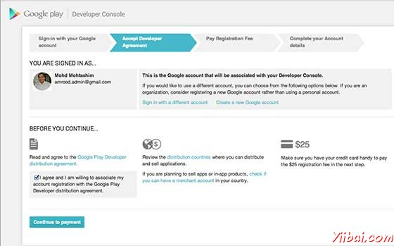

# 发布Android应用 - Android开发教程

Android应用程序的发布是一个过程，让Android的应用程序提供给用户。发布的Android应用程序开发过程的最后阶段。

一旦开发和全面测试Android应用程序，就可以开始销售或分发免费使用谷歌播放（著名的Android市场）。也可以发布应用程序，通过它们直接发送给用户，让用户下载他们从自己的网站。

在Android官方网站上，可以检查详细的出版过程中，但本教程将通过简单的步骤来启动应用程序，谷歌播放。下面是一个简化的检查清单，这将帮助在推出Android应用程序：

| 步骤 | Activity |
| --- | --- |
| 1 | **Regression Testing** Before you publish your application, you need to make sure that its meeting the basic quality expectations for all Android apps, on all of the devices that you are targeting. So perform all the required testing on different devices including phone and tablets. |
| 2 | **Application Rating** When you will publish your application at Google Play, you will have to specify a content rating for your app, which informs Google Play users of its maturity level. Currently available ratings are (a) Everyone (b) Low maturity (c) Medium maturity (d) High maturity. |
| 3 | **Targeted Regions** Google Play lets you control what countries and territories where your application will be sold. Accordingly you must take care of setting up time zone, localization or any other specific requirement as per the targeted region. |
| 4 | **Application Size** Currently, the maximum size for an APK published on Google Play is 50 MB. If your app exceeds that size, or if you want to offer a secondary download, you can use APK Expansion Files, which Google Play will host for free on its server infrastructure and automatically handle the download to devices. |
| 5 | **SDK and Screen Compatibility** It is important to make sure that your app is designed to run properly on the Android platform versions and device screen sizes that you want to target. |
| 6 | **Application Pricing** Deciding whether you app will be free or paid is important because, on Google Play, free apps must remain free. If you want to sell your application then you will have to specify its price in different currencies. |
| 7 | **Promotional Content** It is a good marketing practice to supply a variety of high-quality graphic assets to showcase your app or brand. After you publish, these appear on your product details page, in store listings and search results, and elsewhere. |
| 8 | **Build and Upload release-ready APK** The release-ready APK is what you you will upload to the Developer Console and distribute to users. You can check complete detail on how to create a release-ready version of your app: [Preparing for Release](http://developer.android.com/tools/publishing/preparing.htmll). |
| 9 | **Finalize Application Detail** Google Play gives you a variety of ways to promote your app and engage with users on your product details page, from colorful graphics, screenshots, and videos to localized descriptions, release details, and links to your other apps. So you can decorate your application page and provide as much as clear crisp detail you can provide. |

## 导出Android应用

作为一个APK（Android包）文件，需要将应用程序导出之前上传谷歌播放市场。

要导出应用程序，只要打开该应用程序的Eclipse项目中，从Eclipse中选择File-&gt;Export 并按照简单的步骤来导出应用程序：

接下来选择 Export Android Application“选项，在上面的屏幕截图所示，然后单击”Next “，再 Next ，这样得到的画面，在那里选择”Create new keystore" 来存储应用程序。

输入密码来保护应用程序，并单击“Next ”按钮，再次。它会显示以下画面，让应用程序创建一个密钥：

一旦填写的所有信息，单击“Next ”按钮，最后它会问申请将导出的位置：

最后，单击“Finish ”按钮，生成Android应用程序包文件将被上传在谷歌播放市场。

## 谷歌播放注册

最重要的一步是注册谷歌播放使用[谷歌播放市场](http://play.google.com/apps/publish/)。可以使用您现有的Google ID，如果没有可以创建一个新的Google ID，然后注册与市场。将有以下屏幕接受的条款和条件。

可以使用Continue to payment“按钮，继续进行付款登记费$25，并最终完成帐户细节。

一旦你是一个注册用户在Google Play，您可以上传您的应用程序release-ready APK，最后将完成应用程序的详细使用上述清单的第9步中提到的应用程序的详细页面。 

