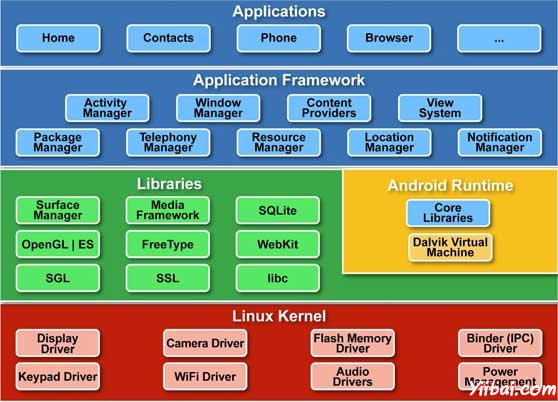

# Android 架构 - Android开发教程

Android操作系统是一个堆栈的软件组件，它大致分为五个部分和四个主要层的体系结构，如下图所示。

## Linux内核

在层次的底部是 Linux - Linux 2.6。它提供基本的系统功能，如进程管理，内存管理，设备管理，如：相机，键盘，显示器等内核处理的事情，Linux 确实不错，如网络设备驱动程序比较多，内搭外围硬件接口。

## 程序库

在Linux内核之上，有一个组库，包括开放源码的 Web浏览器引擎WebKit，libc库，SQLite数据库，这是一个非常有用的库，用于存储和共享应用程序数据，播放和录制音频和视频，SSL库负责互联网安全等。

## Android运行时

这是体系结构第三个部分并在第二层之上由底部提供。本节提供了一个关键的组件，叫做[Java](http://www.yiibai.com/java)虚拟机，是一种专门设计和优化的 Android Dalvik 虚拟机。

Dalvik虚拟机使用的Linux核心功能，如内存管理和多线程，在Java语言中是内在的。 Dalvik虚拟机将每一个Android应用程序运行在自己的进程中，使用Dalvik虚拟机实例。

Android还提供了一组核心库，使Android应用程序开发人员使用标准的Java编程语言编写Android应用程序。

## 应用程序框架

应用程序框架层使用Java类形式的应用程序提供了许多的更高级别的服务。允许应用程序开发人员在其应用程序中使用这些服务。

## 应用

在最上层，即所有的 Android 应用程序。一般我们编写的应用程序只被安装在这层。应用的例子如：浏览器，游戏等。

 