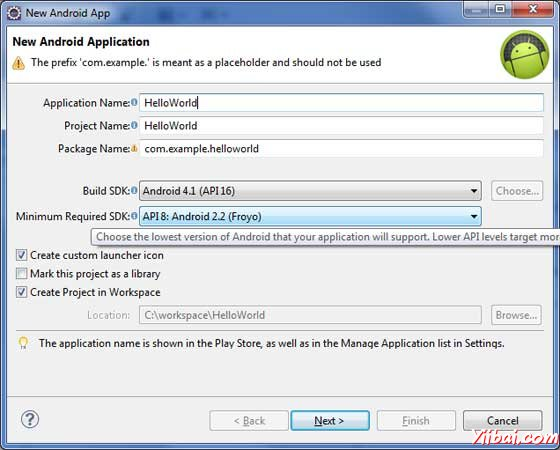
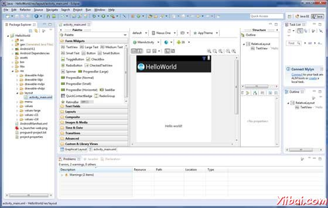
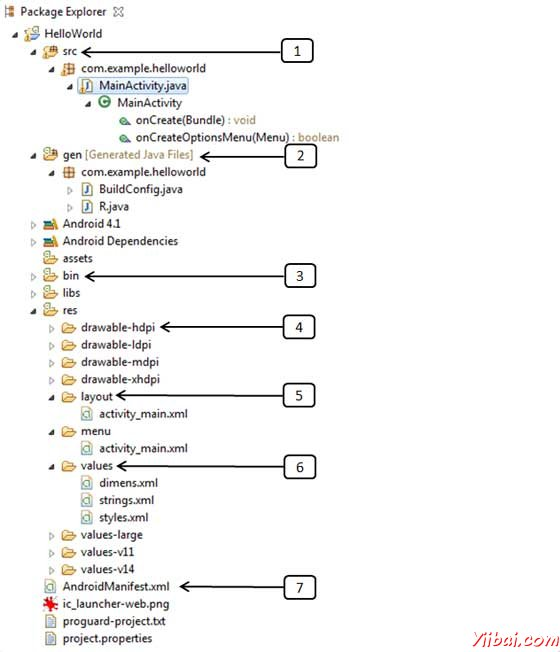
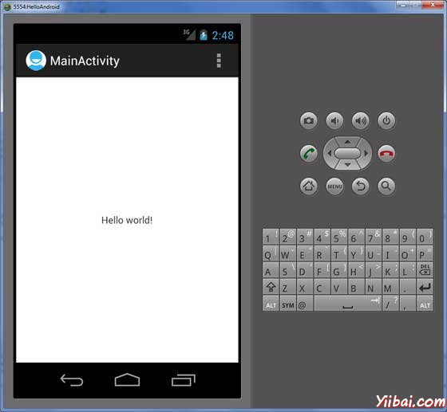

# Android Hello World示例 - Android开发教程

让我们开始实际的Android编程。在开始使用Android SDK编写的第一个例子之前，必须确保设置正确的Android开发环境 - [环境设置教程](http://www.yiibai.com/android/android_environment_setup.html)。也假设你有一点 Eclipse IDE 操作知识。 

因此，现在编写一个简单的Android应用程序，它将打印 "Hello World!".

## 创建Android应用

第一步：使用Eclipse IDE创建一个简单的Android应用程序。按照选择File -&gt; New -&gt; Project ，最后从向导列表选择 Android New Application 。现在，应用程序命名为 HelloWorld 使用向导窗口如下： 



接下来，按照所提供的指示，并保持所有其他项为默认，直到最后一步。项目创建成功后，将有以下项目的画面：



## Android应用解剖

在运行应用程序之前，应该注意在Android项目的几个目录和文件：



| S.N. | 文件夹、文件和说明 |
| --- | --- |
| 1 | **src** 这包含项目java源文件。默认情况下，它包括一个 MainActivity.java源文件的活动类，应用程序运行时使用的应用程序图标启动 |
| 2 | **gen** 这包含了R文件，编译器生成的文件在项目中找到的所有资源。不要修改这个文件。 |
| 3 | **bin** 此文件夹包含了Android APK包文件。ADT在创建生成过程中一切需要运行一个Android应用程序 |
| 4 | **res/drawable-hdpi** 被设计用于高密度的屏幕可绘制的对象目录 |
| 5 | **res/layout** 这是一个目录文件，定义应用程序的用户界面 |
| 6 | **res/values** 这是一个目录，包含各种XML文件，其中包含资源的集合，如字符串和颜色定义 |
| 7 | **AndroidManifest.xml** 这是文件列表，该文件描述了应用程序的基本特征，并定义每个组件 |

下面的部分将简要介绍一些重要的应用程序文件。

## 主要活动Activity 文件

主要活动代码是Java文件：MainActivity.java。这是实际的应用程序文件，最终被转换 Dalvik 可执行的文件，并运行应用程序。以下是默认的Hello World 应用的程序向导生成的代码：

```
package com.example.helloworld;

import android.os.Bundle;
import android.app.Activity;
import android.view.Menu;
import android.view.MenuItem;
import android.support.v4.app.NavUtils;

public class MainActivity extends Activity {

    @Override
    public void onCreate(Bundle savedInstanceState) {
        super.onCreate(savedInstanceState);
        setContentView(R.layout.activity_main);
    }
    @Override
    public boolean onCreateOptionsMenu(Menu menu) {
        getMenuInflater().inflate(R.menu.activity_main, menu);
        return true;
    }
}
```

在这里，R.layout.activity_main 是指位于在 res/layout 文件夹的 activity_main.xml 文件。onCreate()方法是加载一个活动时，被触发的许多方法之一。

## Manifest 文件

组件是开发应用程序的一部分，必须声明其所有组件在 AndroidManifest.xml 中，应用程序项目的根目录在 amanifest 文件。此文件作为Android操作系统和应用程序之间的接口。例如，默认 manifest 文件将看起来如以下文件：

```
<manifest xmlns:android="http://schemas.android.com/apk/res/android"
   package="com.example.helloworld"
   android:versionCode="1"
   android:versionName="1.0" >
   <uses-sdk
      android:minSdkVersion="8"
      android:targetSdkVersion="15" />
   <application
       android:icon="@drawable/ic_launcher"
       android:label="@string/app_name"
       android:theme="@style/AppTheme" >
       <activity
           android:name=".MainActivity"
           android:label="@string/title_activity_main" >
           <intent-filter>
               <action android:name="android.intent.action.MAIN" />
               <category android:name="android.intent.category.LAUNCHER"/>
           </intent-filter>
       </activity>
   </application>
</manifest>
```

这里&lt;application&gt;...&lt;/application&gt;标记括起相关应用程序的组件。属性android:icon将指向应用程序图标，可在res/drawable-hdpi 之下找到。应用程序使用位于图像绘制文件夹，文件名为 ic_launcher.png 。

&lt;activity&gt;标签是用来指定活动，属性android:name指定活动子类，android类完全限定android:label 属性指定一个字符串作为标签使用的活动。可以使用&lt;activity&gt;标签指定多个活动。

intent 过滤器的动作被命名为android.intent.action.MAIN，表示这个活动作为应用程序的入口点。类的意图过滤器是namedandroid.intent.category.LAUNCHER声明，应用程序可以从设备的启动图标启动。

@string是指 strings.xml文件，解释如下。@string/app_name是strings.xml文件中的app_name是“HelloWorld” 定义的字符串。类似的方式，其他的字符串填充到应用中。 

以下是使用manifest 文件中指定不同的 Android 应用程序组件的标签列表：

*   &lt;activity&gt; 活动的元素

*   &lt;service&gt; 服务的元素

*   &lt;receiver&gt; 广播接收器的元素

*   &lt;provider&gt; 内容提供者的元素

## Strings 文件

strings.xml文件在 res/values 文件夹，它包含了所有应用程序所使用的文本。例如，按钮，标签，默认的文本和字符串类型相似的名称都在这个文件。这个文件是负责为他们的文字内容。例如，默认字符串文件看起来像以下文件：

```
<resources>
    <string name="app_name">HelloWorld</string>
    <string name="hello_world">Hello world!</string>
    <string name="menu_settings">Settings</string>
    <string name="title_activity_main">MainActivity</string>
</resources>
```

## R.java 文件

gen/com.example.helloworld/R.java文件就像MainActivity.java 和Java文件strings.xml等资源之间的胶水。这是一个自动生成的文件，不要修改R.java文件的内容。R.java文件下面是一个示例：

```
/* AUTO-GENERATED FILE.  DO NOT MODIFY.
 *
 * This class was automatically generated by the
 * aapt tool from the resource data it found.  It
 * should not be modified by hand.
 */

package com.example.helloworld;

public final class R {
    public static final class attr {
    }
    public static final class dimen {
        public static final int padding_large=0x7f040002;
        public static final int padding_medium=0x7f040001;
        public static final int padding_small=0x7f040000;
    }
    public static final class drawable {
        public static final int ic_action_search=0x7f020000;
        public static final int ic_launcher=0x7f020001;
    }
    public static final class id {
        public static final int menu_settings=0x7f080000;
    }
    public static final class layout {
        public static final int activity_main=0x7f030000;
    }
    public static final class menu {
        public static final int activity_main=0x7f070000;
    }
    public static final class string {
        public static final int app_name=0x7f050000;
        public static final int hello_world=0x7f050001;
        public static final int menu_settings=0x7f050002;
        public static final int title_activity_main=0x7f050003;
    }
    public static final class style {
        public static final int AppTheme=0x7f060000;
    }
}
```

## 布局文件

activity_main.xml是在res/layout 目录，所引用应用程序接口布局文件。要修改应用程序的布局这个文件非常频繁地被修改。“Hello World ”应用中，这个文件默认布局，内容如下： 

```
<RelativeLayout xmlns:android="http://schemas.android.com/apk/res/android"
   xmlns:tools="http://schemas.android.com/tools"
   android:layout_width="match_parent"
   android:layout_height="match_parent" >

   <TextView
       android:layout_width="wrap_content"
       android:layout_height="wrap_content"
       android:layout_centerHorizontal="true"
       android:layout_centerVertical="true"
       android:padding="@dimen/padding_medium"
       android:text="@string/hello_world"
       tools:context=".MainActivity" />

</RelativeLayout>
```

这是一个简单的相对布局，我们将在一个单独的章节学习其它复杂例子。TextView是被用来构建图形用户界面并由Android控制，它有各种各样的Android属性，如：android:layout_width, android:layout_height 等被用来设置其宽度和高度等等，@string是指位于strings.xml文件在文件夹res/values中。因此，@string/hello_world 指 hello 定义的字符串在 strings.xml 文件中的 “Hello World!” 字符串。

## 运行应用程序

让我们试着来运行 Hello World！应用程序。假设创建了AVD，同时做了环境设置。打开Eclipse运行应用程序，打开一个项目的活动文件，并单击“Run” 工具栏上的图标。 Eclipse 在 AVD上安装的应用程序后并启动它，如果一切都设置并应用没有问题，它会显示以下模拟器窗口：



恭喜！开发的第一款Android应用程序完成，现在只要把下面剩余的教程一步一步学习，一定能成为一个熟练的 Android开发者。

 