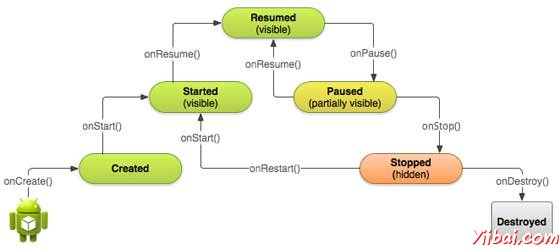
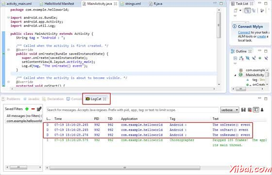

# Android Activity - Android开发教程

活动(activity)表示一个单一屏幕上的用户界面。例如，电子邮件应用程序可能是一个活动，显示新的电子邮件列表是另一个活动，撰写电子邮件，阅读电子邮件可能又是其它的活动。如果应用程序有一个以上的活动，那么应该将其中的一个活动标记为活动启动应用程序。

如果曾使用C，C++或[Java](http://www.yiibai.com/java)编程语言，那么可以知道一般程序是从 main() 函数开始。相似地，Android系统是一个Activity 的 onCreate() 方法调用开始启动程序。一个回调方法 - 启动一个活动，以及其它回调方法，如销毁一个活动，活动的生命周期如下图所示序列：



Activity类定义了以下的回调方法，即事件。并不需要实现所有的回调方法。然而重要的是了解每一个变化以及实现，以确保应用程序如用户所期望的行为或方式。

| 回调方法 | 描述 |
| --- | --- |
| onCreate() | 这是第一次回调，活动在第一次创建时调用。 |
| onStart() | 这个回调被称为活动时变成对用户可见。 |
| onResume() | 这就是所谓的启动，当用户与应用程序交互。 |
| onPause() | 暂停活动不接收用户输入并不执行任何代码并调用时，当前的活动被暂停，恢复以前的活动。 |
| onStop() | 这个回调被称为活动时不再可见 |
| onDestroy() | 活动前由系统被销毁，调用此回调 |
| onRestart() | 活动重新启动时，停止后调用此回调 |

## 例子

这个例子通过简单的步骤，显示Android应用程序活动的生命周期。按照下面的步骤来修改Android应用程序，在创建的 Hello World 范例章节：

| 步骤 | 描述 |
| --- | --- |
| 1 | 我们将使用Eclipse IDE中创建一个Android应用程序，并将其命名在 HelloWorld 的包下，如：com.example.helloworld的Hello World范例章节解释。 |
| 2 | 修改Main活动文件MainActivity.java,其余文件保持不变。 |
| 3 | 运行该应用程序启动Android模拟器并验证应用程序中所做的更改结果。 |

以下是修改主要活动文件src/com.example.helloworld/MainActivity.java后的内容，该文件包含了每个基本生命周期方法。 Log.d() 方法是用来生成日志消息： 

```
package com.example.helloworld;

import android.os.Bundle;
import android.app.Activity;
import android.util.Log;

public class MainActivity extends Activity {
   String msg = "Android : ";

   /** Called when the activity is first created. */
   @Override
   public void onCreate(Bundle savedInstanceState) {
      super.onCreate(savedInstanceState);
      setContentView(R.layout.activity_main);
      Log.d(msg, "The onCreate() event");
   }

   /** Called when the activity is about to become visible. */
   @Override
   protected void onStart() {
      super.onStart();
      Log.d(msg, "The onStart() event");
   }

   /** Called when the activity has become visible. */
   @Override
   protected void onResume() {
      super.onResume();
      Log.d(msg, "The onResume() event");
   }

   /** Called when another activity is taking focus. */
   @Override
   protected void onPause() {
      super.onPause();
      Log.d(msg, "The onPause() event");
   }

   /** Called when the activity is no longer visible. */
   @Override
   protected void onStop() {
      super.onStop();
      Log.d(msg, "The onStop() event");
   }

   /** Called just before the activity is destroyed. */
   @Override
   public void onDestroy() {
      super.onDestroy();
      Log.d(msg, "The onDestroy() event");
   }
}
```

活动类加载UI组件，使用在项目的 res/layout 文件夹的XML文件。下面的语句从 res/layout/activity_main.xml 文件加载UI组件：

```
setContentView(R.layout.activity_main);
```

应用程序可以有一个或多个活动受任何限制。每个活动定义为应用程序必须在AndroidManifest.xml文件中声明，必须声明应用程序的主要活动列表&lt;intent-filter&gt;，包括如下**MAIN** 操作和 **LAUNCHER** 类：

```
<manifest xmlns:android="http://schemas.android.com/apk/res/android"
   package="com.example.helloworld"
   android:versionCode="1"
   android:versionName="1.0" >
   <uses-sdk
      android:minSdkVersion="8"
      android:targetSdkVersion="15" />
   <application
       android:icon="@drawable/ic_launcher"
       android:label="@string/app_name"
       android:theme="@style/AppTheme" >
       <activity
           android:name=".MainActivity"
           android:label="@string/title_activity_main" >
           <intent-filter>
               <action android:name="android.intent.action.MAIN" />
               <category android:name="android.intent.category.LAUNCHER"/>
           </intent-filter>
       </activity>
   </application>
</manifest>
```

如果 MAIN 动作或LAUNCHER类不声明一个活动，那么应用程序图标将不会出现在应用程序列表的主屏幕上。 

现在尝试运行修改后的 Hello World！应用程序。假设已经创建了AVD，同时做环境设置。从Eclipse运行应用程序，打开一个项目的活动文件，并单击“**Run**”  图标。Eclipse 在 AVD上安装应用程序，并启动它，如果设置和应用都没有问题，它会显示仿真器窗口中，也应该看到以下日志消息在Eclipse IDE LogCat 窗口：

```
07-19 15:00:43.405: D/Android :(866): The onCreate() event
07-19 15:00:43.405: D/Android :(866): The onStart() event
07-19 15:00:43.415: D/Android :(866): The onResume() event

```



点击红色按钮 - 在Android模拟器上的红色按钮，它会在Eclipse IDE窗口LogCat中生成以下事件消息：  

```
07-19 15:01:10.995: D/Android :(866): The onPause() event
07-19 15:01:12.705: D/Android :(866): The onStop() event

```

让我们再次尝试单击菜单按钮 - Android菜单按钮在Android模拟器中，它会在Eclipse IDE 的 LogCat窗口中生成以下事件消息： 

```
07-19 15:01:13.995: D/Android :(866): The onStart() event
07-19 15:01:14.705: D/Android :(866): The onResume() event

```

接下来，就让我们再次尝试点击后退按钮 - Android后退按钮在Android模拟器，它会生成以下事件消息在Eclipse IDE LogCat窗口中，以上完成Android应用程序Acitivity 的生命周期。 

```
07-19 15:33:15.687: D/Android :(992): The onPause() event
07-19 15:33:15.525: D/Android :(992): The onStop() event
07-19 15:33:15.525: D/Android :(992): The onDestroy() event
```

 