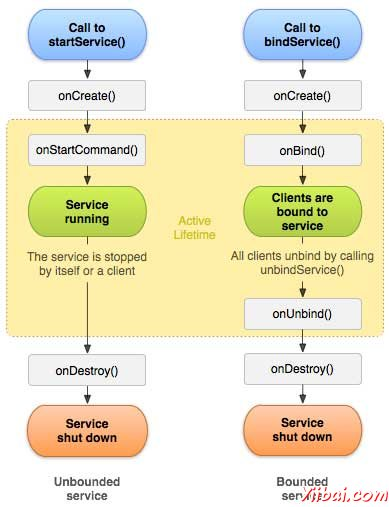
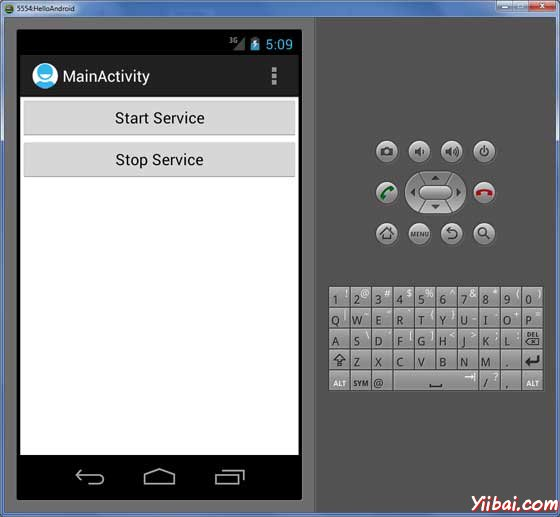
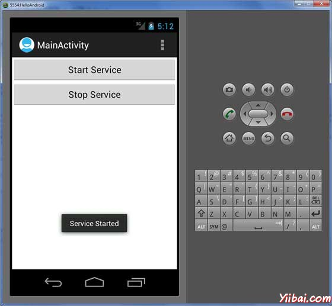

# Android Service - Android开发教程

Service(服务)是一种在后台运行，执行长时间运行的操作，无需与用户交互的组件。例如，一个服务可以在后台播放音乐，用户在不同的应用程序或者可能通过网络获取数据，而不阻塞用户交互活动。本质上，一个服务可以采取两种状态：

| 状态 | 描述 |
| --- | --- |
| **Started** | 当一个应用程序组件，如活动，开始通过调用StartService()启动一个服务。开始以后服务可以无限期地在后台运行，即使启动它的组件被破坏。 |
| **Bound** | 当一个应用程序组件绑定调用bindService()方法绑定服务。绑定服务提供客户端 - 服务器的接口，允许组件进行交互的服务，发送请求，得到结果，这样可以跨进程进程间通信（IPC）。 |

每个服务都具有生命周期回调方法，可以实现监视服务的状态变化，并在适当的阶段执行工作。下图左侧显示的整个生命周期由StartService()创建提供服务 ，右边的图显示bindService()创建的整个生命周期提供服务：



要创建一个服务，需要创建一个Java类，扩展Service基类或者它的子类。Service基类定义各种回调方法，如下面表格给出。但是也并不需要实现所有的回调方法。重要的是要了解每一个变化以及实现，以确保应用程序能如用户所期望的行为方式运行。

| 回调 | 描述 |
| --- | --- |
| **onStartCommand()** | 系统调用此方法当另一组件，如一个活动，通过调用startService()要求该服务启动。如果要实现方法，它工作完成后停止服务，通过调用stopSelf()或stopService()方法。 |
| **onBind()** | 该系统调用这个方法当其他组件要通过调用bindService()绑定服务。如果实现此方法，必须提供客户端与服务进行通信，通过返回一个IBinder对象的接口。必须实现此方法，但如果不希望被绑定，那么应该返回null。 |
| **onUnbind()** | 系统调用此方法，当所有客户都从服务发布的特定接口断开。 |
| **onRebind()** | 该系统调用这个方法时，新的客户端已连接到服务，它事先未通知，所有已经上解除绑定后（意向）断开它。 |
| **onCreate()** | 该系统调用时，使用onStartCommand()或onBind()首先创建的服务这个方法。此调用需要执行一次性安装。 |
| **onDestroy()** | 系统调用这个方法当服务不再使用（被销毁）。服务应该实现这个用于清理，如线程，注册的侦听器，接收器等任何资源 |

下面的主服务演示每一个方法生命周期：

```
package com.yiibai;

import android.app.Service;
import android.os.IBinder;
import android.content.Intent;
import android.os.Bundle;

public class HelloService extends Service {

   /** indicates how to behave if the service is killed */
   int mStartMode;
   /** interface for clients that bind */
   IBinder mBinder;     
   /** indicates whether onRebind should be used */
   boolean mAllowRebind;

   /** Called when the service is being created. */
   @Override
   public void onCreate() {

   }

   /** The service is starting, due to a call to startService() */
   @Override
   public int onStartCommand(Intent intent, int flags, int startId) {
      return mStartMode;
   }

   /** A client is binding to the service with bindService() */
   @Override
   public IBinder onBind(Intent intent) {
      return mBinder;
   }

   /** Called when all clients have unbound with unbindService() */
   @Override
   public boolean onUnbind(Intent intent) {
      return mAllowRebind;
   }

   /** Called when a client is binding to the service with bindService()*/
   @Override
   public void onRebind(Intent intent) {

   }

   /** Called when The service is no longer used and is being destroyed */
   @Override
   public void onDestroy() {

   }
}
```

## 示例

这个例子将通过简单的步骤显示了如何创建Android服务。按照下面的步骤来修改前面章节创建的Android应用程序 - Hello World示例 ：

| 步骤 | 描述 |
| --- | --- |
| 1 | 使用Eclipse IDE创建Android应用程序，并将其命名为HelloWorld在包com.example.helloworld下，类似Hello World示例章节中一样。 |
| 2 | 修改主要活动文件MainActivity.java添加startService()和stopService()方法。 |
| 3 | 在包com.example.helloworld下创建一个新的Java文件MyService.java。该文件将有实现Android服务相关的方法。 |
| 4 | 使用 &lt;service.../&gt;标签定义AndroidManifest.xml文件服务。一个应用可以有一个或多个服务，没有任何限制。 |
| 5 | 修改res/layout/activity_main.xml文件的默认内容包括线性布局中的两个按钮。 |
| 6 | 定义两个常量start_service和stop_service在 res/values/strings.xml 文件中 |
| 7 | 运行该应用程序启动Android模拟器并验证应用程序所做的修改结果。 |

以下是改性主要活动文件** src/com.example.helloworld/MainActivity.java** 的内容。这个文件包括每个基本的生命周期方法。添加 **StartService() **和 **stopService() **方法来启动和停止服务。

```
package com.example.helloworld;

import android.os.Bundle;
import android.app.Activity;
import android.view.Menu;
import android.content.Intent;
import android.view.View;

public class MainActivity extends Activity {

   @Override
   public void onCreate(Bundle savedInstanceState) {
      super.onCreate(savedInstanceState);
      setContentView(R.layout.activity_main);
   }
   @Override
   public boolean onCreateOptionsMenu(Menu menu) {
      getMenuInflater().inflate(R.menu.activity_main, menu);
      return true;
   }

   // Method to start the service
   public void startService(View view) {
      startService(new Intent(getBaseContext(), MyService.class));
   }

   // Method to stop the service
   public void stopService(View view) {
      stopService(new Intent(getBaseContext(), MyService.class));
   }
}
```

以下是**src/com.example.helloworld/MyService.java** 的内容。这个文件可以有一个或多个方法来使用服务。现在要实现只有两个方法 onStartCommand() 和 onDestroy()  ：

```
package com.example.helloworld;

import android.app.Service;
import android.content.Intent;
import android.os.IBinder;
import android.widget.Toast;

public class MyService extends Service {
   @Override
   public IBinder onBind(Intent arg0) {
      return null;
   }

   @Override
   public int onStartCommand(Intent intent, int flags, int startId) {
      // Let it continue running until it is stopped.
      Toast.makeText(this, "Service Started", Toast.LENGTH_LONG).show();
      return START_STICKY;
   }
   @Override
   public void onDestroy() {
      super.onDestroy();
      Toast.makeText(this, "Service Destroyed", Toast.LENGTH_LONG).show();
   }
}

```

下面将 **AndroidManifest.xml** 文件的内容修改。在这里添加 **&lt;service.../&gt;** 标签，包括服务：

```
<manifest xmlns:android="http://schemas.android.com/apk/res/android"
   package="com.example.helloworld"
   android:versionCode="1"
   android:versionName="1.0" >
   <uses-sdk
      android:minSdkVersion="8"
      android:targetSdkVersion="15" />
   <application
       android:icon="@drawable/ic_launcher"
       android:label="@string/app_name"
       android:theme="@style/AppTheme" >
       <activity
           android:name=".MainActivity"
           android:label="@string/title_activity_main" >
           <intent-filter>
               <action android:name="android.intent.action.MAIN" />
               <category android:name="android.intent.category.LAUNCHER"/>
           </intent-filter>
       </activity>
       <service android:name=".MyService" />
   </application>
</manifest>
```

将以下是 **res/layout/activity_main.xml** 文件的内容，包括两个按钮：

```
<LinearLayout xmlns:android="http://schemas.android.com/apk/res/android"
   android:layout_width="fill_parent"
   android:layout_height="fill_parent"
   android:orientation="vertical" >

   <Button android:id="@+id/btnStartService"
   android:layout_width="fill_parent"
   android:layout_height="wrap_content"
   android:text="@string/start_service"
   android:onClick="startService"/>

   <Button android:id="@+id/btnStopService"
   android:layout_width="fill_parent"
   android:layout_height="wrap_content"
   android:text="@string/stop_service"
   android:onClick="stopService" />

</LinearLayout>
```

下面将在** res/values/strings.xml** 中定义两个新的常量： 

```
<resources>

    <string name="app_name">HelloWorld</string>
    <string name="hello_world">Hello world!</string>
    <string name="menu_settings">Settings</string>
    <string name="title_activity_main">MainActivity</string>
    <string name="start_service">Start Service</string>
    <string name="stop_service">Stop Service</string>

</resources>
```

现在运行修改后的 Hello World！应用程序。假设创建了AVD 并同时做了环境设置。要在Eclipse运行的应用程序，打开一个项目的活动文件，从工具栏上找到并单击 “**run**”  图标。 Eclipse AVD上安装的应用程序，并启动它，如果一切设置以及应用都没有问题，那么将会显示以下模拟器窗口：



要开始服务，现在就点击启动服务按钮，onStartCommand() 方法在程序中，每一个服务开始后将出现消息在模拟器底部，如下：



要停止该服务，可以点击停止服务（Stop Service）按钮。

 