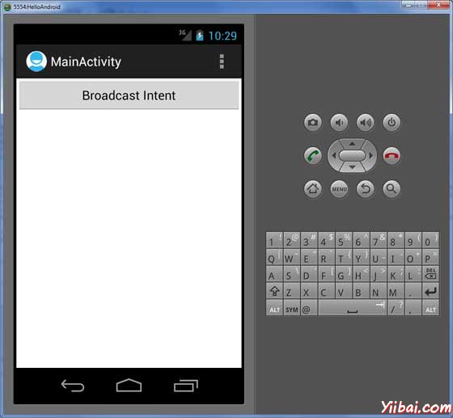
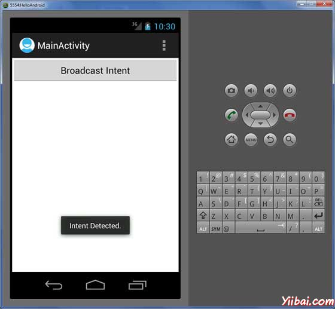

# Android广播接收器 - Android开发教程

广播接收器(Broadcast)简单地从其他应用程序或系统响应广播消息。这些消息有时称为事件或意图。例如，应用程序也可以发起广播，以让其他应用程序知道某些数据已经被下载到设备上，可供它们使用。广播接收器会拦截此通信，并会采取适当操作（动作）。

以下两个重要的步骤，在使用广播接收器工作系统及广播意图：

*   **创建广播接收器**

*   **注册广播接收器**

还有一个附加的步骤，要实现自定义的意图，那么将必须创建并广播意图。

## 创建广播接收器

实现广播接收机BroadcastReceiver类的一个子类并重写 onReceive()方法，其中每个收到消息作为一个 Intent 对象参数。

```
public class MyReceiver extends BroadcastReceiver {

   @Override
   public void onReceive(Context context, Intent intent) {
      Toast.makeText(context, "Intent Detected.", Toast.LENGTH_LONG).show();
   }

}
```

## 注册广播接收器

应用程序侦听特定的广播意图是通过在 AndroidManifest.xml 文件中注册一个广播接收器。寄存器 MyReceiver 系统生成事件 ACTION_BOOT_COMPLETED，在Android系统完成了启动过程后，这是由系统启动执行的。

```
<application
   android:icon="@drawable/ic_launcher"
   android:label="@string/app_name"
   android:theme="@style/AppTheme" >

   <receiver android:name="MyReceiver">
      <intent-filter>
         <action android:name="android.intent.action.BOOT_COMPLETED">
      </action>
      </intent-filter>
   </receiver>

</application>
```

当 Android 设备启动，它会被截获 **BroadcastReceiver** 的 **MyReceiverand** 内实现逻辑，首先 **onReceive**() 将被执行。

有几个系统产生的事件定义在最后意图类的静态字段。下表列出了一些重要的系统事件。

| 事件常量 | 描述 |
| --- | --- |
| android.intent.action.BATTERY_CHANGED | 持久广播含充电状态，级别，以及其他相关的电池信息。 |
| android.intent.action.BATTERY_LOW | 显示设备的电池电量低。 |
| android.intent.action.BATTERY_OKAY | 指示电池正在低点后但没有问题。 |
| android.intent.action.BOOT_COMPLETED | 一次播出后，系统已完成启动。 |
| android.intent.action.BUG_REPORT | 显示活动报告的错误。 |
| android.intent.action.CALL | 执行呼叫由数据指定某人。 |
| android.intent.action.CALL_BUTTON | 用户按下“呼叫”按钮进入拨号器或其他适当的用户界面发出呼叫。 |
| android.intent.action.DATE_CHANGED | 日期改变。 |
| android.intent.action.REBOOT | 有设备重启。 |

## 广播定制意图

如果希望应用程序本身生成并发送自定义意图，那么必须使用sendBroadcast()方法里面活动类来创建和发送这些的意图。使用（意向）sendStickyBroadcast() 方法意图是粘粘的，这意味着所发送的意图保持周广围播出后完成。

```
public void broadcastIntent(View view)
{
   Intent intent = new Intent();
   intent.setAction("com.yiibai.CUSTOM_INTENT");
   sendBroadcast(intent);
}
```

意图 com.yiibai.CUSTOM_INTENT也可以以注册类似的方式，因为我们产生注册系统的意图。

```
<application
   android:icon="@drawable/ic_launcher"
   android:label="@string/app_name"
   android:theme="@style/AppTheme" >

   <receiver android:name="MyReceiver">
      <intent-filter>
         <action android:name="com.yiibai.CUSTOM_INTENT">
      </action>
      </intent-filter>
   </receiver>

</application>
```

## 示例

这个例子将解释如何创建BroadcastReceiver 拦截自定义意图。熟悉自定义意图后，就可以编写应用程序来拦截系统生成的意图。现在按照下面的步骤来修改前面创建的Hello World范例中 Android 应用程序：

| 步骤 | 描述 |
| --- | --- |
| 1 | 使用Eclipse IDE创建Android应用程序，并将其命名为HelloWorld在包com.example.helloworld下，类似Hello World示例章节中一样。 |
| 2 | 修改主要活动文件MainActivity.java添加broadcastIntent()方法。 |
| 3 | 在包com.example.helloworld下创建一个新的Java文件 MyReceiver.java，并定义一个BroadcastReceiver。 |
| 4 | 应用程序可以处理一个或多个自定义和系统的意图不受任何限制。要拦截每一个意图，必须使用 &lt;receiver.../&gt;标签并注册在AndroidManifest.xml文件中。 |
| 5 | 修改 res/layout/activity_main.xml 文件的默认内容包括：一个按钮广播意图。 |
| 6 | 定义常量 broadcast_inte 在 ntres/values/strings.xml文件中 |
| 7 | 运行该应用程序启动Android模拟器并验证应用程序所做的修改结果。 |

以下是修改主要活动文件 **src/com.example.helloworld/MainActivity.java** 后的内容。这个文件包括每个生命周期方法。这里添加了 **broadcastIntent()** 方法来广播自定义的意图。

```
package com.example.helloworld;

import android.os.Bundle;
import android.app.Activity;
import android.view.Menu;
import android.content.Intent;
import android.view.View;

public class MainActivity extends Activity {

   @Override
   public void onCreate(Bundle savedInstanceState) {
      super.onCreate(savedInstanceState);
      setContentView(R.layout.activity_main);
   }
   @Override
   public boolean onCreateOptionsMenu(Menu menu) {
      getMenuInflater().inflate(R.menu.activity_main, menu);
      return true;
   }
   // broadcast a custom intent. 
   public void broadcastIntent(View view)
   {
      Intent intent = new Intent();
      intent.setAction("com.yiibai.CUSTOM_INTENT");
      sendBroadcast(intent);
   }
}
```

下面是 **src/com.example.helloworld/MyReceiver.java** 的内容:

```
package com.example.helloworld;

import android.content.BroadcastReceiver;
import android.content.Context;
import android.content.Intent;
import android.widget.Toast;

public class MyReceiver extends BroadcastReceiver {

   @Override
   public void onReceive(Context context, Intent intent) {
      Toast.makeText(context, "Intent Detected.", Toast.LENGTH_LONG).show();
   }

}
```

下面将 AndroidManifest.xml 文件的内容修改。在这里添加 &lt;service.../&gt;标签，包括服务：

```
<manifest xmlns:android="http://schemas.android.com/apk/res/android"
   package="com.example.helloworld"
   android:versionCode="1"
   android:versionName="1.0" >
   <uses-sdk
      android:minSdkVersion="8"
      android:targetSdkVersion="15" />
   <application
       android:icon="@drawable/ic_launcher"
       android:label="@string/app_name"
       android:theme="@style/AppTheme" >
       <activity
           android:name=".MainActivity"
           android:label="@string/title_activity_main" >
           <intent-filter>
               <action android:name="android.intent.action.MAIN" />
               <category android:name="android.intent.category.LAUNCHER"/>
           </intent-filter>
       </activity>
       <receiver android:name="MyReceiver">
          <intent-filter>
          <action android:name="com.yiibai.CUSTOM_INTENT">
          </action>
          </intent-filter>
      </receiver>
   </application>
</manifest>
```

以下将 **res/layout/activity_main.xml **文件的内容包括一个按钮来广播自定义意图：

```
<LinearLayout xmlns:android="http://schemas.android.com/apk/res/android"
   android:layout_width="fill_parent"
   android:layout_height="fill_parent"
   android:orientation="vertical" >

   <Button android:id="@+id/btnStartService"
   android:layout_width="fill_parent"
   android:layout_height="wrap_content"
   android:text="@string/broadcast_intent"
   android:onClick="broadcastIntent"/>

</LinearLayout>
```

下面将在 res/values/strings.xml 中定义两个新的常量的内容： 

```
<resources>

    <string name="app_name">HelloWorld</string>
    <string name="hello_world">Hello world!</string>
    <string name="menu_settings">Settings</string>
    <string name="title_activity_main">MainActivity</string>
    <string name="broadcast_intent">Broadcast Intent</string>

</resources>
```

现在运行修改后的 Hello World！应用程序。假设创建了AVD并设置了环境。要从Eclipse运行的应用程序，首先打开一个项目的活动文件，从工具栏单击“run”  图标。 Eclipse AVD安装的应用程序，并启动它，如果设置和应用都没有问题，将会显示以下模拟器窗口：



现在广播自定义的意图，点击上广播意图按钮，这将广播自定义在 “com.yiibai.CUSTOM_INTENT”  注册BroadcastReceiver 的意图将被 MyReceiver拦截。 实现的逻辑如下出现底部的模拟器：



可以尝试执行其他 BroadcastReceiver 拦截系统的意图，如系统启动，更改日期，电池电量不足等。

 