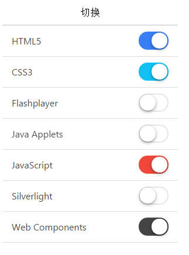
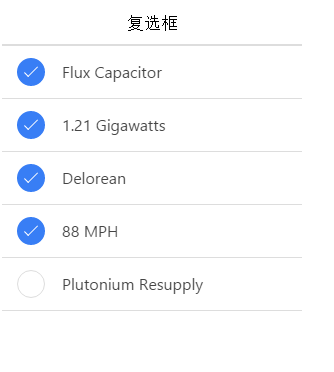

# ionic Toggle(切换开关)

切换开关类似与 HTML 的 checkbox 标签，但它更易于在移动设备上使用。

切换开关可以使用 toggle-assertive 来指定颜色。

```
<label class="toggle">
   <input type="checkbox">
   <div class="track">
     <div class="handle"></div>
   </div>
</label>

```

该实例有是多个切换开关列表。注意，每个选项的 item 类后需要添加 item-toggle 类。

```
<ul class="list">

  <li class="item item-toggle">
     HTML5
     <label class="toggle toggle-assertive">
       <input type="checkbox">
       <div class="track">
         <div class="handle"></div>
       </div>
     </label>
  </li>

  ...

</ul>

```


运行效果如下：



## ionic checkbox（复选框）

ionic 里面的 Checkbox 和普通的 Checkbox 效果上其实相差不大，只是样式上有所不同。

以下实例颜色了多个复选框的列表。

注意，每个选项的 item 类后需要添加 item-checkbox 类。

复选框可以使用 checkbox-assertive 来指定颜色。

```
<ul class="list">

  <li class="item item-checkbox">
     <label class="checkbox">
       <input type="checkbox">
     </label>
     Flux Capacitor
  </li>

  ...

</ul>

```


运行效果如下：


