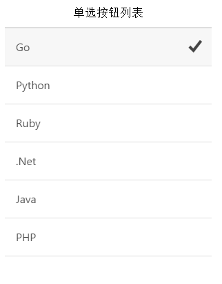

# ionic 单选框

ionic 当选按钮与标准 type="radio" 的 input元素类似。以下展示了现代app类型的单选按钮。

每个 item-radio 中的 type="radio" 的 input 元素的 name 属性都相同。radio-icon 类用于是否显示图标。

ionic 在单选项中使用了 &lt;label&gt; 元素，使其更易点击。

### 实例

```
<div class="list">

<label class="item item-radio">
  <input type="radio" name="group" value="go" checked="checked">
  <div class="item-content">
    Go
  </div>
  <i class="radio-icon ion-checkmark"></i>
</label>

<label class="item item-radio">
  <input type="radio" name="group" value="python">
  <div class="item-content">
    Python
  </div>
  <i class="radio-icon ion-checkmark"></i>
</label>

<label class="item item-radio">
  <input type="radio" name="group" value="ruby">
  <div class="item-content">
    Ruby
  </div>
  <i class="radio-icon ion-checkmark"></i>
</label>

<label class="item item-radio">
  <input type="radio" name="group" value=".net">
  <div class="item-content">
    .Net
  </div>
  <i class="radio-icon ion-checkmark"></i>
</label>

<label class="item item-radio">
  <input type="radio" name="group" value="java">
  <div class="item-content">
    Java
  </div>
  <i class="radio-icon ion-checkmark"></i>
</label>

<label class="item item-radio">
  <input type="radio" name="group" value="php">
  <div class="item-content">
    PHP
  </div>
  <i class="radio-icon ion-checkmark"></i>
</label>

</div>

```


运行效果如下：


