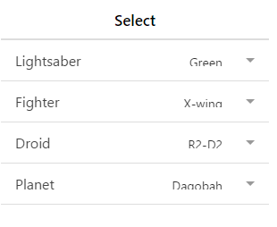

# ionic select

ionic select 的 select 相比原生的要更加美观些。但是弹出的可选选项样式是浏览器默认的。

每个平台上的可选项样式都是不一样的，在PC电脑的浏览器上，你会看到传统的下拉界面，Android 上会弹出单选按钮选项，iOS 有个滚轮操作界面。

### 实例

```
<div  class="list">  <div  class="item item-input item-select">  <div  class="input-label"> Lightsaber </div>  <select>  <option>Blue</option>  <option  selected="">Green</option>  <option>Red</option>  </select>  </div>  <div  class="item item-input item-select">  <div  class="input-label"> Fighter </div>  <select>  <option>ARC-170</option>  <option>A-wing</option>  <option>Delta-7</option>  <option>Naboo N-1</option>  <option>TIE</option>  <option  selected="">X-wing</option>  <option>Y-wing</option>  </select>  </div>  <div  class="item item-input item-select">  <div  class="input-label"> Droid </div>  <select>  <option>2-1B</option>  <option>B1</option>  <option>C-3PO</option>  <option>IG-88</option>  <option>IT-O</option>  <option  selected="">R2-D2</option>  </select>  </div>  <div  class="item item-input item-select">  <div  class="input-label"> Planet </div>  <select>  <option>Alderaan</option>  <option  selected="">Dagobah</option>  <option>Felucia</option>  <option>Geonosis </option>  <option>Hoth</option>  <option>Kamino</option>  <option>Mygeeto</option>  <option>Naboo</option>  <option>Tataouine</option>  <option>Utapau</option>  <option>Yavin</option>  </select>  </div>  </div>
```


运行效果如下：


