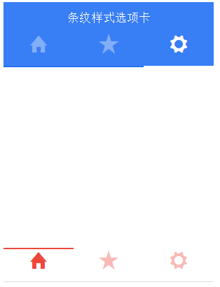

# ionic tab(选项卡)

ionic tab(选项卡) 是水平排列的按钮或者链接，用以页面间导航的切换。它可以包含文字和图标的组合，是一种移动设备上流行的导航方法。

以下选项卡容器使用了 tabs 类，每个选项卡使用 tab-item 类。默认情况下，选项卡是文本的，并没有图标。

### 实例

```
<div class="tabs">
  <a class="tab-item">
    主页
  </a>
  <a class="tab-item">
    收藏
  </a>
  <a class="tab-item">
    设置
  </a>
</div>

```


默认情况，选项卡颜色为默认，你可以设置以下不同颜色样式：tabs-default ，tabs-light ，tabs-stable ，tabs-positive ，tabs-calm ，tabs-balanced ，tabs-energized ，tabs-assertive ，tabs-royal ，tabs-dark。

要隐藏选项卡栏，可使用 tabs-item-hide 类。

### 图标选项卡

在 tabs 类后添加 tabs-icon-only 类可设置只显示图标选项卡。

```
<div class="tabs tabs-icon-only">
  <a class="tab-item">
    <i class="icon ion-home"></i>
  </a>
  <a class="tab-item">
    <i class="icon ion-star"></i>
  </a>
  <a class="tab-item">
    <i class="icon ion-gear-a"></i>
  </a>
</div>

```


### 顶部图标+文字选项卡

在 tabs 类后添加 ttabs-icon-top 类可设置顶部图标+文字选项卡。

```
<div class="tabs tabs-icon-top">
  <a class="tab-item" href="#">
    <i class="icon ion-home"></i>
    主页
  </a>
  <a class="tab-item" href="#">
    <i class="icon ion-star"></i>
    收藏
  </a>
  <a class="tab-item" href="#">
    <i class="icon ion-gear-a"></i>
    设置
  </a>
</div>

```


### 左侧图标+文字选项卡

在 tabs 类后添加 ttabs-icon-left 类可设置左侧图标+文字选项卡。

```
<div class="tabs tabs-icon-left">
  <a class="tab-item">
    <i class="icon ion-home"></i>
    主页
  </a>
  <a class="tab-item">
    <i class="icon ion-star"></i>
    收藏
  </a>
  <a class="tab-item">
    <i class="icon ion-gear-a"></i>
    设置
  </a>
</div>

```


### 条纹样式选项卡

可以在带有 tabs 的样式名的元素上添加 tabs-striped 来实现像 Android 风格的 tabs。也可以添加 tabs-top 来实现选项卡在页面顶部。

条纹选项卡颜色可通过 tabs-background-{color} 和 tabs-color-{color} 来控制， {color} 值可以是：default, light, stable, positive, calm, balanced, energized, assertive, royal, 或 dark。

注意：如果要再选项卡上设置头部标题，需要使用 has-tabs-top 类。

```
<div class="tabs-striped tabs-top tabs-background-positive tabs-color-light">
    <div class="tabs">
      <a class="tab-item active" href="#">
        <i class="icon ion-home"></i>
        Test
      </a>
      <a class="tab-item" href="#">
        <i class="icon ion-star"></i>
        Favorites
      </a>
      <a class="tab-item" href="#">
        <i class="icon ion-gear-a"></i>
        Settings
      </a>
    </div>
  </div>
  <div class="tabs-striped tabs-color-assertive">
    <div class="tabs">
      <a class="tab-item active" href="#">
        <i class="icon ion-home"></i>
        Test
      </a>
      <a class="tab-item" href="#">
        <i class="icon ion-star"></i>
        Favorites
      </a>
      <a class="tab-item" href="#">
        <i class="icon ion-gear-a"></i>
        Settings
      </a>
    </div>
  </div>

```


运行效果如下：


