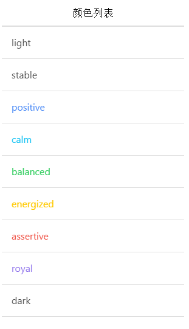

# ionic 颜色

ionic 提供了很多颜色的配置，当然你可以根据自己的需要自定义颜色。

```
<ul class="list color-list-demo">
	<li class="item dark">
	  light
	  <span class="color-demo light-bg light-border"></span>
	</li>
	<li class="item stable-dark">
	  stable
	  <span class="color-demo stable-bg stable-border"></span>
	</li>
	<li class="item positive">
	  positive
	  <span class="color-demo positive-bg positive-border"></span>
	</li>
	<li class="item calm">
	  calm
	  <span class="color-demo calm-bg calm-border"></span>
	</li>
	<li class="item balanced">
	  balanced
	  <span class="color-demo balanced-bg balanced-border"></span>
	</li>
	<li class="item energized">
	  energized
	  <span class="color-demo energized-bg energized-border"></span>
	</li>
	<li class="item assertive">
	  assertive
	  <span class="color-demo assertive-bg assertive-border"></span>
	</li>
	<li class="item royal">
	  royal
	  <span class="color-demo royal-bg royal-border"></span>
	</li>
	<li class="item dark">
	  dark
	  <span class="color-demo dark-bg dark-border"></span>
	</li>
</ul>

```


实例运行结果：


