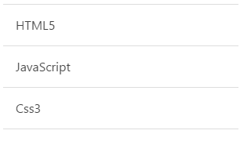

# ionic 下拉刷新

在加载新数据的时候，我们需要实现下拉刷新效果，代码如下：

## 实例

### HTML 代码

```
<body ng-app="starter" ng-controller="actionsheetCtl" >
    <ion-pane>
        <ion-content >
            <ion-refresher pulling-text="下拉刷新" on-refresh="doRefresh()"></ion-refresher>
            <ion-list>
                <ion-item ng-repeat="item in items" ng-bind="item.name"></ion-item>
            </ion-list>
        </ion-content>
    </ion-pane>
</body>

```

### JavaScript 代码

```
angular.module('starter', ['ionic'])

.run(function($ionicPlatform) {
  $ionicPlatform.ready(function() {
    // Hide the accessory bar by default (remove this to show the accessory bar above the keyboard
    // for form inputs)
    if(window.cordova && window.cordova.plugins.Keyboard) {
      cordova.plugins.Keyboard.hideKeyboardAccessoryBar(true);
    }
    if(window.StatusBar) {
      StatusBar.styleDefault();
    }
  });
})

.controller( 'actionsheetCtl',['$scope','$timeout' ,'$http',function($scope,$timeout,$http){

    $scope.items=[
        {
            "name":"HTML5"
        },
        {
            "name":"JavaScript"
        },
        {
            "name":"Css3"
        }
    ];

    $scope.doRefresh = function() {
        $http.get('http://www.runoob.com/try/demo_source/item.json')  //注意改为自己本站的地址，不然会有跨域问题
            .success(function(newItems) {
                $scope.items = newItems;
            })
            .finally(function() {
                $scope.$broadcast('scroll.refreshComplete');
            });
    };
}])

```

item.json 文件数据：

```
[
    {
        "name":"菜鸟教程"
    },
    {
        "name":"www.runoob.com"
    }
]

```


效果如下所示：


