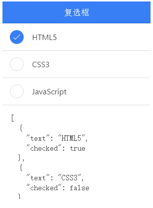

# ionic 复选框

ionic 复选框（checkbox）与普通的 HTML 复选框没什么区别，以下实例演示了 ionic 复选框 ion-checkbox 的应用。

```
<ion-checkbox ng-model="isChecked">复选框标签</ion-checkbox>

```

## 实例

实例中，会根据复选框是否选中，修改 checked 值，true 为选中， false 为未选中。

### HTML 代码

```
<ion-header-bar class="bar-positive">
  <h1 class="title">复选框</h1>
</ion-header-bar>

<ion-content>

  <div class="list">

    <ion-checkbox ng-repeat="item in devList"
                  ng-model="item.checked"
                  ng-checked="item.checked">
      {{ item.text }}
    </ion-checkbox>

    <div class="item">
      <div ng-bind="devList | json"></div>
    </div>

    <div class="item item-divider">
      Notifications
    </div>

    <ion-checkbox ng-model="pushNotification.checked"
                  ng-change="pushNotificationChange()">
      Push Notifications
    </ion-checkbox>

    <div class="item">
      <div ng-bind="pushNotification | json"></div>
    </div>

    <ion-checkbox ng-model="emailNotification"
                  ng-true-value="'Subscribed'"
                  ng-false-value="'Unubscribed'">
      Newsletter
    </ion-checkbox>
    <div class="item">
      <div ng-bind="emailNotification | json"></div>
    </div>

  </div>

</ion-content>

```

### JavaScript 代码

```
angular.module('starter', ['ionic'])

.run(function($ionicPlatform) {
$ionicPlatform.ready(function() {
  // Hide the accessory bar by default (remove this to show the accessory bar above the keyboard
  // for form inputs)
  if(window.cordova && window.cordova.plugins.Keyboard) {
    cordova.plugins.Keyboard.hideKeyboardAccessoryBar(true);
  }
  if(window.StatusBar) {
    StatusBar.styleDefault();
  }
});
})

.controller( 'actionsheetCtl',['$scope',function($scope){

  $scope.devList = [
      { text: "HTML5", checked: true },
      { text: "CSS3", checked: false },
      { text: "JavaScript", checked: false }
    ];

    $scope.pushNotificationChange = function() {
      console.log('Push Notification Change', $scope.pushNotification.checked);
    };

    $scope.pushNotification = { checked: true };
    $scope.emailNotification = 'Subscribed';

}])

```

css 代码：

```
body {
  cursor: url('http://www.runoob.com/try/demo_source/finger.png'), auto;
}

```


效果如下所示：


