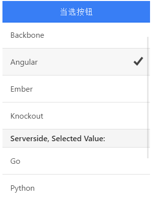

# ionic 单选框操作

实例中，根据选中的不同选项，显示不同的值。

### HTML 代码

```
<ion-header-bar class="bar-positive">
  <h1 class="title">当选按钮</h1>
</ion-header-bar>

<ion-content>

  <div class="list">

    <div class="item item-divider">
      选取的值为: {{ data.clientSide }}
    </div>

    <ion-radio ng-repeat="item in clientSideList"
               ng-value="item.value"
               ng-model="data.clientSide">
      {{ item.text }}
    </ion-radio>

    <div class="item item-divider">
      Serverside, Selected Value: {{ data.serverSide }}
    </div>

    <ion-radio ng-repeat="item in serverSideList"
               ng-value="item.value"
               ng-model="data.serverSide"
               ng-change="serverSideChange(item)"
               name="server-side">
      {{ item.text }}
    </ion-radio>

  </div>

</ion-content>

```

### JavaScript 代码

```
angular.module('ionicApp', ['ionic'])

.controller('MainCtrl', function($scope) {

  $scope.clientSideList = [
    { text: "Backbone", value: "bb" },
    { text: "Angular", value: "ng" },
    { text: "Ember", value: "em" },
    { text: "Knockout", value: "ko" }
  ];

  $scope.serverSideList = [
    { text: "Go", value: "go" },
    { text: "Python", value: "py" },
    { text: "Ruby", value: "rb" },
    { text: "Java", value: "jv" }
  ];

  $scope.data = {
    clientSide: 'ng'
  };

  $scope.serverSideChange = function(item) {
    console.log("Selected Serverside, text:", item.text, "value:", item.value);
  };

});

```

css 代码：

```
body {
  cursor: url('http://www.runoob.com/try/demo_source/finger.png'), auto;
}

```


效果如下所示：


