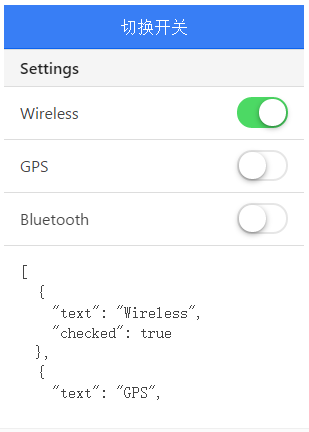

# ionic 切换开关操作

以下实例中，通过切换不同开关 checked 显示不同的值，true 为打开，false 为关闭。

### HTML 代码

```
<ion-header-bar class="bar-positive">
  <h1 class="title">开关切换</h1>
</ion-header-bar>

<ion-content>

  <div class="list">

    <div class="item item-divider">
      Settings
    </div>

    <ion-toggle ng-repeat="item in settingsList"
                ng-model="item.checked"
                ng-checked="item.checked">
      {{ item.text }}
    </ion-toggle>

    <div class="item">
    	<!-- 使用 pre 标签展示效果更美观 -->
      <div ng-bind="settingsList | json"></div>
    </div>

    <div class="item item-divider">
      Notifications
    </div>

    <ion-toggle ng-model="pushNotification.checked"
                ng-change="pushNotificationChange()">
      Push Notifications
    </ion-toggle>

    <div class="item">
    	<!-- 使用 pre 标签展示效果更美观 -->
      <div ng-bind="pushNotification | json"></div>
    </div>

    <ion-toggle toggle-class="toggle-assertive"
                ng-model="emailNotification"
                ng-true-value="Subscribed"
                ng-false-value="Unubscribed">
      Newsletter
    </ion-toggle>

    <div class="item">
    	<!-- 使用 pre 标签展示效果更美观 -->
      <div ng-bind="emailNotification | json"></div>
    </div>

  </div>

</ion-content>

```

由于pre标签冲突，实例中的 pre 已替换为 div标签，具体可以在"尝试一下"中查看。

### JavaScript 代码

```
angular.module('ionicApp', ['ionic'])

.controller('MainCtrl', function($scope) {

  $scope.settingsList = [
    { text: "Wireless", checked: true },
    { text: "GPS", checked: false },
    { text: "Bluetooth", checked: false }
  ];

  $scope.pushNotificationChange = function() {
    console.log('Push Notification Change', $scope.pushNotification.checked);
  };

  $scope.pushNotification = { checked: true };
  $scope.emailNotification = 'Subscribed';

});

```

css 代码：

```
body {
  cursor: url('http://www.runoob.com/try/demo_source/finger.png'), auto;
}

```


效果如下所示：


