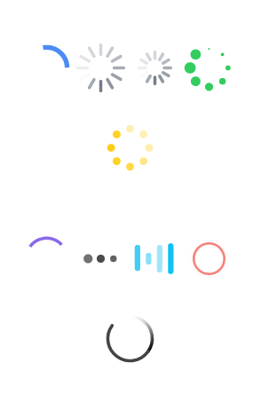

# ionic 加载动画

## ion-spinner

ionSpinner 提供了许多种旋转加载的动画图标。当你的界面加载时，你就可以呈现给用户相应的加载图标。

该图标采用的是SVG。

### 用法

```
<ion-spinner icon="spiral"></ion-spinner>    //默认用法

```

像大部分其他的ionic组件一样，spinner也可以使用ionic的标准颜色命名规则，就像下面这样：

```
<ion-spinner class="spinner-energized"></ion-spinner>

```

## 实例

### HTML 代码

```
<ion-content scroll="false" class="has-header">
  <p>
    <ion-spinner icon="android"></ion-spinner>
    <ion-spinner icon="ios"></ion-spinner>
    <ion-spinner icon="ios-small"></ion-spinner>
    <ion-spinner icon="bubbles" class="spinner-balanced"></ion-spinner>
    <ion-spinner icon="circles" class="spinner-energized"></ion-spinner>
  </p>

  <p>
    <ion-spinner icon="crescent" class="spinner-royal"></ion-spinner>

    <ion-spinner icon="dots" class="spinner-dark"></ion-spinner>
    <ion-spinner icon="lines" class="spinner-calm"></ion-spinner>
    <ion-spinner icon="ripple" class="spinner-assertive"></ion-spinner>
    <ion-spinner icon="spiral"></ion-spinner>
  </p>

</ion-content>

```

### CSS 代码

```
body {
  cursor: url('http://www.runob.com/try/demo_source/finger.png'), auto;
}    
p {
  text-align: center;
  margin-bottom: 40px !important;
}
.spinner svg {
  width: 19% !important;
  height: 85px !important;
}

```

### JavaScript 代码

```
angular.module('ionicApp', ['ionic'])

.controller('MyCtrl', function($scope) {

});

```


效果如下所示：


