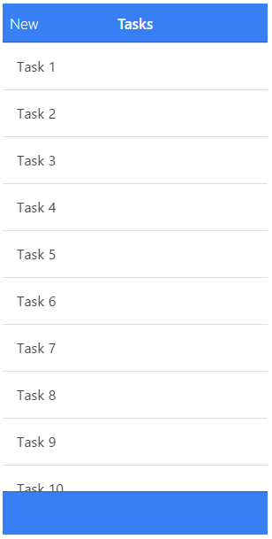

# ionic 选项卡栏操作

## ion-tabs

ion-tabs 是有一组页面选项卡组成的选项卡栏。可以通过点击选项来切换页面。

对于 iOS，它会出现在屏幕的底部，Android会出现在屏幕的顶部(导航栏下面)。

### 用法

```
<ion-tabs class="tabs-positive tabs-icon-only">

  <ion-tab title="首页" icon-on="ion-ios7-filing" icon-off="ion-ios7-filing-outline">
    <!-- 标签 1 内容 -->
  </ion-tab>

  <ion-tab title="关于" icon-on="ion-ios7-clock" icon-off="ion-ios7-clock-outline">
    <!-- 标签 2 内容 -->
  </ion-tab>

  <ion-tab title="设置" icon-on="ion-ios7-gear" icon-off="ion-ios7-gear-outline">
    <!-- 标签 3 内容 -->
  </ion-tab>

</ion-tabs>

```


效果如下所示：



### API

`delegate-handle(可选)`：`字符串`

该句柄用[`$ionicTabsDelegate`](/docs/api/service/$ionicTabsDelegate/)来标识这些选项卡。


## ion-tab

隶属于ionTabs

包含一个选项卡内容。该内容仅存在于被选中的给定选项卡中。

每个ionTab都有自己的浏览历史。

### 用法

```
<ion-tab
  title="Tab!"
  icon="my-icon"
  href="#/tab/tab-link"
  on-select="onTabSelected()"
  on-deselect="onTabDeselected()">
</ion-tab>

```

### API

`title`：`字符串`

选项卡的标题。


`href(可选)`：`字符串`

但触碰的时候，该选项卡将会跳转的的链接。


`icon(可选)`：`字符串`

选项卡的图标。如果给定值，它将成为ion-on和ion-off的默认值。


`icon-on(可选)`：`字符串`

被选中标签的图标。


`icon-off(可选)`：`字符串`

没被选中标签的图标。


`badge(可选)`：`表达式`

选项卡上的徽章（通常是一个数字）。


`badge-style(可选)`：`表达式`

选项卡上微章的样式（例，tabs-positive ）。


`on-select(可选)`：`表达式`

选项卡被选中时触发。


`on-deselect(可选)`：`表达式`

选项卡取消选中时触发。


`ng-click(可选)`：`表达式`

通常，点击时选项卡会被选中。如果设置了 ng-Click，它将不会被选中。 你可以用$ionicTabsDelegate.select()来指定切换标签。


## $ionicTabsDelegate

授权控制ionTabs指令。

该方法直接调用$ionicTabsDelegate服务，控制所有ionTabs指令。用$getByHandle方法控制具体的ionTabs实例。

### 用法

```
<body ng-controller="MyCtrl">
  <ion-tabs>

    <ion-tab title="Tab 1">
      你好，标签1！
      <button ng-click="selectTabWithIndex(1)">选择标签2</button>
    </ion-tab>
    <ion-tab title="Tab 2">你好标签2！</ion-tab>

  </ion-tabs>
</body>

```

```
function MyCtrl($scope, $ionicTabsDelegate) {
  $scope.selectTabWithIndex = function(index) {
    $ionicTabsDelegate.select(index);
  }
}

```

### 方法

```
select(index, [shouldChangeHistory])

```

选择标签来匹配给定的索引。

`index`：`数值`

选择标签的索引。


`shouldChangeHistory(可选)`：`布尔值`

此选项是否应该加载这个标签的浏览历史（如果存在），并使用，或仅加载默认页面。默认为false。提示：如果一个`ion-nav-view`在选项卡里，你可能需要设置它为true。


```
selectedIndex()
```

**返回值:** 数值, 被选中标签的索引，如 -1。

```
$getByHandle(handle)

```

`handle`：`字符串`

例如:

```
$ionicTabsDelegate.$getByHandle('my-handle').select(0);
```

****
