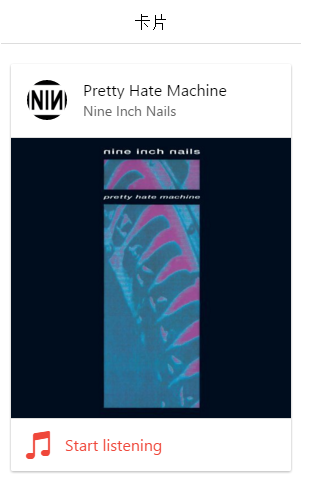
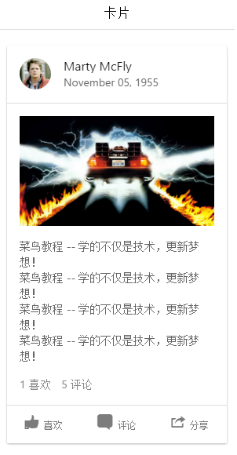

# ionic 卡片

近年来卡片(card)的应用越来越流行，卡片提供了一个更好组织信息展示的工具。

针对移动端的应用，卡片会根据屏幕大小自适应大小。

我们可以很灵活的控制卡片的显示效果，甚至实现动画效果。

卡片一般放在页面顶部，当然也可以实现左右切换的功能。

```
<div class="card">
  <div class="item item-text-wrap">
    基本卡片，包含了文本信息。
  </div>
</div>

```


卡片(card)默认样式带有box-shadow(阴影)，由于性能的原因，和他类似的元素像 list list-inset 并没有阴影。

如果你有很多的卡片，每个卡片都有很多子元素，建议使用内嵌列表（inset list）。

## 卡片的头部与底部

我们可以通过添加 item-divider 类为卡片添加头部与底部：

```
<div class="card">
  <div class="item item-divider">
    卡片头部！
  </div>
  <div class="item item-text-wrap">
    基本卡片，包含了文本信息。
  </div>
  <div class="item item-divider">
    卡片底部！
  </div>
</div>

```


## 卡片列表

使用 list card 类来设置卡片列表：

```
<div class="list card">

  <a href="#" class="item item-icon-left">
    <i class="icon ion-home"></i>
    Enter home address
  </a>

  <a href="#" class="item item-icon-left">
    <i class="icon ion-ios-telephone"></i>
    Enter phone number
  </a>

  <a href="#" class="item item-icon-left">
    <i class="icon ion-wifi"></i>
    Enter wireless password
  </a>

  <a href="#" class="item item-icon-left">
    <i class="icon ion-card"></i>
    Enter card information
  </a>

</div>

```


## 带图片卡片

卡片中使用图片，效果会更好，实例如下：

```
<div class="list card">

  <div class="item item-avatar">
    
    <h2>Pretty Hate Machine</h2>
    <p>Nine Inch Nails</p>
  </div>

  <div class="item item-image">
    
  </div>

  <a class="item item-icon-left assertive" href="#">
    <i class="icon ion-music-note"></i>
    Start listening
  </a>

</div>

```


运行效果如下：


## 卡片展现

以下实例中使用几种不同的选项的卡片展现方式。 开始使用了 list card 元素，并使用了 item-avatar , item-body 元素用于展示图片和文本信息，底部使用 item-divider 类。

```
<div class="list card">

  <div class="item item-avatar">
    
    <h2>Marty McFly</h2>
    <p>November 05, 1955</p>
  </div>

  <div class="item item-body">
    
    <p>
      菜鸟教程 -- 学的不仅是技术，更新梦想！<br>
      菜鸟教程 -- 学的不仅是技术，更新梦想！<br>
      菜鸟教程 -- 学的不仅是技术，更新梦想！<br>
      菜鸟教程 -- 学的不仅是技术，更新梦想！
    </p>
    <p>
      <a href="#" class="subdued">1 喜欢</a>
      <a href="#" class="subdued">5 评论</a>
    </p>
  </div>

  <div class="item tabs tabs-secondary tabs-icon-left">
    <a class="tab-item" href="#">
      <i class="icon ion-thumbsup"></i>
      喜欢
    </a>
    <a class="tab-item" href="#">
      <i class="icon ion-chatbox"></i>
      Comment
    </a>
    <a class="tab-item" href="#">
      <i class="icon ion-share"></i>
      分享
    </a>
  </div>

</div>

```


运行效果如下：


