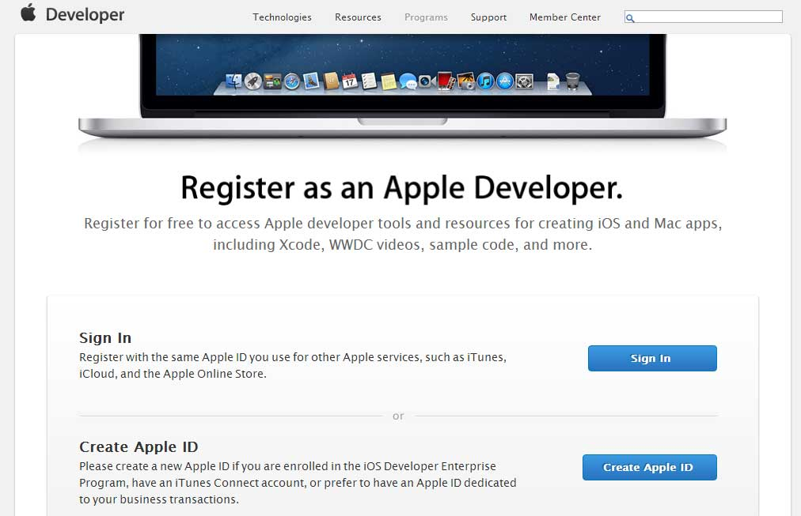
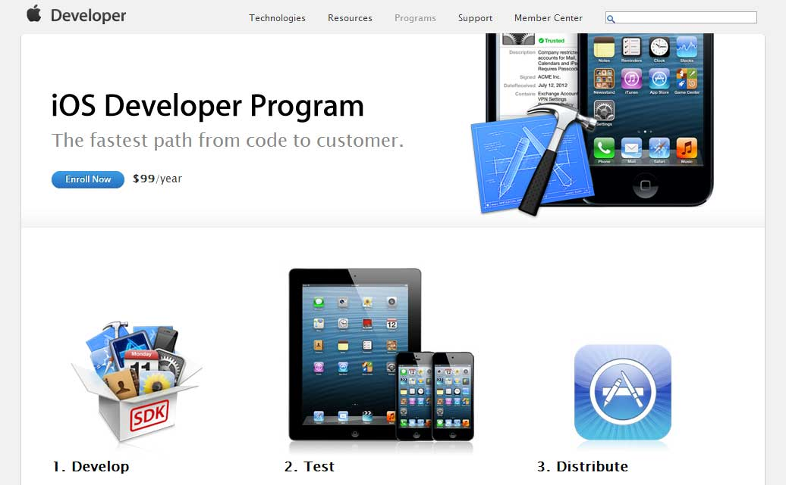
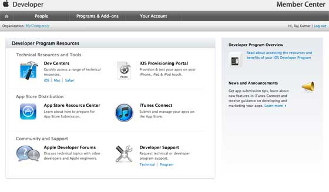
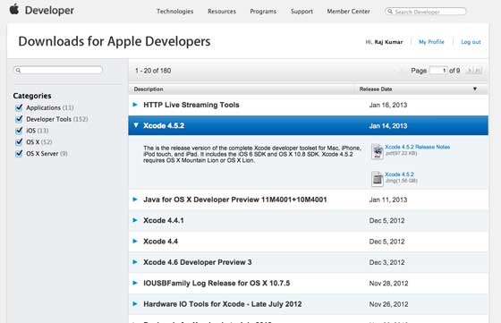

# IOS 简介

IOS之前被称为iPhone OS，是一个由苹果公司开发的移动操作系统。

iOS的第一个版本是在2007年发布的，其中包括iPhone和iPod Touch。

2004年4月发布iPad（第一代），并于2012年11月发布了iPad迷你款。

IOS设备发布相当频繁，由以往经验可知，每年都会推出至少一个版本的iPhone和iPad。

现在发布了iPhone5s，之前还推出了iPhone，iPhone3gs，iPhone4,iPhone4s以及iphone5。

同样的iPad也从iPad一代更新到iPad四代以及一个特别的迷你版iPad。

iOS SDK已经从1.0更新到6.0。最新的iOS SDK6.0，是唯一支持Xcode4.5和其更高版本的版本。

丰富的苹果文档，使我们能找到许多方法和库用于我们的部署目标。在Xcode的当前版本中，我们能够在iOS4.3,5.0和6.0的部署目标之间选择。

IOS的影响能够从以下的特点显现:

Facebook和Twitter上，加速度计，GPS，高端处理器，相机，Safari浏览器，功能强大的API，游戏中心，在应用程序内购买，提醒，宽范围的手势
*   地图
*   Siri
*   Facebook 和 Twitter
*   Multi-Touch（多点触摸）
*   Accelerometer（加速度传感器）
*   GPS
*   高性能处理器
*   相机
*   Safari浏览器
*   功能强大的API
*   游戏中心
*   在应用程序内购买
*   提醒功能
*   手势

iPhone和iPad的用户日益增多，这为iPhone和iPad应用商城的研发者创造了赚钱的机遇。

IOS最新的一点是，苹果公司研发了应用商城，这样用户可以购买应用程序来完善他们的iOS设备。

研发者可以在应用商城发布免费和付费的应用软件。

开发应用程序并将其发布到应用商店，开发人员需要注册iOS开发者计划，为其发展更新Xcode每年话费99美元和Mac Mountain Lion 或更高。

## 注册Apple开发者

对拥有Apple设备的用户来说，非常有必要拥有Apple ID，而且成为一个研发者，必须用到Apple ID,获取 Apple ID是免费的，也无需有资费方面的顾虑。

拥有Apple账户有以下好处：

*   易于了解研发工具；
*   全球研发者视频会议；
*   受邀加入iOS研发者团队;  

## 注册苹果账号

1、单击 ([https://developer.apple.com/programs/register/](https://developer.apple.com/programs/register/)) 并选择创建Apple ID

2、输入个人信息

3、返回邮箱确认，激活账号

4、下载研发工具，Xcode及它所包含的iOS模拟器，iOS SDK和其他研发资源

## 申请APP开发者

1、点击 ([https://developer.apple.com/programs/ios/](https://developer.apple.com/programs/ios/))

2、点击注册页面

3、登录账号（已有账号）或注册Apple ID

4、选择个人账号或公司账号，研发者团队使用公司账号，个人账号不能添加其他用户

5、新用户进入个人信息页面，使用信用卡购买加入研发项目

6、选择会员中心，利用研发者资源

7、在此处可以执行以下操作:

*   创建资源调配的配置文件
*   管理团队和设备
*   通过iTunes Connect管理应用到应用程序
*   获取论坛和技术支持

## IOS Xcode 安装

1、从 [https://developer.apple.com/downloads/](https://developer.apple.com/downloads/) 下载Xcode的最新版本。

2、双击Xcode dmg文件

3、将找到的设备安装和打开

4、在这里会有两个项目在显示的窗口中即Xcode应用程序和应用程序文件夹的快捷方式

5、将Xcode拖拽并复制到应用程序

6、在应用里选择和运行程序，Xcode也将成为运行程序中的一部分

还可以从Mac App store里下载Xcode，并按照屏幕上的安装步

## 界面生成器（Interface Builder）

利用界面生成器这一工具，能很容易的创建UI界面。

可利用一系列的UI元素，拖拽进入UI可视界面。

我们将在接下来的页面了解添加用户界面元素，创建零售商和UI元素的操作。

在对象库的下方包含有全部必要的UI元素。用户界面通常称为xibs，这是他们的文件扩展名。

每个xibs都链接到相应的试图控制器。

## IOS模拟器

IOS模拟器实际上包含两种类型的设备即iPhone和iPad及其不同的版本。

iPhone版本包括iPhone（常规版）、iPhone Retina，iPhone5,iPhone53。

Ipad有iPad和iPad Retina。iPhone模拟器显示如下:

你可以在经度和纬度影响应用程序的位置的情况下运行iOS模拟器，也可以模拟内存警告和呼叫在模拟器中的状态。

能够多数目的使用模拟器，但不能测试像加速度计这样的设备的功能。因此你可能需要iOS设备来测试一个应用程序的所有方面。

