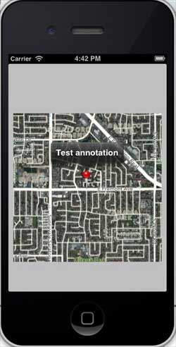
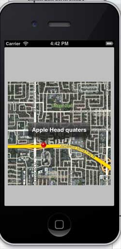

# IOS地图开发

## 简介

IOS地图帮助我们定位位置，IOS地图使用 MapKit 框架。

### 实例步骤

1.创建一个简单的 View based application

2.选择项目文件，然后选择目标，然后添加MapKit.framework.

3.添加 Corelocation.framework

4.向 ViewController.xib 添加地图查看和创建 ibOutlet 并且命名为mapView。

5.通过"File-&gt; New -&gt; File... -&gt; "选择 Objective C class创建一个新的文件，单击下一步

6."sub class of"为 NSObject，类作命名为MapAnnotation

7.选择创建

8.更新MapAnnotation.h ，如下所示

```
#import <Foundation/Foundation.h>
#import <MapKit/MapKit.h>

@interface MapAnnotation : NSObject<MKAnnotation>
@property (nonatomic, strong) NSString *title;
@property (nonatomic, readwrite) CLLocationCoordinate2D coordinate;

- (id)initWithTitle:(NSString *)title andCoordinate:
  (CLLocationCoordinate2D)coordinate2d;

@end

```

9.更新MapAnnotation.m ，如下所示

```
#import "MapAnnotation.h"

@implementation MapAnnotation
-(id)initWithTitle:(NSString *)title andCoordinate:
 (CLLocationCoordinate2D)coordinate2d{    
    self.title = title;
    self.coordinate =coordinate2d;
    return self;
}
@end

```

10.更新ViewController.h ，如下所示

```
#import <UIKit/UIKit.h>
#import <MapKit/MapKit.h>
#import <CoreLocation/CoreLocation.h>
@interface ViewController : UIViewController<MKMapViewDelegate>
{
    MKMapView *mapView;
}
@end

```

11.更新ViewController.m ，如下所示

```
#import "ViewController.h"
#import "MapAnnotation.h"

@interface ViewController ()

@end

@implementation ViewController

- (void)viewDidLoad
{
   [super viewDidLoad];
   mapView = [[MKMapView alloc]initWithFrame:
   CGRectMake(10, 100, 300, 300)];
   mapView.delegate = self;
   mapView.centerCoordinate = CLLocationCoordinate2DMake(37.32, -122.03);
   mapView.mapType = MKMapTypeHybrid;
   CLLocationCoordinate2D location;
   location.latitude = (double) 37.332768;
   location.longitude = (double) -122.030039;
   // Add the annotation to our map view
   MapAnnotation *newAnnotation = [[MapAnnotation alloc]
   initWithTitle:@"Apple Head quaters" andCoordinate:location];
   [mapView addAnnotation:newAnnotation];
   CLLocationCoordinate2D location2;
   location2.latitude = (double) 37.35239;
   location2.longitude = (double) -122.025919;
   MapAnnotation *newAnnotation2 = [[MapAnnotation alloc] 
   initWithTitle:@"Test annotation" andCoordinate:location2];
   [mapView addAnnotation:newAnnotation2];
   [self.view addSubview:mapView];
}
// When a map annotation point is added, zoom to it (1500 range)
- (void)mapView:(MKMapView *)mv didAddAnnotationViews:(NSArray *)views
{
   MKAnnotationView *annotationView = [views objectAtIndex:0];
   id <MKAnnotation> mp = [annotationView annotation];
   MKCoordinateRegion region = MKCoordinateRegionMakeWithDistance
   ([mp coordinate], 1500, 1500);
   [mv setRegion:region animated:YES];
   [mv selectAnnotation:mp animated:YES];
}

- (void)didReceiveMemoryWarning
{
    [super didReceiveMemoryWarning];
    // Dispose of any resources that can be recreated.
}

@end

```

### 输出

运行应用程序时，输出结果如下



当我们向上滚动地图时，输出结果如下


