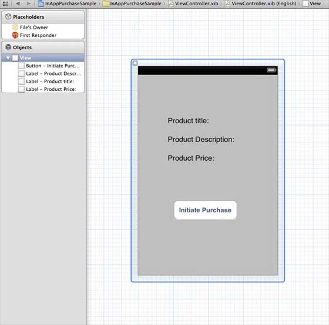
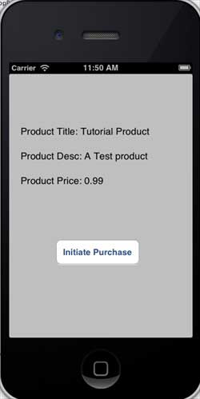
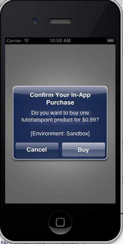
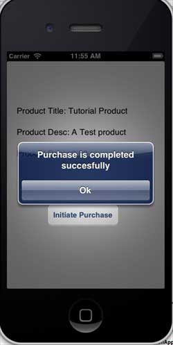

# IOS应用内购买

## 简介

应用程序内购买是应用程序用于购买额外内容或升级功能。

### 实例步骤

1.在 iTunes 连接中请确保拥有一个唯一的 App ID（unique App ID ），当创建捆绑的ID（ bundle ID）应用程序更新时，代码会以相应的配置文件签名在Xcode上

2.创建新的应用程序和更新应用程序信息。你可以知道更多有关的，在苹果的 添加新的应用程序 文档中

3.在应用程序页的管理应用程序( Manage In-App Purchase)中，为app内付费添加新产品

4.确保设置的应用程序为的银行详细。需要将其设置为在应用程序内购买（In-App purchase）。此外在 iTunes 中使用管理用户（Manage Users）选项，创建一个测试用户帐户连接您的应用程序的页。

5.下一步是与处理代码和为我们在应用程序内购买创建有关的 UI。

6.创建一个单一的视图应用程序，并在 iTunes 中指定的标识符连接输入捆绑标识符

7.更新ViewController.xib ，如下所示



8.为三个标签创建IBOutlets，且将按钮分别命名为 productTitleLabel、 productDescriptionLabel、 productPriceLabel 和 purchaseButton

9.选择项目文件，然后选择目标，然后添加StoreKit.framework

10.更新ViewController.h ，如下所示

```
#import <UIKit/UIKit.h>
#import <StoreKit/StoreKit.h>

@interface ViewController : UIViewController<
SKProductsRequestDelegate,SKPaymentTransactionObserver>
{
    SKProductsRequest *productsRequest;
    NSArray *validProducts;
    UIActivityIndicatorView *activityIndicatorView;
    IBOutlet UILabel *productTitleLabel;
    IBOutlet UILabel *productDescriptionLabel;
    IBOutlet UILabel *productPriceLabel;
    IBOutlet UIButton *purchaseButton;
}
- (void)fetchAvailableProducts;
- (BOOL)canMakePurchases;
- (void)purchaseMyProduct:(SKProduct*)product;
- (IBAction)purchase:(id)sender;

@end

```

11.更新ViewController.m ，如下所示

```
#import "ViewController.h"
#define kTutorialPointProductID 
@"com.tutorialPoints.testApp.testProduct"

@interface ViewController ()

@end

@implementation ViewController

- (void)viewDidLoad
{
    [super viewDidLoad];
    // Adding activity indicator
    activityIndicatorView = [[UIActivityIndicatorView alloc]
    initWithActivityIndicatorStyle:UIActivityIndicatorViewStyleWhiteLarge];
    activityIndicatorView.center = self.view.center;
    [activityIndicatorView hidesWhenStopped];
    [self.view addSubview:activityIndicatorView];
    [activityIndicatorView startAnimating];
    //Hide purchase button initially
    purchaseButton.hidden = YES;
    [self fetchAvailableProducts];    
}

- (void)didReceiveMemoryWarning
{
    [super didReceiveMemoryWarning];
    // Dispose of any resources that can be recreated.
}

-(void)fetchAvailableProducts{
    NSSet *productIdentifiers = [NSSet 
    setWithObjects:kTutorialPointProductID,nil];
    productsRequest = [[SKProductsRequest alloc] 
    initWithProductIdentifiers:productIdentifiers];
    productsRequest.delegate = self;
    [productsRequest start];
}

- (BOOL)canMakePurchases
{
    return [SKPaymentQueue canMakePayments];
}
- (void)purchaseMyProduct:(SKProduct*)product{
    if ([self canMakePurchases]) {
        SKPayment *payment = [SKPayment paymentWithProduct:product];
        [[SKPaymentQueue defaultQueue] addTransactionObserver:self];
        [[SKPaymentQueue defaultQueue] addPayment:payment];
    }
    else{
        UIAlertView *alertView = [[UIAlertView alloc]initWithTitle:
        @"Purchases are disabled in your device" message:nil delegate:
        self cancelButtonTitle:@"Ok" otherButtonTitles: nil];
        [alertView show];
    }
}
-(IBAction)purchase:(id)sender{
    [self purchaseMyProduct:[validProducts objectAtIndex:0]];
    purchaseButton.enabled = NO; 
}

#pragma mark StoreKit Delegate

-(void)paymentQueue:(SKPaymentQueue *)queue 
 updatedTransactions:(NSArray *)transactions {
    for (SKPaymentTransaction *transaction in transactions) {
        switch (transaction.transactionState) {
            case SKPaymentTransactionStatePurchasing:
                    NSLog(@"Purchasing");
                break;                
            case SKPaymentTransactionStatePurchased:
               if ([transaction.payment.productIdentifier 
                  isEqualToString:kTutorialPointProductID]) {
                   NSLog(@"Purchased ");
                   UIAlertView *alertView = [[UIAlertView alloc]initWithTitle:
                   @"Purchase is completed succesfully" message:nil delegate:
                   self cancelButtonTitle:@"Ok" otherButtonTitles: nil];
                   [alertView show];
                }               
                [[SKPaymentQueue defaultQueue] finishTransaction:transaction];
                break;                
            case SKPaymentTransactionStateRestored:               
                NSLog(@"Restored ");               
                [[SKPaymentQueue defaultQueue] finishTransaction:transaction];
                break;                
            case SKPaymentTransactionStateFailed:
                NSLog(@"Purchase failed ");
                break;
            default:
                break;
        }
    }
}

-(void)productsRequest:(SKProductsRequest *)request 
 didReceiveResponse:(SKProductsResponse *)response
{
    SKProduct *validProduct = nil;
    int count = [response.products count];
    if (count>0) {
        validProducts = response.products;
        validProduct = [response.products objectAtIndex:0];
        if ([validProduct.productIdentifier 
           isEqualToString:kTutorialPointProductID]) {
            [productTitleLabel setText:[NSString stringWithFormat:
            @"Product Title: %@",validProduct.localizedTitle]];
            [productDescriptionLabel setText:[NSString stringWithFormat:
            @"Product Desc: %@",validProduct.localizedDescription]];
            [productPriceLabel setText:[NSString stringWithFormat:
            @"Product Price: %@",validProduct.price]];           
        }        
    } else {
        UIAlertView *tmp = [[UIAlertView alloc]
                            initWithTitle:@"Not Available"
                            message:@"No products to purchase"
                            delegate:self
                            cancelButtonTitle:nil
                            otherButtonTitles:@"Ok", nil];
        [tmp show];
    }    
    [activityIndicatorView stopAnimating];
    purchaseButton.hidden = NO;
}

@end

```

**注意：** 需要修改你创建In-App Pur（应用内购买）的 kTutorialPointProductID 。通过修改fetchAvailableProducts产品标识符的 NSSet, 你可以添加多个产品。

### 输出

运行该应用程序,输出结果如下



确保已经中登录。单击购买选择现有的Apple ID。输入有效的测试帐户的用户名和密码。几秒钟后，显示下面的信息



一旦产品成功购买，将获得以下信息。可以在显示此信息的地方，更新应用功能相关的代码


