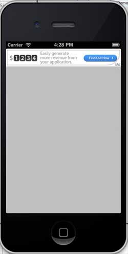

# IOS iAD整合

## 简介

IAD是苹果推出的广告平台，它可以帮助开发者从应用程序中获取收入。

### 实例步骤

1\. 创建一个简单的View based application

2\. 选择项目文件，然后选择目标，然后选择框架并添加 iAd.framework。

3\. 更新 ViewController.h 如下所示

```
#import <UIKit/UIKit.h>
#import <iAd/iAd.h>
@interface ViewController : UIViewController<ADBannerViewDelegate>
{
    ADBannerView *bannerView;
}
@end

```

4\. 更新ViewController.m ，如下所示

```
#import "ViewController.h"

@interface ViewController ()

@end

@implementation ViewController

- (void)viewDidLoad
{
    [super viewDidLoad];
    bannerView = [[ADBannerView alloc]initWithFrame:
    CGRectMake(0, 0, 320, 50)];
    // Optional to set background color to clear color
    [bannerView setBackgroundColor:[UIColor clearColor]];
    [self.view addSubview: bannerView];
}

- (void)didReceiveMemoryWarning
{
    [super didReceiveMemoryWarning];
    // Dispose of any resources that can be recreated.
}

#pragma mark - AdViewDelegates

-(void)bannerView:(ADBannerView *)banner 
 didFailToReceiveAdWithError:(NSError *)error{
    NSLog(@"Error loading");
}

-(void)bannerViewDidLoadAd:(ADBannerView *)banner{
    NSLog(@"Ad loaded");
}
-(void)bannerViewWillLoadAd:(ADBannerView *)banner{
    NSLog(@"Ad will load");
}
-(void)bannerViewActionDidFinish:(ADBannerView *)banner{
    NSLog(@"Ad did finish");

}
@end

```

### 输出

运行该应用程序,得到如下输出结果:


