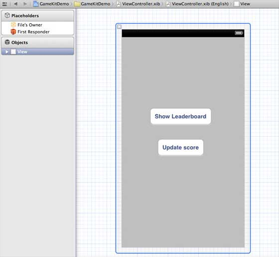
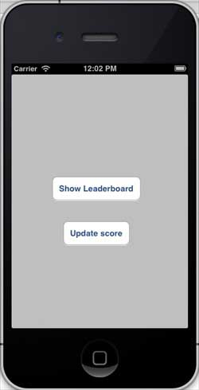
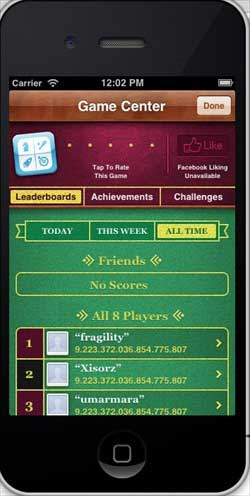
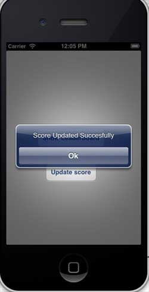

# IOS GameKit

## 简介

GameKit是iOS SDK中一个常用的框架。其核心功能有3个：

*   交互游戏平台Game Center，
*   P2P设备通讯功能
*   In-Game Voice。

## 实例步骤

1.在链接 iTunes 时请确保拥有一个唯一的 App ID（ unique App ID），App ID在我们应用程序更新 bundle ID时及在Xcode代码签名与相应的配置文件需要使用到。

2.创建新的应用程序和更新应用程序信息。在添加新的应用程序文档可以了解更多有关信息。

3.打开你申请的application,点击Manage Game Center选项。进入后点击Enable Game Center使你的Game Center生效。接下来设置自己的Leaderboard和Achievements。

4.下一步涉及处理代码，并为我们的应用程序创建用户界面。

5.创建一个single view application，并输入 bundle identifier 。

6.更新 ViewController.xib，如下所示



7.选择项目文件，然后选择目标，然后添加GameKit.framework

8.为已添加的按钮创建IBActions

9.更新ViewController.h文件，如下所示

```
#import <UIKit/UIKit.h>
#import <GameKit/GameKit.h>

@interface ViewController : UIViewController
<GKLeaderboardViewControllerDelegate>

-(IBAction)updateScore:(id)sender;
-(IBAction)showLeaderBoard:(id)sender;

@end

```

10.更新ViewController.m ，如下所示

```
#import "ViewController.h"

@interface ViewController ()

@end

@implementation ViewController

- (void)viewDidLoad
{
    [super viewDidLoad];
    if([GKLocalPlayer localPlayer].authenticated == NO)
    {
      [[GKLocalPlayer localPlayer] 
      authenticateWithCompletionHandler:^(NSError *error)
      {
         NSLog(@"Error%@",error);
      }];
    }    
}

- (void)didReceiveMemoryWarning
{
    [super didReceiveMemoryWarning];
    // Dispose of any resources that can be recreated.
}
- (void) updateScore: (int64_t) score 
forLeaderboardID: (NSString*) category
{
    GKScore *scoreObj = [[GKScore alloc]
    initWithCategory:category];
    scoreObj.value = score;
    scoreObj.context = 0;
    [scoreObj reportScoreWithCompletionHandler:^(NSError *error) {
        // Completion code can be added here
        UIAlertView *alert = [[UIAlertView alloc]
        initWithTitle:nil message:@"Score Updated Succesfully" 
        delegate:self cancelButtonTitle:@"Ok" otherButtonTitles: nil];
        [alert show];

    }];
}
-(IBAction)updateScore:(id)sender{
    [self updateScore:200 forLeaderboardID:@"tutorialsPoint"];
}
-(IBAction)showLeaderBoard:(id)sender{
    GKLeaderboardViewController *leaderboardViewController =
    [[GKLeaderboardViewController alloc] init];
    leaderboardViewController.leaderboardDelegate = self;
    [self presentModalViewController:
    leaderboardViewController animated:YES];

}
#pragma mark - Gamekit delegates
- (void)leaderboardViewControllerDidFinish:
(GKLeaderboardViewController *)viewController{
    [self dismissModalViewControllerAnimated:YES];
}

@end

```

### 输出

运行该应用程序，输出结果如下



当我们单击显示排行榜时，屏幕显示如下:



当我们点击更新分数，比分将被更新到我们排行榜上，我们会得到一个信息，如下图所示


