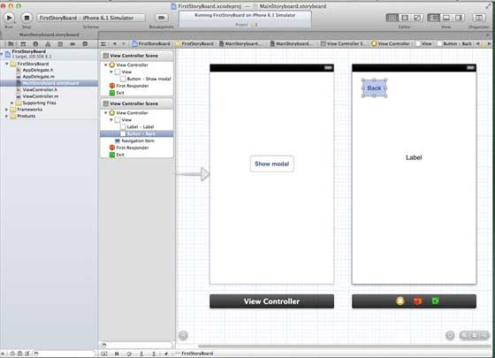
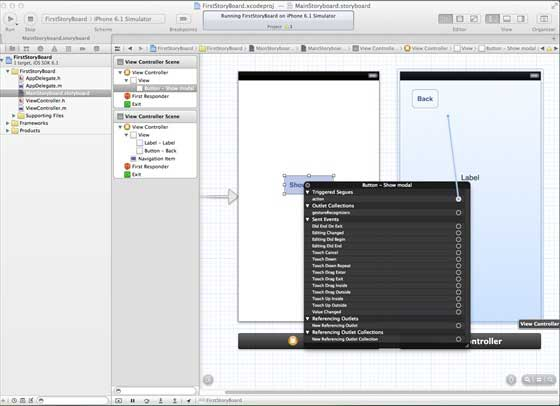
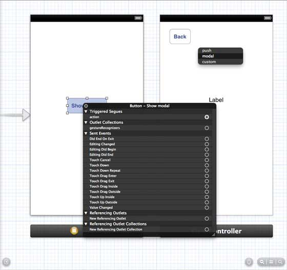
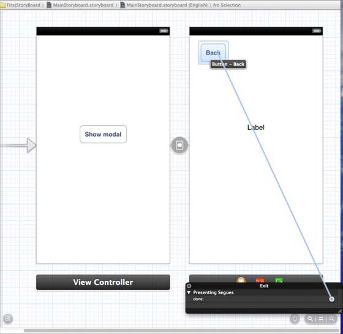
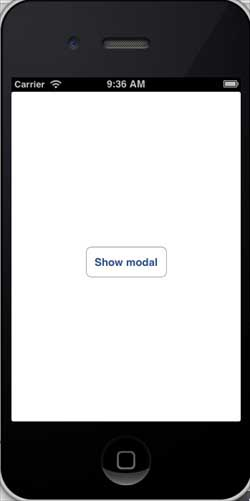
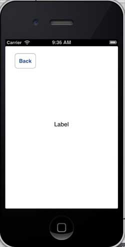

# IOS 故事板(Storyboards)

## 简介

Storyboards在 iOS 5 中才有介绍，当我们用Storyboards时，部署目标应该是iOS5.0或更高版本。

Storyboards 帮助我们了解视觉流动的画面，在界面为

MainStoryboard.storyboard下创建所有应用程序屏幕。

### 实例步骤

1\. 创建一个single view application，创建应用程序时选择 storyboard 复选框。

2\. 选择MainStoryboard.storyboard，在这里你可以找到单一视图控制器。添加一个视图控制器，更新视图控制器，如下所示



3.连接两个视图控制器。右键单击"show modal（显示模式）"按钮，在左侧视图控制器将其拖动到右视视图控制器中,如下图所示：



4.现在从如下所示的三个显示选项中选择modal(模态)



5.更新 ViewController.h 如下所示

```
#import <UIKit/UIKit.h>

@interface ViewController : UIViewController

-(IBAction)done:(UIStoryboardSegue *)seque;

@end

```

6.更新 ViewController.m 如下所示

```
#import "ViewController.h"

@interface ViewController ()

@end

@implementation ViewController

- (void)viewDidLoad
{
    [super viewDidLoad];	
}

- (void)didReceiveMemoryWarning
{
    [super didReceiveMemoryWarning];
    // Dispose of any resources that can be recreated.
}
-(IBAction)done:(UIStoryboardSegue *)seque{
    [self.navigationController popViewControllerAnimated:YES];
}

@end

```

7.选择"MainStoryboard.storyboard"，并右键点击"Exit "按钮，在右侧视图控制器中选择和连接后退按钮，如下图所示



### 输出

在iPhone设备中运行该应用程序,得到如下输出结果



现在，选择显示模式，将得到下面的输出结果


