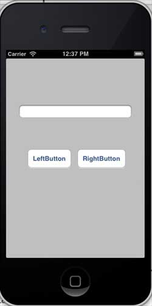
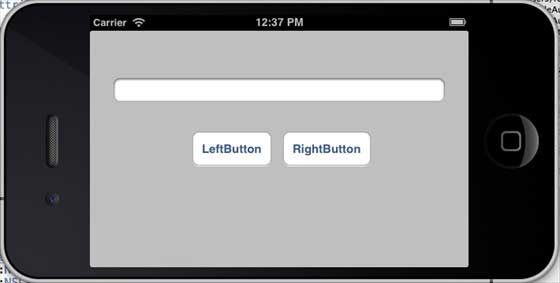
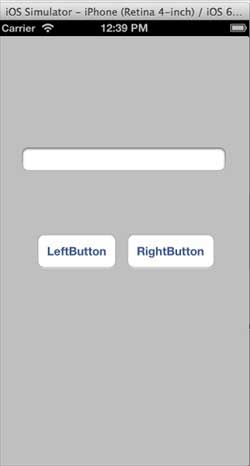
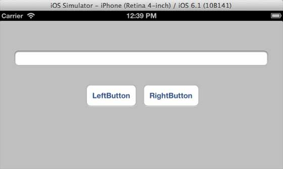

# IOS自动布局

## 简介

自动布局在iOS 6.0中引入，仅可以支持IOS6.0 及 更高版本。它可以帮助我们创建用于多个种设备的界面。

### 实例步骤

1.创建一个简单的 View based application

2.修改 ViewController.m 的文件内容，如下所示

```
#import "ViewController.h"
@interface ViewController ()
@property (nonatomic, strong) UIButton *leftButton;
@property (nonatomic, strong) UIButton *rightButton;
@property (nonatomic, strong) UITextField *textfield;

@end
@implementation ViewController

- (void)viewDidLoad{
    [super viewDidLoad];
    UIView *superview = self.view;
    /*1\. Create leftButton and add to our view*/
    self.leftButton = [UIButton buttonWithType:UIButtonTypeRoundedRect];
    self.leftButton.translatesAutoresizingMaskIntoConstraints = NO;
    [self.leftButton setTitle:@"LeftButton" forState:UIControlStateNormal];
    [self.view addSubview:self.leftButton];    
    /* 2\. Constraint to position LeftButton's X*/
    NSLayoutConstraint *leftButtonXConstraint = [NSLayoutConstraint 
    constraintWithItem:self.leftButton attribute:NSLayoutAttributeCenterX 
    relatedBy:NSLayoutRelationGreaterThanOrEqual toItem:superview attribute:
    NSLayoutAttributeCenterX multiplier:1.0 constant:-60.0f];
    /* 3\. Constraint to position LeftButton's Y*/
    NSLayoutConstraint *leftButtonYConstraint = [NSLayoutConstraint 
    constraintWithItem:self.leftButton attribute:NSLayoutAttributeCenterY 
    relatedBy:NSLayoutRelationEqual toItem:superview attribute:
    NSLayoutAttributeCenterY multiplier:1.0f constant:0.0f];   
    /* 4\. Add the constraints to button's superview*/
    [superview addConstraints:@[ leftButtonXConstraint,
    leftButtonYConstraint]];    
    /*5\. Create rightButton and add to our view*/
    self.rightButton = [UIButton buttonWithType:UIButtonTypeRoundedRect];
    self.rightButton.translatesAutoresizingMaskIntoConstraints = NO;
    [self.rightButton setTitle:@"RightButton" forState:UIControlStateNormal];
    [self.view addSubview:self.rightButton];    
    /*6\. Constraint to position RightButton's X*/
    NSLayoutConstraint *rightButtonXConstraint = [NSLayoutConstraint 
    constraintWithItem:self.rightButton attribute:NSLayoutAttributeCenterX 
    relatedBy:NSLayoutRelationGreaterThanOrEqual toItem:superview attribute:
    NSLayoutAttributeCenterX multiplier:1.0 constant:60.0f];
    /*7\. Constraint to position RightButton's Y*/
    rightButtonXConstraint.priority = UILayoutPriorityDefaultHigh;
    NSLayoutConstraint *centerYMyConstraint = [NSLayoutConstraint 
    constraintWithItem:self.rightButton attribute:NSLayoutAttributeCenterY 
    relatedBy:NSLayoutRelationGreaterThanOrEqual toItem:superview attribute:
    NSLayoutAttributeCenterY multiplier:1.0f constant:0.0f];
    [superview addConstraints:@[centerYMyConstraint,
    rightButtonXConstraint]];
   //8\. Add Text field
    self.textfield = [[UITextField alloc]initWithFrame:
    CGRectMake(0, 100, 100, 30)];
    self.textfield.borderStyle = UITextBorderStyleRoundedRect;
    self.textfield.translatesAutoresizingMaskIntoConstraints = NO;
    [self.view addSubview:self.textfield];
    //9\. Text field Constraints
    NSLayoutConstraint *textFieldTopConstraint = [NSLayoutConstraint 
    constraintWithItem:self.textfield attribute:NSLayoutAttributeTop 
    relatedBy:NSLayoutRelationGreaterThanOrEqual toItem:superview 
    attribute:NSLayoutAttributeTop multiplier:1.0 constant:60.0f];
    NSLayoutConstraint *textFieldBottomConstraint = [NSLayoutConstraint 
    constraintWithItem:self.textfield attribute:NSLayoutAttributeTop 
    relatedBy:NSLayoutRelationGreaterThanOrEqual toItem:self.rightButton 
    attribute:NSLayoutAttributeTop multiplier:0.8 constant:-60.0f];
    NSLayoutConstraint *textFieldLeftConstraint = [NSLayoutConstraint 
    constraintWithItem:self.textfield attribute:NSLayoutAttributeLeft 
    relatedBy:NSLayoutRelationEqual toItem:superview attribute:
    NSLayoutAttributeLeft multiplier:1.0 constant:30.0f];
    NSLayoutConstraint *textFieldRightConstraint = [NSLayoutConstraint 
    constraintWithItem:self.textfield attribute:NSLayoutAttributeRight 
    relatedBy:NSLayoutRelationEqual toItem:superview attribute:
    NSLayoutAttributeRight multiplier:1.0 constant:-30.0f];
    [superview addConstraints:@[textFieldBottomConstraint ,
    textFieldLeftConstraint, textFieldRightConstraint, 
    textFieldTopConstraint]];   
}
- (void)didReceiveMemoryWarning
{
    [super didReceiveMemoryWarning];
    // Dispose of any resources that can be recreated.
}
@end

```

### 输出

运行应用程序，在 iPhone 模拟器上会有下面的输出结果



当我们更改模拟器为横向的方向时，输出结果如下



我们在 iPhone 5 模拟器上运行同一应用程序时,输出结果如下



当我们更改模拟器为横向的方向时，输出结果如下:


