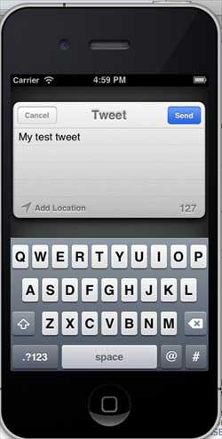

# IOS-Twitter和Facebook

## 简介

Twitter已经整合到iOS5.0，而Facebook已经被集成在 iOS 6.0中。本教程的重点讲解如何利用苹果提供的类在iOS5.0和iOS6.0中部署Twitter和Facebook。

### 实例步骤

1\. 创建一个简单View based application

2\. 选择项目文件，然后选择"targets(目标)"，然后在 choose frameworks（选择框架）中添加Social.framework 和 Accounts.framework

3\. 添加两个名为facebookPost 和 twitterPost的按钮，并为他们创建 ibActions。

4\. 更新 ViewController.h 如下

```
#import <Social/Social.h>
#import <Accounts/Accounts.h>
#import <UIKit/UIKit.h>

@interface ViewController : UIViewController

-(IBAction)twitterPost:(id)sender;
-(IBAction)facebookPost:(id)sender;

@end

```

5\. 更新ViewController.m ，如下所示

```
#import "ViewController.h"

@interface ViewController ()

@end

@implementation ViewController

- (void)viewDidLoad
{
    [super viewDidLoad];
}

- (void)didReceiveMemoryWarning
{
    [super didReceiveMemoryWarning];
    // Dispose of any resources that can be recreated.
}

-(IBAction)facebookPost:(id)sender{

   SLComposeViewController *controller = [SLComposeViewController 
   composeViewControllerForServiceType:SLServiceTypeFacebook];
   SLComposeViewControllerCompletionHandler myBlock = 
   ^(SLComposeViewControllerResult result){
          if (result == SLComposeViewControllerResultCancelled)
          {                
            NSLog(@"Cancelled");                
          } 
          else                
          {
            NSLog(@"Done");
          }
          [controller dismissViewControllerAnimated:YES completion:nil];
        };
   controller.completionHandler =myBlock;        
   //Adding the Text to the facebook post value from iOS
   [controller setInitialText:@"My test post"];        
   //Adding the URL to the facebook post value from iOS
   [controller addURL:[NSURL URLWithString:@"http://www.test.com"]];        
   //Adding the Text to the facebook post value from iOS
   [self presentViewController:controller animated:YES completion:nil];    
}

-(IBAction)twitterPost:(id)sender{
    SLComposeViewController *tweetSheet = [SLComposeViewController 
    composeViewControllerForServiceType:SLServiceTypeTwitter];
    [tweetSheet setInitialText:@"My test tweet"];
    [self presentModalViewController:tweetSheet animated:YES];
}

@end

```

### 输出

运行该应用程序并单击 facebookPost 时我们将获得以下输出


当我们单击 twitterPost 时，我们将获得以下输出


