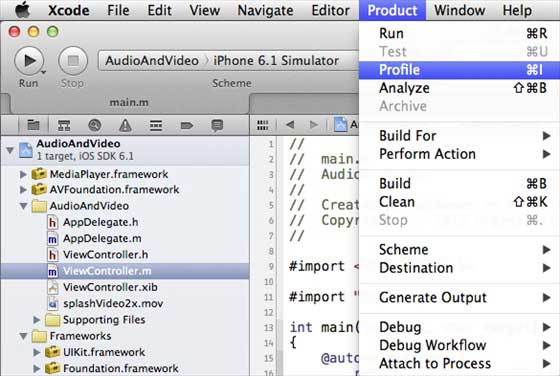
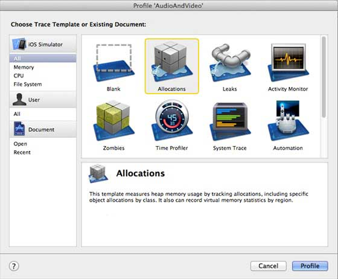
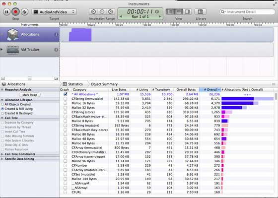
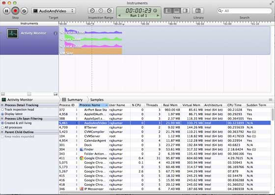

# IOS内存管理

## 简介

iOS下内存管理的基本思想就是引用计数，通过对象的引用计数来对内存对象的生命周期进行控制。具体到编程时间方面，主要有两种方式：

1：MRR（manual retain-release），人工引用计数，对象的生成、销毁、引用计数的变化都是由开发人员来完成。

2：ARC（Automatic Reference Counting），自动引用计数，只负责对象的生成，其他过程开发人员不再需要关心其销毁，使用方式类似于垃圾回收，但其实质还是引用计数。

### 面临的问题

根据苹果说明文档，面临的两个主要问题是：

释放或覆盖的数据仍然在使用。这将造成内存损坏，通常在应用程序崩溃，或者更糟，损坏用户数据。

不释放不再使用的数据会导致内存泄漏。分配的内存，内存泄漏不会释放，即使它从来没有再次使用。泄漏会导致应用程序的内存使用量日益增加，这反过来又可能会导致系统性能较差或死机。

### 内存管理规则

我们创建自己的对象，当他们不再需要的时候，释放他们。

保留需要使用的对象。如果没有必要必须释放这些对象。

不要释放我们没有拥有的对象。

### 使用内存管理工具

可以用Xcode工具仪器的帮助下分析内存的使用情况。它包括的工具有活动监视器，分配，泄漏，僵尸等

### 分析内存分配的步骤

1\. 打开一个现有的应用程序。

2\. 选择产品，配置文件如下所示

3.在以下界面中选择 Allocations 和 Profile。

4\. 我们可以看到不同对象的内存使用情况

5\. 你可以切换视图控制器查看内存是否释放。

6.同样我们可以使用 Activity Monitor 来查看内存在应用程序中的分配的情况。

7\. 这些工具可以帮助我们了解内存的使用情况及在什么地方可能发生泄漏。
