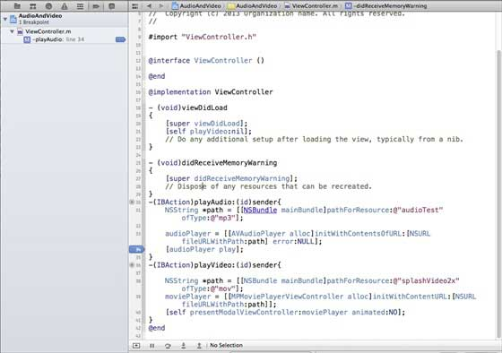
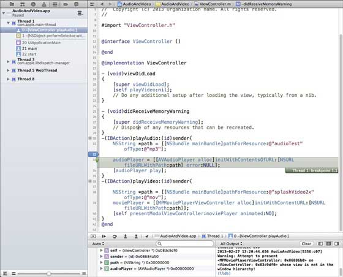
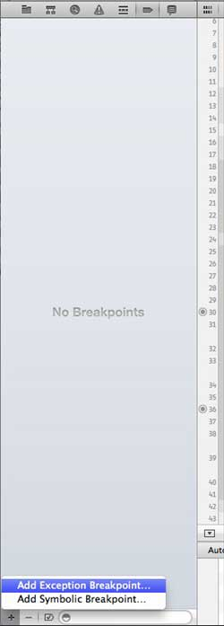
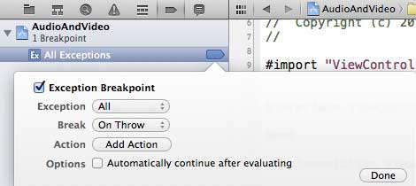

# IOS应用程序调试

## 简介

当我们做应用程序的时候，可能会犯各种错误，这可能会导致各种不同的错误。因此，为了修复这些错误或缺陷，我们需要来调试应用程序。

### 选择一个调试器

Xcode中调试器即 GDB 和 LLDB 调试器，GDB 是默认的。 LLDB是一个调试器是LLVM开源的编译器项目的一部分。您可以更改调试，编辑活动计划选项。

### 如何查找编码错误？

我们只需要建立我们的应用程序，代码被编译器编译，所有的消息，错误和警告将显示以及错误的原因，我们可以纠正他们。可以点击 product，然后点击"分析"，将在应用程序中可能发生的问题。

### 设置断点

断点帮助我们了解我们的应用程序对象，帮助我们找出许多缺陷，包括逻辑问题的不同状态。我们只需要点击创建一个断点的行号。我们可以通过点击并拖动它删除断点。如下所示

当我们运行应用程序并选择playVideo，按钮的应用程序将被暂停，我们来分析一下我们的应用程序的状态。当断点被触发时，我们将得到一个输出，如下图所示

可以轻松地确定哪个线程触发断点。在底部可以看到对象，如self，sender等，这些持有相应的对象的值，我们可以展开一些这些对象，看看他们每个的状态是什么。

要继续应用程序，我们在调试区选择继续按钮（最左边的按钮），如下图所示。其他选项包括步骤和单步跳过

### 异常断点

我们也有异常断点，触发应用程序停止发生异常的位置。通过选择调试导航后选择"+"按钮，我们可以创建异常断点。将得到下面的窗口

然后，我们需要选择" Exception Breakpoint (添加异常)"断点，它会显示下面的窗口

### 下一步是什么？

你可以在 [Xcode 4 用户指南](//developer.apple.com/library/ios/#documentation/ToolsLanguages/Conceptual/Xcode4UserGuide/Introduction/Introduction.html "Xcode 4 user guide") 知道更多关于调试和其他Xcode功能的知识。
