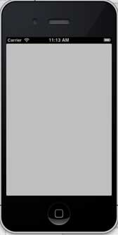
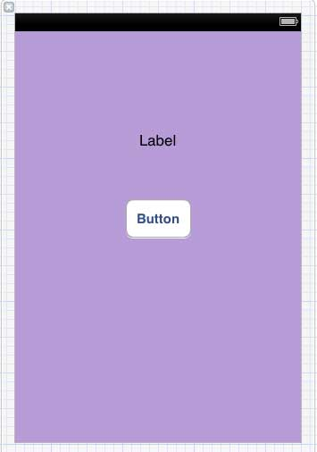
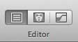
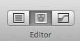
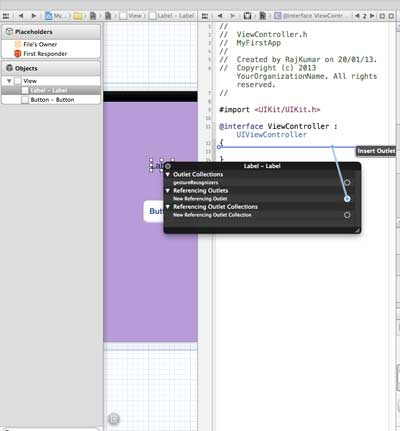
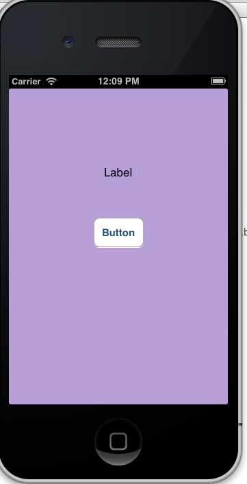

# 创建第一款iPhone应用程序

现在让我们来创建一个在iOS模拟器上运行的简单视图应用（空白的应用程序）。

操作步骤如下：

1、打开Xcode并选择创建一个新的Xcode项目。


2\. 然后选择单一视图应用程序


3\. 接下来输入产品名称即应用程序名称、组织名称和公司标识符。


4\. 确定已经选择自动应用计数，以自动释放超出范围的资源。单击下一步。

5.选择项目目录并选择创建


6\. 你将看到如下所示的页面


屏幕上方能够设置方向、生成和释放。有一个部署目标，设备支持4.3及以上版本的部署目标，这些不是必须的，现在只要专注于运行该应用程序。

7\. 在下拉菜单中选择iPhone Simulator并运行。


8\. 成功运行第一个应用程序，将得到的输出，如下所示。



更改背景颜色使之有开始的界面生成器。选择ViewController.xib。在右侧选择背景选项，更改颜色并运行。


在上述项目中，默认情况下，部署目标已设置为iOS6.0且自动布局将被启用。

为确保应用程序能iOS4.3设备上正常运行，我们已经在开始创建应用程序时修改了部署目标，但我们不禁用自动布局，要取消自动布局，我们需要取消选择自动班上复选框在文件查看器的每个nib，也就是xib文件。

Xcode项目IDE的各部分显示如下（苹果Xcode4用户文档）


在上面所示的检查器选择器栏中可以找到文件检查器，且可以取消选择自动布局。当你想要的目标只有iOS6.0的设备时，可以使用自动布局。

当然，也可以使用新功能，如当加注到iOS6时，就可以使用passbook这一功能。现在，以Ios4.3作为部署目标。

## 深入了解第一款IOS应用程序代码

5个不同文件生成应用程序，如下所示
*   AppDelegate.h
*   AppDelegate.m
*   ViewController.h
*   ViewController.m
*   ViewController.xib

我们使用单行注释（//）来解释简单代码，重要的项目代码解释在代码下方。

#### AppDelegate.h

```
// Header File that provides all UI related items.
#import &lt;UIKit/UIKit.h&gt;
 // Forward declaration (Used when class will be defined /imported in future)
@class ViewController;  

 // Interface for Appdelegate
@interface AppDelegate : UIResponder &lt;UIApplicationDelegate&gt;
// Property window
@property (strong, nonatomic) UIWindow *window;
 // Property Viewcontroller
@property (strong, nonatomic) ViewController *viewController;
//this marks end of interface
@end
```

###### 代码说明

*   AppDelegate调用UIResponder来处理Ios事件。
*   完成UIApplication的命令，提供关键应用程序事件，如启动完毕，终止，等等
*   在iOS设备的屏幕上用UIWindow对象来管理和协调各种视角，它就像其它加载视图的基本视图一样。通常一个应用程序只有一个窗口。
*   UIViewController来处理屏幕流

#### AppDelegate.m

```
// Imports the class Appdelegate's interface
import "AppDelegate.h"

// Imports the viewcontroller to be loaded
#import "ViewController.h"

// Class definition starts here
@implementation AppDelegate

// Following method intimates us the application launched  successfully
- (BOOL)application:(UIApplication *)application
 didFinishLaunchingWithOptions:(NSDictionary *)launchOptions
{
    self.window = [[UIWindow alloc] initWithFrame:
	[[UIScreen mainScreen] bounds]];
    // Override point for customization after application launch.
    self.viewController = [[ViewController alloc]
	 initWithNibName:@"ViewController" bundle:nil];
    self.window.rootViewController = self.viewController;
    [self.window makeKeyAndVisible];
    return YES;
}

- (void)applicationWillResignActive:(UIApplication *)application
{
    /* Sent when the application is about to move from active to inactive state.
    This can occur for certain types of temporary interruptions
    (such as an incoming phone call or SMS message)
    or when the user quits the application and it begins the transition to the
    background state. Use this method to pause ongoing tasks, disable timers,
    and throttle down OpenGL ES frame rates. Games should use this method
    to pause the game.*/
}

- (void)applicationDidEnterBackground:(UIApplication *)application
{
    /* Use this method to release shared resources, save user data, invalidate
    timers, and store enough application state information	to restore your
    application to its current state in case it is terminated later. If your
    application supports background execution, this method is called instead
    of applicationWillTerminate: when the user quits.*/
}

- (void)applicationWillEnterForeground:(UIApplication *)application
{
    /* Called as part of the transition from the background to the inactive state;
    here you can undo many of the changes made on entering the background.*/
}

- (void)applicationDidBecomeActive:(UIApplication *)application
{
    /* Restart any tasks that were paused (or not yet started) while the
    application was inactive. If the application was previously in the background,
	optionally refresh the user interface.*/
}

- (void)applicationWillTerminate:(UIApplication *)application
{
    /* Called when the application is about to terminate. Save data if appropriate.
    See also applicationDidEnterBackground:. */
}

@end
```

###### 代码说明

*   此处定义UIApplication。上面定义的所有方法都是应用程序UI调动和不包含任何用户定义的方法。
*   UIWindow对象被分配用来保存应用程序分配对象。
*   UIController作为窗口初始视图控制器
*   调用makeKeyAndVisible能使窗口可见

#### ViewController.h

```
#import  

// Interface for class ViewController
@interface ViewController : UIViewController

@end
```

###### 代码说明

*   ViewController类继承UIViewController，为iOS应用程序提供基本视图管理模型。

#### ViewController.m

```
#import "ViewController.h"

// Category, an extension of ViewController class
@interface ViewController ()

@end

@implementation ViewController  

- (void)viewDidLoad
{
    [super viewDidLoad];
	// Do any additional setup after loading the view, typically from a nib.
}

- (void)didReceiveMemoryWarning
{
    [super didReceiveMemoryWarning];
    // Dispose of any resources that can be recreated.
}

@end
```

###### 代码说明

*   在这里两种方法实现UIViewController类的基类中定义
*   初始视图加载后调用viewDidLoad中的安装程序
*   在内存警告的情况下调用didReceviveMemoryWarning

## 简介

在iOS中，操作（action）和输出口（Outlet）指的是ibActions和ibOutlets，也就是ib接口生成器所在的地方。这些都和UI元素相关，我们将直观的了解他们后探讨如何实现他们。

## 步骤

1、让我们使用第一款iPhone应用程序。

2、从导航部分中的文件中选择ViewController.xib文件

3、从右手边得窗口下面显示的窗口格库中选择UI元素


4、拖拽UI元素到界面生成器的可视框中

5、添加标签和红色圆形按钮到可视图中



6、在工作区工具栏的右上角找到编辑器选择按钮，如下图所示



**选择编辑器按钮**



7、编辑器区域中心有两个窗口，ViewController.xib文件和ViewController.h

8、右击标签上的选择按钮，按住并拖动新引用参照，如下所示



9、现在放在ViewController.h之间的大括号中。也可以放在文件中，如果是这样，必须在做这个之前已经添加了。如下所示


10\. 输入输出口（Outlet）的标签名称，这里给出的是myTitleLable。单击链接，完成ibOutlet

11、同样的，添加操作，只需右击倒圆角矩形，选择触摸内心拖动它下方的大括号


12、重新命名为setTitleLable


13、 选择ViewController.m文件，有一种方法，如下所示

```
-(IBAction) setTitleLabel:(id)sender{
}
```

14、在上述的方法内，如下所示，添加一个语句

```
[myTitleLabel setTitleText:@"Hello"];
```

15、选择运行按钮运行该程序，得到如下的输出



16、单击按钮


17.、创建的参照（outlets）按钮标签已更改为对按钮执行的操作（actions）

18、由上可知，IBOutlet将创建对UIElement的引用（此处为UILable），同样的IBAction和UIButton通过执行操作和UIButton相链接。

19、当创建动作时通过选择不同的事件你可以做不同的操作。

## 委托（Delegates）示例

假设对象A调用B来执行一项操作，操作一旦完成，对象A就必须知道对象B已完成任务且对象A将执行其他必要操作。

在上面的示例中的关键概念有

*   A是B的委托对象
*   B引用一个A
*   A将实现B的委托方法
*   B通过委托方法通知

创建一个委托（Delegates）对象

1\. 创建一个单一视图的应用程序

2\. 然后选择文件 File -&gt; New -&gt; File...


3\. 然后选择Objective C单击下一步

4\. 将SampleProtocol的子类命名为NSObject，如下所示


5\. 然后选择创建

6.向SampleProtocol.h文件夹中添加一种协议，然后更新代码，如下所示：

```
#import &lt;Foundation/Foundation.h&gt;
// Protocol definition starts here
@protocol SampleProtocolDelegate &lt;NSObject&gt;
@required
- (void) processCompleted;
@end
// Protocol Definition ends here
@interface SampleProtocol : NSObject

{
   // Delegate to respond back
   id &lt;SampleProtocolDelegate&gt; _delegate;

}
@property (nonatomic,strong) id delegate;

-(void)startSampleProcess; // Instance method

@end
```

7\. Implement the instance method by updating the SampleProtocol.m file as shown below.

```
#import "SampleProtocol.h"

@implementation SampleProtocol

-(void)startSampleProcess{

    [NSTimer scheduledTimerWithTimeInterval:3.0 target:self.delegate
	selector:@selector(processCompleted) userInfo:nil repeats:NO];
}
@end
```

8\. 将标签从对象库拖到UIView，从而在ViewController.xib中添加UILabel，如下所示:


9\. 创建一个IBOutlet标签并命名为myLabel，然后按如下所示更新代码并在ViewController.h里显示SampleProtocolDelegate

```
#import &lt;UIKit/UIKit.h&gt;
#import "SampleProtocol.h"

@interface ViewController : UIViewController&lt;SampleProtocolDelegate&gt;
{
    IBOutlet UILabel *myLabel;
}
@end
```

10\. 完成授权方法，为SampleProtocol创建对象和调用startSampleProcess方法。如下所示，更新ViewController.m文件

```
#import "ViewController.h"

@interface ViewController ()

@end

@implementation ViewController

- (void)viewDidLoad
{
    [super viewDidLoad];
    SampleProtocol *sampleProtocol = [[SampleProtocol alloc]init];
    sampleProtocol.delegate = self;
    [myLabel setText:@"Processing..."];
    [sampleProtocol startSampleProcess];
	// Do any additional setup after loading the view, typically from a nib.
}

- (void)didReceiveMemoryWarning
{
    [super didReceiveMemoryWarning];
    // Dispose of any resources that can be recreated.
}

#pragma mark - Sample protocol delegate
-(void)processCompleted{    
    [myLabel setText:@"Process Completed"];
}

@end
```

11\. 将看到如下所示的输出结果，最初的标签也会继续运行，一旦授权方法被SampleProtocol对象所调用，标签运行程序的代码也会更新。


## 什么是UI元素？

UI元素是我们应用程序里可以看见的任何可视元素，其中一些元素响应用户的操作，如按钮、文本字段，有其他的丰富内容，如图像、标签等。

## 如何添加UI元素？

可以在界面生成器的参与下，在代码中添加UI元素。如果需要，我们可以使用他们其中之一。

## 我们关注的

通过代码，将集中于添加UI元素到应用程序。比较简单而直接的方法是使用界面生成器拖放UI元素。

## 方法

以下我们通过创建一款简单的IOS应用程序，来解释一些UI元素

#### 步骤

1、在第一款IOS程序里一样，创建一个Viewbased应用程序

2、只更新ViewController.h和ViewController.m文件

3、然后我们将方法添加到ViewController.m文件中来创建UI元素

4、在viewDidLoad方法中调用此方法

5、重要的代码行已经在代码中通过在单行上方标注的方式进行了注释

## 用户界面元素列表

下面解释具体的UI元素和其相关的功能

| 具体的UI元素 | 功能 |
| --- | --- |
| [Text Fields-文本字段](att-ios-ui-text-field.html) | 用户界面元素，使用应用程序来获取用户输入 |
| [输入类型-TextFields](att-ios-ui-input-types.html) | 用户可以通过使用UITextField来赋予键盘输入属性 |
| [Buttons-按钮](att-ios-ui-buttons.html) | 用于处理用户操作 |
| [Label-标签](att-ios-ui-label.html) | 用于显示静态内容 |
| [Toolbar-工具栏](att-ios-ui-toolbar.html) | 操纵当前视图所显示的东西 |
| [Status Bar-状态栏](att-ios-ui-status-bar.html) | 显示设备的关键信息 |
| [Navigation Bar-导航栏](att-ios-ui-navigation-bar.html) | 包含一个可以推断的视图控制器，并弹出导航控制器的导航按钮 |
| [Tab bar-选项卡栏](att-ios-ui-tab-bar.html) | 一般用于各个子任务、视图或同一视图中的模型之间的切换. |
| [Image View-图像视图](att-ios-ui-imageview.html) | 用于显示一个简单的图像序列 |
| [Scroll View-滚动视图](att-ios-ui-scrollview.html) | 用来显示更多屏幕区域的内容 |
| [Table View-列表视图](att-ios-ui-tableview.html) | 用于在多个行或部分中显示可滚动列表的数据 |
| [IOS分割视图(Split View)](att-ios-ui-splitview.html) | 用于在详细信息窗格上显示两个窗格与主窗格的控制信息 |
| [Text View-文本视图](att-ios-ui-textview.html) | 用于显示滚动列表的文本信息可以被选中和编辑 |
| [View Transition -视图切换](att-ios-ui-view-transition.html) | 各种视图查看之间的切换 |
| [Pickers-选择器](att-ios-ui-picker.html) | 用来显示从列表中选择一个特定的数据 |
| [Switches-开关](att-ios-ui-switches.html) | 用作禁用和启用操作 |
| [IOS滑块(Sliders)](att-ios-ui-sliders.html) | 用来允许用户在允许的值范围内选对一个值 |
| [IOS警告对话框(Alerts)](att-ios-ui-alerts.html) | 用来给用户提供重要的信息 |
| [IOS图标(Icons)](att-ios-ui-icons.html) | 它是图像，表示用于行动或描绘与应用程序相关的东西 |

## 文本字段的使用

文本字段是一个用户界面元素，通过应用程序来获取用户输入。

一个UITextfield如下所示：


重要的文本字段的属性

*   在没有任何用户输入时，显示占位符
*   正常文本
*   自动更正型
*   键盘类型
*   返回键类型
*   清除按钮模式
*   对齐方式
*   委托

## 更新xib中的属性

可以在Utility area（实用区域，窗口的右侧）更改xib在属性查看器中的文本字段属性。


## 文本字段委托

我们可以通过右击 UIElement 界面生成器中设置委托并将它连接到文件的所有者，如下所示：


使用委托的步骤：

*   1.设置委托如上图所示
*   2.添加委托到您的响应类
*   3.执行文本字段代表，重要的文本字段代表如下:

```
- (void)textFieldDidBeginEditing:(UITextField *)textField

```

```
- (void)textFieldDidEndEditing:(UITextField *)textField

```

*   4.正如其名称所暗示，上述两个委托分别叫做编辑的文本字段和结束编辑
*   5\. 其他的委托请查看 UITextDelegate Protocol 参考手册。  

## 实例

以下我们使用简单的实例来创建UI元素

ViewController 类将采用UITextFieldDelegate，修改ViewController.h文件，如下所示:

将方法addTextField添加到我们的 ViewController.m 文件

然后在 viewDidLoad 方法中调用此方法

在ViewController.m中更新viewDidLoad，如下所示

```
#import "ViewController.h"
@interface ViewController ()

@end

@implementation ViewController

- (void)viewDidLoad
{
    [super viewDidLoad];
    //The custom method to create our textfield is called
    [self addTextField];
    // Do any additional setup after loading the view, typically from a nib.
}

- (void)didReceiveMemoryWarning
{
    [super didReceiveMemoryWarning];
    // Dispose of any resources that can be recreated.
}

-(void)addTextField{
   // This allocates a label
   UILabel *prefixLabel = [[UILabel alloc]initWithFrame:CGRectZero];
   //This sets the label text
   prefixLabel.text =@"## ";
   // This sets the font for the label
   [prefixLabel setFont:[UIFont boldSystemFontOfSize:14]];
   // This fits the frame to size of the text
   [prefixLabel sizeToFit];

   // This allocates the textfield and sets its frame
   UITextField *textField = [[UITextField  alloc] initWithFrame:
   CGRectMake(20, 50, 280, 30)];

   // This sets the border style of the text field
   textField.borderStyle = UITextBorderStyleRoundedRect;
   textField.contentVerticalAlignment =
   UIControlContentVerticalAlignmentCenter;
   [textField setFont:[UIFont boldSystemFontOfSize:12]];

   //Placeholder text is displayed when no text is typed
   textField.placeholder = @"Simple Text field";

   //Prefix label is set as left view and the text starts after that
   textField.leftView = prefixLabel;

   //It set when the left prefixLabel to be displayed
   textField.leftViewMode = UITextFieldViewModeAlways;

   // Adds the textField to the view.
   [self.view addSubview:textField];

   // sets the delegate to the current class
   textField.delegate = self;
}

// pragma mark is used for easy access of code in Xcode
#pragma mark - TextField Delegates

// This method is called once we click inside the textField
-(void)textFieldDidBeginEditing:(UITextField *)textField{
   NSLog(@"Text field did begin editing");
}

// This method is called once we complete editing
-(void)textFieldDidEndEditing:(UITextField *)textField{
   NSLog(@"Text field ended editing");
}

// This method enables or disables the processing of return key
-(BOOL) textFieldShouldReturn:(UITextField *)textField{    
    [textField resignFirstResponder];
    return YES;
}

- (void)viewDidUnload {
   label = nil;
   [super viewDidUnload];
}

@end
```

运行该应用程序会看到下面的输出


委托调用的方法基于用户操作。要知道调用委托时请参阅控制台输出。

## 为什么使用不同的输入类型？

键盘输入的类型帮助我们从用户获取必需的输入。

它移除不需要的键，并包括所需的部分。用户可以通过使用 UITextField 的键盘属性设置输入的类型。

*   如：文本字段（ textField）。  keyboardType = UIKeyboardTypeDefault

键盘输入类型

| 输入的类型 | 描述 |
| --- | --- |
| UIKeyboardTypeASCIICapable | 键盘包括所有标准的 ASCII 字符。 |
| UIKeyboardTypeNumbersAndPunctuation | 键盘显示数字和标点。 |
| UIKeyboardTypeURL | 键盘的 URL 项优化。 |
| UIKeyboardTypeNumberPad | 键盘用于 PIN 输入和显示一个数字键盘。 |
| UIKeyboardTypePhonePad | 键盘对输入电话号码进行了优化。 |
| UIKeyboardTypeNamePhonePad | 键盘用于输入姓名或电话号码。 |
| UIKeyboardTypeEmailAddress | 键盘对输入电子邮件地址的优化。 |
| UIKeyboardTypeDecimalPad | 键盘用来输入十进制数字。 |
| UIKeyboardTypeTwitter | 键盘对 twitter @ 和 # 符号进行了优化。 |

## 添加自定义方法 addTextFieldWithDifferentKeyboard

```
-(void) addTextFieldWithDifferentKeyboard{

   UITextField *textField1= [[UITextField alloc]initWithFrame:
   CGRectMake(20, 50, 280, 30)];
   textField1.delegate = self;
   textField1.borderStyle = UITextBorderStyleRoundedRect;
   textField1.placeholder = @"Default Keyboard";
   [self.view addSubview:textField1];

   UITextField *textField2 = [[UITextField alloc]initWithFrame:
   CGRectMake(20, 100, 280, 30)];
   textField2.delegate = self;
   textField2.borderStyle = UITextBorderStyleRoundedRect;
   textField2.keyboardType = UIKeyboardTypeASCIICapable;
   textField2.placeholder = @"ASCII keyboard";
   [self.view addSubview:textField2];

   UITextField *textField3 = [[UITextField alloc]initWithFrame:
   CGRectMake(20, 150, 280, 30)];
   textField3.delegate = self;
   textField3.borderStyle = UITextBorderStyleRoundedRect;
   textField3.keyboardType = UIKeyboardTypePhonePad;
   textField3.placeholder = @"Phone pad keyboard";
   [self.view addSubview:textField3];

   UITextField *textField4 = [[UITextField alloc]initWithFrame:
   CGRectMake(20, 200, 280, 30)];
   textField4.delegate = self;
   textField4.borderStyle = UITextBorderStyleRoundedRect;
   textField4.keyboardType = UIKeyboardTypeDecimalPad;
   textField4.placeholder = @"Decimal pad keyboard";
   [self.view addSubview:textField4];

   UITextField *textField5= [[UITextField alloc]initWithFrame:
   CGRectMake(20, 250, 280, 30)];
   textField5.delegate = self;
   textField5.borderStyle = UITextBorderStyleRoundedRect;
   textField5.keyboardType = UIKeyboardTypeEmailAddress;
   textField5.placeholder = @"Email keyboard";
   [self.view addSubview:textField5];

   UITextField *textField6= [[UITextField alloc]initWithFrame:
   CGRectMake(20, 300, 280, 30)];
   textField6.delegate = self;
   textField6.borderStyle = UITextBorderStyleRoundedRect;
   textField6.keyboardType = UIKeyboardTypeURL;
   textField6.placeholder = @"URL keyboard";
   [self.view addSubview:textField6];
}
```

在 ViewController.m 中更新 viewDidLoad，如下所示

```
(void)viewDidLoad
{
   [super viewDidLoad];
   //The custom method to create textfield with different keyboard input
   [self addTextFieldWithDifferentKeyboard];
   //Do any additional setup after loading the view, typically from a nib
}
```

## 输出

现在当我们运行应用程序时我们就会得到下面的输出:


选择不同的文本区域我们将看到不同的键盘。

## 按钮使用

按钮用于处理用户操作。它截取触摸事件，并将消息发送到目标对象。

## 圆角矩形按钮


## 在 xib 中的按钮属性

您可以在Utility area（实用区域，窗口的右侧）的属性检查器的更改  xib 按钮属性。


按钮类型

*   UIButtonTypeCustom
*   UIButtonTypeRoundedRect
*   UIButtonTypeDetailDisclosure
*   UIButtonTypeInfoLight
*   UIButtonTypeInfoDark
*   UIButtonTypeContactAdd

重要的属性

*   imageView
*   titleLabel

重要的方法

```
+ (id)buttonWithType:(UIButtonType)buttonType
```

```
- (UIImage *)backgroundImageForState:(UIControlState)state
```

```
- (UIImage *)imageForState:(UIControlState)state
```

```
- (void)setTitle:(NSString *)title forState:(UIControlState)state
```

```
- (void)addTarget:(id)target action:(SEL)action forControlEvents: (UIControlEvents) controlEvents
```

添加自定义方法 addDifferentTypesOfButton

```
-(void)addDifferentTypesOfButton
{
    // A rounded Rect button created by using class method
    UIButton *roundRectButton = [UIButton buttonWithType:
    UIButtonTypeRoundedRect];
    [roundRectButton setFrame:CGRectMake(60, 50, 200, 40)];
    // sets title for the button
    [roundRectButton setTitle:@"Rounded Rect Button" forState:
    UIControlStateNormal];
    [self.view addSubview:roundRectButton];

    UIButton *customButton = [UIButton buttonWithType: UIButtonTypeCustom];
    [customButton setBackgroundColor: [UIColor lightGrayColor]];
    [customButton setTitleColor:[UIColor blackColor] forState:
    UIControlStateHighlighted];
    //sets background image for normal state
    [customButton setBackgroundImage:[UIImage imageNamed:
    @"Button_Default.png"]
    forState:UIControlStateNormal];
    //sets background image for highlighted state
    [customButton setBackgroundImage:[UIImage imageNamed:
    @"Button_Highlighted.png"]
    forState:UIControlStateHighlighted];
    [customButton setFrame:CGRectMake(60, 100, 200, 40)];
    [customButton setTitle:@"Custom Button" forState:UIControlStateNormal];
    [self.view addSubview:customButton];

    UIButton *detailDisclosureButton = [UIButton buttonWithType:
    UIButtonTypeDetailDisclosure];
    [detailDisclosureButton setFrame:CGRectMake(60, 150, 200, 40)];
    [detailDisclosureButton setTitle:@"Detail disclosure" forState:
    UIControlStateNormal];
    [self.view addSubview:detailDisclosureButton];

    UIButton *contactButton = [UIButton buttonWithType:
    UIButtonTypeContactAdd];
    [contactButton setFrame:CGRectMake(60, 200, 200, 40)];
    [self.view addSubview:contactButton];

    UIButton *infoDarkButton = [UIButton buttonWithType:
    UIButtonTypeInfoDark];
    [infoDarkButton setFrame:CGRectMake(60, 250, 200, 40)];
    [self.view addSubview:infoDarkButton];

    UIButton *infoLightButton = [UIButton buttonWithType:
    UIButtonTypeInfoLight];
    [infoLightButton setFrame:CGRectMake(60, 300, 200, 40)];
    [self.view addSubview:infoLightButton];
}
```

## 注意：

我们将命名为"Button_Default.png"和"Button_Highlighted.png"的个图像添加到我们的项目，可以通过将图像拖到列出了我们的项目文件的导航区域来完成。

在 ViewController.m 中更新 viewDidLoad，如下所示

```
(void)viewDidLoad
{
	[super viewDidLoad];
	//The custom method to create our different types of button is called
	[self addDifferentTypesOfButton];
	//Do any additional setup after loading the view, typically from a nib
}
```

## 输出

现在当我们运行应用程序时我们就会得到下面的输出：


## 标签的使用

标签用于显示静态内容，包括单独的一行或多行。

重要的属性

*   textAlignment
*   textColor
*   text
*   numberOflines
*   lineBreakMode

## 添加自定义方法 addLabel

```
-(void)addLabel{
    UILabel *aLabel = [[UILabel alloc]initWithFrame:
    CGRectMake(20, 200, 280, 80)];
    aLabel.numberOfLines = 0;
    aLabel.textColor = [UIColor blueColor];
    aLabel.backgroundColor = [UIColor clearColor];
    aLabel.textAlignment = UITextAlignmentCenter;
    aLabel.text = @"This is a sample text\n of multiple lines.
    here number of lines is not limited.";
    [self.view addSubview:aLabel];
}
```

在 ViewController.m 中更新 viewDidLoad，如下所示:

```
- (void)viewDidLoad
{
    [super viewDidLoad];
    //The custom method to create our label is called
    [self addLabel];
    // Do any additional setup after loading the view, typically from a nib.
}
```

## 输出

运行应用程序，就会得到下面的输出:


## 工具栏的使用

我们可以使用工具栏修改视图元素。

如，邮件应用程序里的收件箱栏中有删除、分享、答复等等。如下所示：


重要的属性

*   barStyle
*   items

## 添加自定义方法 addToolbar

```
-(void)addToolbar
{
    UIBarButtonItem *spaceItem = [[UIBarButtonItem alloc]
    initWithBarButtonSystemItem:UIBarButtonSystemItemFlexibleSpace
    target:nil action:nil];
    UIBarButtonItem *customItem1 = [[UIBarButtonItem alloc]
    initWithTitle:@"Tool1" style:UIBarButtonItemStyleBordered
    target:self action:@selector(toolBarItem1:)];
    UIBarButtonItem *customItem2 = [[UIBarButtonItem alloc]
    initWithTitle:@"Tool2" style:UIBarButtonItemStyleDone
    target:self action:@selector(toolBarItem2:)];
    NSArray *toolbarItems = [NSArray arrayWithObjects:
    customItem1,spaceItem, customItem2, nil];
    UIToolbar *toolbar = [[UIToolbar alloc]initWithFrame:
    CGRectMake(0, 366+54, 320, 50)];
    [toolbar setBarStyle:UIBarStyleBlackOpaque];
    [self.view addSubview:toolbar];
    [toolbar setItems:toolbarItems];
}
```

为了解所执行的操作我们在我们的ViewController.xib中添加UILabel Iboutlet并为 UILabel 创建命名为标签的IBoutlet。

我们还需要添加两个方法来执行，如下所示的工具栏项的操作:

```
-(IBAction)toolBarItem1:(id)sender{
    [label setText:@"Tool 1 Selected"];
}

-(IBAction)toolBarItem2:(id)sender{
    [label setText:@"Tool 2 Selected"];    
}
```

在ViewController.m中更新 viewDidLoad，如下所示:

```
- (void)viewDidLoad
{
    [super viewDidLoad];
    // The method hideStatusbar called after 2 seconds
    [self addToolbar];    
    // Do any additional setup after loading the view, typically from a nib.
}
```

## 输出

现在当我们运行该应用程序我们会看到下面的输出。


单击我们得到的 tool1 和 tool2 栏按钮


## 状态栏的使用

状态栏显示设备的关键信息。

*   设备模型或网络提供商
*   网络信号强度
*   电池使用量
*   时间

状态栏如下所示：


隐藏状态栏的方法

```
 [[UIApplication sharedApplication] setStatusBarHidden:YES];
```

## 另一种隐藏状态栏的方法

我们还可以通过添加行，并在info.plist 的帮助下选择 UIStatusBarHidden 隐藏状态栏，并使其值为否（NO）。

## 在类中添加自定义方法 hideStatusbar

它隐藏状态栏进行动画处理，并也调整我们认为占据状态栏空间的大小。

```

-(void)hideStatusbar{
    [[UIApplication sharedApplication] setStatusBarHidden:YES
    withAnimation:UIStatusBarAnimationFade];
    [UIView beginAnimations:@"Statusbar hide" context:nil];
    [UIView setAnimationDuration:0.5];
    [self.view setFrame:CGRectMake(0, 0, 320, 480)];
    [UIView commitAnimations];
}
```

在 ViewController.m 中更新 viewDidLoad，如下所示：

```

- (void)viewDidLoad
{
    [super viewDidLoad];
    // The method hideStatusbar called after 2 seconds
    [self performSelector:@selector(hideStatusbar)
    withObject:nil afterDelay:2.0];
    // Do any additional setup after loading the view, typically from a nib.
}
```

## 初始输出以及2秒后输出


## IOS导航栏的使用

导航栏包含导航控制器的导航的按钮。在导航栏中的标题是当前视图控制器的标题。

## 示例代码和步骤

1.创视图应用程序

2. 现在，选择应用程序 Delegate.h ，添加导航控制器的属性，如下所示:

```
#import <UIKit/UIKit.h>

@class ViewController;

@interface AppDelegate : UIResponder <UIApplicationDelegate>

@property (strong, nonatomic) UIWindow *window;

@property (strong, nonatomic) ViewController *viewController;

@property (strong, nonatomic) UINavigationController *navController;

@end
```

3\. 更新应用程序: didFinishLaunchingWithOptions:方法，在AppDelegate.m文件分配的导航控制器，并使其成为窗口的根视图控制器，如下所示：

```
- (BOOL)application:(UIApplication *)application didFinishLaunchingWithOptions:(NSDictionary *)launchOptions
{
    self.window = [[UIWindow alloc] initWithFrame:
    [[UIScreen mainScreen] bounds]];
    // Override point for customization after application launch.
    self.viewController = [[ViewController alloc]
    initWithNibName:@"ViewController" bundle:nil];
    //Navigation controller init with ViewController as root
    UINavigationController *navController = [[UINavigationController alloc]
    initWithRootViewController:self.viewController];
    self.window.rootViewController = navController;
    [self.window makeKeyAndVisible];
    return YES;
}
```

4.现在，通过选择**File** -&gt; **New** -&gt;**File...** -&gt; Objective C Class 添加新的类文件TempViewController，然后将类命名 TempViewController 与 UIViewController 的子类。

5.在ViewController.h中添加navButon，如下所示

```
// ViewController.h
#import <UIKit/UIKit.h>

@interface ViewController : UIViewController
{    
    UIButton *navButton;
}
@end
```

6.现在添加方法addNavigationBarItem并在viewDidLoad调用方法

7\. 为导航项创建方法

8. 我们还需要创建另一种方法到另一视图控制器 TempViewController。

9. 更新后的ViewController.m，如下所示:

```
// ViewController.m
#import "ViewController.h"
#import "TempViewController.h"
@interface ViewController ()

@end
@implementation ViewController

- (void)viewDidLoad
{
    [super viewDidLoad];
    [self addNavigationBarButton];
    //Do any additional setup after loading the view, typically from a nib
}

- (void)didReceiveMemoryWarning
{
    [super didReceiveMemoryWarning];
    // Dispose of any resources that can be recreated.
}

-(IBAction)pushNewView:(id)sender{
   TempViewController *tempVC =[[TempViewController alloc]
   initWithNibName:@"TempViewController" bundle:nil];
   [self.navigationController pushViewController:tempVC animated:YES];
}

-(IBAction)myButtonClicked:(id)sender{
   // toggle hidden state for navButton
   [navButton setHidden:!nav.hidden];
}

-(void)addNavigationBarButton{
   UIBarButtonItem *myNavBtn = [[UIBarButtonItem alloc] initWithTitle:
   @"MyButton" style:UIBarButtonItemStyleBordered target:
   self action:@selector(myButtonClicked:)];

   [self.navigationController.navigationBar setBarStyle:UIBarStyleBlack];
   [self.navigationItem setRightBarButtonItem:myNavBtn];

   // create a navigation push button that is initially hidden
   navButton = [UIButton buttonWithType:UIButtonTypeRoundedRect];
   [navButton setFrame:CGRectMake(60, 50, 200, 40)];
   [navButton setTitle:@"Push Navigation" forState:UIControlStateNormal];
   [navButton addTarget:self action:@selector(pushNewView:)
   forControlEvents:UIControlEventTouchUpInside];
   [self.view addSubview:navButton];
   [navButton setHidden:YES];
}
@end
```

10. 现在当我们运行应用程序时我们就会得到下面的输出


11. 单击 MyButton 导航按钮，切换导航按钮可见性

12. 单击导航按钮，显示另一个视图控制器，如下所示


## IOS选项卡栏的使用

它一般用于在同一视图中各个子任务、 视图或的模型之间切换。

选项卡栏的示例如下所示：


重要的属性

*   backgroundImage
*   items
*   selectedItem

示例代码和步骤

1\. 创建一个新的项目，选择  **Tabbed Application** 替代视图应用程序 ,点击下一步, 输入项目名称和选择 **create**.

2. 这里默认创建两个视图控制器和标签栏添加到我们的应用程序。

3\. **AppDelegate.m didFinishLaunchingWithOptions**方法如下：

```
- (BOOL)application:(UIApplication *)application didFinishLaunchingWithOptions:(NSDictionary *)launchOptions
{
    self.window = [[UIWindow alloc] initWithFrame:[[UIScreen mainScreen]
    bounds]];
    // Override point for customization after application launch.
    UIViewController *viewController1 = [[FirstViewController alloc]
    initWithNibName:@"FirstViewController" bundle:nil];
    UIViewController *viewController2 = [[SecondViewController alloc]
    initWithNibName:@"SecondViewController" bundle:nil];
    self.tabBarController = [[UITabBarController alloc] init];
    self.tabBarController.viewControllers = @[viewController1,
    viewController2];
    self.window.rootViewController = self.tabBarController;
    [self.window makeKeyAndVisible];
    return YES;
}
```

4. 两个视图控制器被用来分配作为选项卡栏控制器的视图控制器

5. 运行应用程序,得到如下结果：


## 图像视图的使用

图像视图用于显示单个图像或动画序列的图像。

重要的属性

*   image
*   highlightedImage
*   userInteractionEnabled
*   animationImages
*   animationRepeatCount

## 重要的方法

```
- (id)initWithImage:(UIImage *)image

```

```
- (id)initWithImage:(UIImage *)image highlightedImage:
  (UIImage *)highlightedImage

```

```
- (void)startAnimating

```

```
- (void)stopAnimating

```

### 添加自定义方法 addImageView

```
-(void)addImageView{
    UIImageView *imgview = [[UIImageView alloc]
    initWithFrame:CGRectMake(10, 10, 300, 400)];
    [imgview setImage:[UIImage imageNamed:@"AppleUSA1.jpg"]];
    [imgview setContentMode:UIViewContentModeScaleAspectFit];
    [self.view addSubview:imgview];
}

```

### 添加另一个自定义方法 addImageViewWithAnimation

这种方法解释了如何对imageView 中的图像进行动画处理

```
-(void)addImageViewWithAnimation{
    UIImageView *imgview = [[UIImageView alloc]
    initWithFrame:CGRectMake(10, 10, 300, 400)];
    // set an animation
    imgview.animationImages = [NSArray arrayWithObjects:
    [UIImage imageNamed:@"AppleUSA1.jpg"],
    [UIImage imageNamed:@"AppleUSA2.jpg"], nil];
    imgview.animationDuration = 4.0;
    imgview.contentMode = UIViewContentModeCenter;
    [imgview startAnimating];
    [self.view addSubview:imgview];
}

```

**注意：** 我们必须添加命名为"AppleUSA1.jpg"和"AppleUSA2.jpg"到我们的项目，可以通过将图像拖到我们导航区域，其中列出了我们的项目文件所做的图像。

在 ViewController.m 中更新 viewDidLoad，如下所示

```
(void)viewDidLoad
{
   [super viewDidLoad];
   [self addImageView];
}

```

## 滚动视图的使用

如果内容超出屏幕的大小就会使用到滚动视图来显示隐藏的部分。

它可以包含所有的其他用户界面元素 如图像视图、 标签、 文本视图甚至另一个滚动视图。

### 重要的属性

*   contentSize
*   contentInset
*   contentOffset
*   delegate

### 重要的方法

```
- (void)scrollRectToVisible:(CGRect)rect animated:(BOOL)animated

```

```
- (void)setContentOffset:(CGPoint)contentOffset animated:(BOOL)animated

```

### 重要的委托方法

在ViewController.h中，加入&lt;uiscrollviewdelegate&gt;滚动视图和声明滚动视图让类符合委托协议，如下所示:&lt;/uiscrollviewdelegate&gt;

```
#import <UIKit/UIKit.h>

@interface ViewController : UIViewController<UIScrollViewDelegate>
{
    UIScrollView *myScrollView;
}

@end

```

添加自定义方法 addScrollView

```
-(void)addScrollView{
    myScrollView = [[UIScrollView alloc]initWithFrame:
    CGRectMake(20, 20, 280, 420)];
    myScrollView.accessibilityActivationPoint = CGPointMake(100, 100);
    imgView = [[UIImageView alloc]initWithImage:
    [UIImage imageNamed:@"AppleUSA.jpg"]];
    [myScrollView addSubview:imgView];
    myScrollView.minimumZoomScale = 0.5;
    myScrollView.maximumZoomScale = 3;
    myScrollView.contentSize = CGSizeMake(imgView.frame.size.width,
    imgView.frame.size.height);
    myScrollView.delegate = self;
    [self.view addSubview:myScrollView];
}

```

**注意：** 我们必须添加一个命名为"AppleUSA1.jpg"到我们的项目，可以通过将图像拖到我们导航区域，其中列出了我们的项目文件所做的图像。图像应高于设备的高度。

### ViewController.m中实现scrollView 委托

```
 -(UIView *)viewForZoomingInScrollView:(UIScrollView *)scrollView{
    return imgView;
}
-(void)scrollViewDidEndDecelerating:(UIScrollView *)scrollView{
    NSLog(@"Did end decelerating");
}
-(void)scrollViewDidScroll:(UIScrollView *)scrollView{
//    NSLog(@"Did scroll");
}
-(void)scrollViewDidEndDragging:(UIScrollView *)scrollView
  willDecelerate:(BOOL)decelerate{
    NSLog(@"Did end dragging");
}
-(void)scrollViewWillBeginDecelerating:(UIScrollView *)scrollView{
    NSLog(@"Did begin decelerating");
}
-(void)scrollViewWillBeginDragging:(UIScrollView *)scrollView{
    NSLog(@"Did begin dragging");
}

```

### 在 ViewController.m 中更新 viewDidLoad，如下所示

```
(void)viewDidLoad
{
   [super viewDidLoad];
   [self addScrollView];
   //Do any additional setup after loading the view, typically from a nib
}

```

### 输出

现在当我们运行该应用程序我们会看到下面的输出。一旦滚动滚动视图，将能够查看图像的其余部分:


## 表格视图的使用

IOS表格视图由单元格 （一般可重复使用） 组成，用于显示垂直滚动的视图。

在iOS 中,表格视图用于显示数据列表,如联系人、待办事项或购物项列表。

### 重要的属性

*   delegate
*   dataSource
*   rowHeight
*   sectionFooterHeight
*   sectionHeaderHeight
*   separatorColor
*   tableHeaderView
*   tableFooterView

### 重要的方法

```
- (UITableViewCell *)cellForRowAtIndexPath:(NSIndexPath *)indexPath

```

```
- (void)deleteRowsAtIndexPaths:(NSArray *)indexPaths
   withRowAnimation:(UITableViewRowAnimation)animation

```

```
- (id)dequeueReusableCellWithIdentifier:(NSString *)identifier

```

```
- (id)dequeueReusableCellWithIdentifier:(NSString *)identifier
   forIndexPath:(NSIndexPath *)indexPath

```

```
- (void)reloadData

```

```
- (void)reloadRowsAtIndexPaths:(NSArray *)indexPaths
   withRowAnimation:(UITableViewRowAnimation)animation

```

```
- (NSArray *)visibleCells

```

### 示例代码和步骤

1.在ViewController.xib中添加表格视图，如下所示


2\. 通过右键单击并选择数据源和委托将委托和数据源设定到"File's Owner（文件的所有者）"。设置数据源如下所示


3.为表格视图创建IBOutlet的并将其命名为myTableView。如以下图片中所示


4\. 为拥有数据，添加一个NSMutableArray使其能够在列表格视图中显示

5.ViewController应采用的UITableViewDataSource和UITableViewDelegate协议。ViewController.h代码如下所示

```
#import <UIKit/UIKit.h>

@interface ViewController : UIViewController<UITableViewDataSource,
UITableViewDelegate>
{

    IBOutlet UITableView *myTableView;
    NSMutableArray *myData;
}

@end

```

6.执行所需的表格视图委托和数据源的方法。更新ViewController.m，如下所示

```
#import "ViewController.h"

@interface ViewController ()

@end

@implementation ViewController

- (void)viewDidLoad
{
    [super viewDidLoad];
    // table view data is being set here
    myData = [[NSMutableArray alloc]initWithObjects:
    @"Data 1 in array",@"Data 2 in array",@"Data 3 in array",
    @"Data 4 in array",@"Data 5 in array",@"Data 5 in array",
    @"Data 6 in array",@"Data 7 in array",@"Data 8 in array",
    @"Data 9 in array", nil];
    // Do any additional setup after loading the view, typically from a nib.
}

- (void)didReceiveMemoryWarning
{
    [super didReceiveMemoryWarning];
    // Dispose of any resources that can be recreated.
}

#pragma mark - Table View Data source
- (NSInteger)tableView:(UITableView *)tableView numberOfRowsInSection:
  (NSInteger)section{
    return [myData count]/2;
}

- (UITableViewCell *)tableView:(UITableView *)tableView cellForRowAtIndexPath:
  (NSIndexPath *)indexPath{
    static NSString *cellIdentifier = @"cellID";

    UITableViewCell *cell = [tableView dequeueReusableCellWithIdentifier:
    cellIdentifier];
    if (cell == nil) {
        cell = [[UITableViewCell alloc]initWithStyle:
        UITableViewCellStyleDefault reuseIdentifier:cellIdentifier];
    }
    NSString *stringForCell;
    if (indexPath.section == 0) {
        stringForCell= [myData objectAtIndex:indexPath.row];

    }
    else if (indexPath.section == 1){
        stringForCell= [myData objectAtIndex:indexPath.row+ [myData count]/2];

    }
    [cell.textLabel setText:stringForCell];
    return cell;
}

// Default is 1 if not implemented
- (NSInteger)numberOfSectionsInTableView:(UITableView *)tableView{
    return 2;
}

- (NSString *)tableView:(UITableView *)tableView titleForHeaderInSection:
  (NSInteger)section{
    NSString *headerTitle;
    if (section==0) {
        headerTitle = @"Section 1 Header";
    }
    else{
        headerTitle = @"Section 2 Header";

    }
    return headerTitle;
}
- (NSString *)tableView:(UITableView *)tableView titleForFooterInSection:
  (NSInteger)section{
    NSString *footerTitle;
    if (section==0) {
        footerTitle = @"Section 1 Footer";
    }
    else{
        footerTitle = @"Section 2 Footer";

    }
    return footerTitle;
}

#pragma mark - TableView delegate

-(void)tableView:(UITableView *)tableView didSelectRowAtIndexPath:
 (NSIndexPath *)indexPath{
    [tableView deselectRowAtIndexPath:indexPath animated:YES];
    UITableViewCell *cell = [tableView cellForRowAtIndexPath:indexPath];
    NSLog(@"Section:%d Row:%d selected and its data is %@",
    indexPath.section,indexPath.row,cell.textLabel.text);
}

@end

```

7.现在当我们运行应用程序时我们就会得到下面的输出


## 分割视图的使用

分割视图是 iPad 的特定视图控制器用于管理两个视图控制器，在左侧是一个主控制器，其右侧是一个详细信息视图控制器。 重要的属性

*   delegate
*   viewControllers

## 示例代码和步骤

1.创建一个新项目，选择Master Detail Application并单击下一步，输入项目名称，然后选择创建。

2.简单的分割视图控制器与母版中的表视图是默认创建的。

3.在这里我们为我们创建的下列文件。

*   AppDelegate.h
*   AppDelegate.m
*   DetailViewController.h
*   DetailViewController.m
*   DetailViewController.xib
*   MasterViewController.h
*   MasterViewController.m
*   MasterViewController.xib

4\. AppDelegate.h文件如下所示

```
#import <UIKit/UIKit.h>

@interface AppDelegate : UIResponder <UIApplicationDelegate>

@property (strong, nonatomic) UIWindow *window;

@property (strong, nonatomic) UISplitViewController *splitViewController;

@end

```

5.在AppDelegate.m中的didFinishLaunchingWithOptions方法，如下所示

```
 - (BOOL)application:(UIApplication *)application
   didFinishLaunchingWithOptions:(NSDictionary *)launchOptions
   self.window = [[UIWindow alloc] initWithFrame:[[UIScreen mainScreen]
   bounds]];
    // Override point for customization after application launch.
    MasterViewController *masterViewController = [[MasterViewController
    alloc] initWithNibName:@"MasterViewController" bundle:nil];
    UINavigationController *masterNavigationController =
    [[UINavigationController alloc] initWithRootViewController:
    masterViewController];

    DetailViewController *detailViewController =
    [[DetailViewController alloc] initWithNibName:@"DetailViewController"
    bundle:nil];
    UINavigationController *detailNavigationController =
    [[UINavigationController alloc] initWithRootViewController:
    detailViewController];

    masterViewController.detailViewController = detailViewController;

    self.splitViewController = [[UISplitViewController alloc] init];
    self.splitViewController.delegate = detailViewController;
    self.splitViewController.viewControllers =
    @[masterNavigationController, detailNavigationController];
    self.window.rootViewController = self.splitViewController;
    [self.window makeKeyAndVisible];
    return YES;
}

```

6\. MasterViewController.h，如下所示

```
#import <UIKit/UIKit.h>

@class DetailViewController;

@interface MasterViewController : UITableViewController

@property (strong, nonatomic) DetailViewController *detailViewController;

@end

```

7\. MasterViewController.m，如下所示

```
#import "MasterViewController.h"

#import "DetailViewController.h"

@interface MasterViewController () {
    NSMutableArray *_objects;
}
@end

@implementation MasterViewController

- (id)initWithNibName:(NSString *)nibNameOrNil bundle:(NSBundle *)
  nibBundleOrNil
{
    self = [super initWithNibName:nibNameOrNil bundle:nibBundleOrNil];
    if (self) {
        self.title = NSLocalizedString(@"Master", @"Master");
        self.clearsSelectionOnViewWillAppear = NO;
        self.contentSizeForViewInPopover = CGSizeMake(320.0, 600.0);
    }
    return self;
}

- (void)viewDidLoad
{
    [super viewDidLoad];
    self.navigationItem.leftBarButtonItem = self.editButtonItem;

    UIBarButtonItem *addButton = [[UIBarButtonItem alloc]
    initWithBarButtonSystemItem: UIBarButtonSystemItemAdd
    target:self action:@selector(insertNewObject:)];
    self.navigationItem.rightBarButtonItem = addButton;
}

- (void)didReceiveMemoryWarning
{
    [super didReceiveMemoryWarning];
    // Dispose of any resources that can be recreated.
}

- (void)insertNewObject:(id)sender
{
    if (!_objects) {
        _objects = [[NSMutableArray alloc] init];
    }
    [_objects insertObject:[NSDate date] atIndex:0];
    NSIndexPath *indexPath = [NSIndexPath indexPathForRow:0 inSection:0];
    [self.tableView insertRowsAtIndexPaths:@[indexPath] withRowAnimation:
    UITableViewRowAnimationAutomatic];
}

#pragma mark - Table View

- (NSInteger)numberOfSectionsInTableView:(UITableView *)tableView
{
    return 1;
}

- (NSInteger)tableView:(UITableView *)tableView numberOfRowsInSection:
  (NSInteger)section
{
    return _objects.count;
}

// Customize the appearance of table view cells.
- (UITableViewCell *)tableView:(UITableView *)tableView cellForRowAtIndexPath:
  (NSIndexPath *)indexPath
{
    static NSString *CellIdentifier = @"Cell";

    UITableViewCell *cell = [tableView dequeueReusableCellWithIdentifier:
    CellIdentifier];
    if (cell == nil) {
        cell = [[UITableViewCell alloc] initWithStyle:
        UITableViewCellStyleDefault reuseIdentifier:CellIdentifier];
    }

    NSDate *object = _objects[indexPath.row];
    cell.textLabel.text = [object description];
    return cell;
}

- (BOOL)tableView:(UITableView *)tableView canEditRowAtIndexPath:
  (NSIndexPath *)indexPath
{
    // Return NO if you do not want the specified item to be editable.
    return YES;
}

- (void)tableView:(UITableView *)tableView commitEditingStyle:
  (UITableViewCellEditingStyle)editingStyle forRowAtIndexPath:
  (NSIndexPath *)indexPath
{
    if (editingStyle == UITableViewCellEditingStyleDelete) {
        [_objects removeObjectAtIndex:indexPath.row];
        [tableView deleteRowsAtIndexPaths:@[indexPath] withRowAnimation:
        UITableViewRowAnimationFade];
    } else if (editingStyle == UITableViewCellEditingStyleInsert) {
        // Create a new instance of the appropriate class, insert it into
        //the array, and add a new row to the table view.
    }
}

/*
// Override to support rearranging the table view.
- (void)tableView:(UITableView *)tableView moveRowAtIndexPath:
  (NSIndexPath *) fromIndexPath toIndexPath:(NSIndexPath *)toIndexPath
{
}
*/

/*
// Override to support conditional rearranging of the table view.
- (BOOL)tableView:(UITableView *)tableView canMoveRowAtIndexPath:
  (NSIndexPath *)indexPath
{
    // Return NO if you do not want the item to be re-orderable.
    return YES;
}
*/

- (void)tableView:(UITableView *)tableView didSelectRowAtIndexPath:
  (NSIndexPath *)indexPath
{
    NSDate *object = _objects[indexPath.row];
    self.detailViewController.detailItem = object;
    NSDateFormatter *formatter = [[NSDateFormatter alloc] init];
    [formatter setDateFormat: @"yyyy-MM-dd HH:mm:ss zzz"];  
    NSString *stringFromDate = [formatter stringFromDate:object];
    self.detailViewController.detailDescriptionLabel.text = stringFromDate;
}

@end

```

8\. DetailViewController.h ，如下所示

```
#import <UIKit/UIKit.h>

@interface DetailViewController : UIViewController
<UISplitViewControllerDelegate>

@property (strong, nonatomic) id detailItem;

@property (weak, nonatomic) IBOutlet UILabel *detailDescriptionLabel;
@end

```

9\. DetailViewController.m ，如下所示

```
#import "DetailViewController.h"

@interface DetailViewController ()
@property (strong, nonatomic) UIPopoverController *masterPopoverController;
- (void)configureView;
@end

@implementation DetailViewController

#pragma mark - Managing the detail item

- (void)setDetailItem:(id)newDetailItem
{
    if (_detailItem != newDetailItem) {
        _detailItem = newDetailItem;

        // Update the view.
        [self configureView];
    }

    if (self.masterPopoverController != nil) {
        [self.masterPopoverController dismissPopoverAnimated:YES];
    }        
}

- (void)configureView
{
    // Update the user interface for the detail item.

    if (self.detailItem) {
        self.detailDescriptionLabel.text = [self.detailItem description];
    }
}

- (void)viewDidLoad
{
    [super viewDidLoad];
    [self configureView];
}

- (void)didReceiveMemoryWarning
{
    [super didReceiveMemoryWarning];
    // Dispose of any resources that can be recreated.
}

- (id)initWithNibName:(NSString *)nibNameOrNil bundle:
  (NSBundle *)nibBundleOrNil
{
    self = [super initWithNibName:nibNameOrNil bundle:nibBundleOrNil];
    if (self) {
        self.title = NSLocalizedString(@"Detail", @"Detail");
    }
    return self;
}

#pragma mark - Split view

- (void)splitViewController:(UISplitViewController *)splitController
  willHideViewController:(UIViewController *)viewController withBarButtonItem:
  (UIBarButtonItem *)barButtonItem forPopoverController:
  (UIPopoverController *)popoverController
{
    barButtonItem.title = NSLocalizedString(@"Master", @"Master");
    [self.navigationItem setLeftBarButtonItem:barButtonItem animated:YES];
    self.masterPopoverController = popoverController;
}

- (void)splitViewController:(UISplitViewController *)splitController
  willShowViewController:(UIViewController *)viewController
  invalidatingBarButtonItem:(UIBarButtonItem *)barButtonItem
{
    // Called when the view is shown again in the split view,
    //invalidating the button and popover controller.
    [self.navigationItem setLeftBarButtonItem:nil animated:YES];
    self.masterPopoverController = nil;
}

@end

```

10.现在当我们运行应用程序时，在横向模式下我们会得到下面的输出


11\. 当我们切换到纵向模式，我们会获得下面的输出:


## IOS文本视图的使用

文本视图用于显示多行滚动的文本。

### 重要属性

*   dataDetectorTypes
*   delegate
*   editable
*   inputAccessoryView
*   inputView
*   text
*   textAlignment
*   textColor  

## 重要的委托方法

```
-(void)textViewDidBeginEditing:(UITextView *)textView
```

```
-(void)textViewDidEndEditing:(UITextView *)textView
```

```
-(void)textViewDidChange:(UITextView *)textView
```

```
-(BOOL)textViewShouldEndEditing:(UITextView *)textView
```

### 添加自定义方法 addTextView

```
-(void)addTextView{
    myTextView = [[UITextView alloc]initWithFrame:
    CGRectMake(10, 50, 300, 200)];
    [myTextView setText:@"Lorem ipsum dolor sit er elit lamet, consectetaur
    cillium adipisicing pecu, sed do eiusmod tempor incididunt ut labore et
    dolore magna aliqua. Ut enim ad minim veniam, quis nostrud exercitation
    ullamco laboris nisi ut aliquip ex ea commodo consequat. Duis aute irure
    dolor in reprehenderit in voluptate velit esse cillum dolore eu fugiat
    nulla pariatur. Excepteur sint occaecat cupidatat non proident, sunt in
    culpa qui officia deserunt mollit anim id est laborum. Nam liber te
    conscient to factor tum poen legum odioque civiuda.
    Lorem ipsum dolor sit er elit lamet, consectetaur cillium adipisicing
    pecu, sed do eiusmod tempor incididunt ut labore et dolore magna aiqua.
    Ut enim ad minim veniam, quis nostrud exercitation ullamco laboris nisi
    aliquip ex ea commodo consequat. Duis aute irure dolor in reprehenderit
    in voluptate velit esse cillum dolore eu fugiat nulla pariatur.
    Excepteur sint occaecat cupidatat non proident, sunt in culpa
    qui officia deserunt mollit anim id est laborum. Nam liber te conscient
    to factor tum poen legum odioque civiuda."];
    myTextView.delegate = self;
    [self.view addSubview:myTextView];

}

```

在 ViewController.m 中执行 textView 委托

```
#pragma mark - Text View delegates

-(BOOL)textView:(UITextView *)textView shouldChangeTextInRange:
 (NSRange)range replacementText:(NSString *)text{
    if ([text isEqualToString:@"\n"]) {
        [textView resignFirstResponder];
    }
    return YES;
}
-(void)textViewDidBeginEditing:(UITextView *)textView{
    NSLog(@"Did begin editing");
}
-(void)textViewDidChange:(UITextView *)textView{
    NSLog(@"Did Change");

}
-(void)textViewDidEndEditing:(UITextView *)textView{
    NSLog(@"Did End editing");

}
-(BOOL)textViewShouldEndEditing:(UITextView *)textView{
    [textView resignFirstResponder];
    return YES;
}

```

修改 ViewController.m 中的 viewDidLoad方法，如下所示

```
(void)viewDidLoad
{
   [super viewDidLoad];
   [self addTextView];
}

```

### 结果输出

现在当我们运行该应用程序我们会看到下面的输出


## IOS视图切换的使用

视图切换通过一系列动画效果实现,包括折叠切换、爆炸切换、卡片式切换等等。

### 修改 ViewController.xib，如下所示


在 xib 中创建按钮的操作

### 修改 ViewController.h

```
#import <UIKit/UIKit.h>

@interface ViewController : UIViewController
{
    UIView *view1;
    UIView *view2;
}

-(IBAction)flipFromLeft:(id)sender;
-(IBAction)flipFromRight:(id)sender;
-(IBAction)flipFromTop:(id)sender;
-(IBAction)flipFromBottom:(id)sender;
-(IBAction)curlUp:(id)sender;
-(IBAction)curlDown:(id)sender;
-(IBAction)dissolve:(id)sender;
-(IBAction)noTransition:(id)sender;

@end

```

在 ViewController 类中声明两个视图的实例。ViewController.h文件代码如下：

### 修改 ViewController.m

我们将添加自定义方法setUpView来初始化视图。

我们还将创建了另一种方法doTransitionWithType: 实现view1切换到view2，反之亦然。

后我们将执行之前创建的操作的方法即调用 doTransitionWithType: 方法与切换类型。ViewController.m代码如下:

```
#import "ViewController.h"

@interface ViewController ()

@end

@implementation ViewController

- (void)viewDidLoad
{
    [super viewDidLoad];
    [self setUpView];
	// Do any additional setup after loading the view, typically from a nib.
}

-(void)setUpView{
    view1 = [[UIView alloc]initWithFrame:self.view.frame];
    view1.backgroundColor = [UIColor lightTextColor];
    view2 = [[UIView alloc]initWithFrame:self.view.frame];
    view2.backgroundColor = [UIColor orangeColor];
    [self.view addSubview:view1];
    [self.view sendSubviewToBack:view1];

}

-(void)doTransitionWithType:(UIViewAnimationTransition)animationTransitionType{
    if ([[self.view subviews] containsObject:view2 ]) {
        [UIView transitionFromView:view2
                            toView:view1
                          duration:2
                           options:animationTransitionType
                        completion:^(BOOL finished){
                            [view2 removeFromSuperview];
                        }];
        [self.view addSubview:view1];
        [self.view sendSubviewToBack:view1];
    }
    else{

        [UIView transitionFromView:view1
                            toView:view2
                          duration:2
                           options:animationTransitionType
                        completion:^(BOOL finished){
                            [view1 removeFromSuperview];
                        }];
        [self.view addSubview:view2];
        [self.view sendSubviewToBack:view2];

    }
}

-(IBAction)flipFromLeft:(id)sender
{
    [self doTransitionWithType:UIViewAnimationOptionTransitionFlipFromLeft];

}
-(IBAction)flipFromRight:(id)sender{
    [self doTransitionWithType:UIViewAnimationOptionTransitionFlipFromRight];

}
-(IBAction)flipFromTop:(id)sender{
    [self doTransitionWithType:UIViewAnimationOptionTransitionFlipFromTop];

}
-(IBAction)flipFromBottom:(id)sender{
    [self doTransitionWithType:UIViewAnimationOptionTransitionFlipFromBottom];

}
-(IBAction)curlUp:(id)sender{
    [self doTransitionWithType:UIViewAnimationOptionTransitionCurlUp];

}
-(IBAction)curlDown:(id)sender{
    [self doTransitionWithType:UIViewAnimationOptionTransitionCurlDown];

}
-(IBAction)dissolve:(id)sender{
    [self doTransitionWithType:UIViewAnimationOptionTransitionCrossDissolve];

}
-(IBAction)noTransition:(id)sender{
    [self doTransitionWithType:UIViewAnimationOptionTransitionNone];

}

- (void)didReceiveMemoryWarning
{
    [super didReceiveMemoryWarning];
    // Dispose of any resources that can be recreated.
}

@end

```

### 输出

现在当我们运行该应用程序我们会看到下面的输出


您可以选择不同的按钮，看切换是如何工作。选择蜷缩切换将效果如下所示


## 选择器的使用

选择器是一个可滚动视图，用于选取列表项中的值。

### 重要的属性

*   delegate
*   dataSource

### 重要的方法

```
- (void)reloadAllComponents

```

```
- (void)reloadComponent:(NSInteger)component

```

```
- (NSInteger)selectedRowInComponent:(NSInteger)component

```

```
- (void)selectRow:(NSInteger)row inComponent:(NSInteger)component
  animated:(BOOL)animated

```

### 修改 ViewController.h

我们将添加一个文本字段、选择器视图和一个数组。

我们将采用UITextFieldDelegate、UIPickerViewDataSource、UIPickerViewDelegate的协议。ViewController.h文件代码如下所示：

```
#import <UIKit/UIKit.h>

@interface ViewController : UIViewController
<UITextFieldDelegate,UIPickerViewDataSource,UIPickerViewDelegate>
{

    UITextField *myTextField;
    UIPickerView *myPickerView;
    NSArray *pickerArray;
}
@end

```

### 添加自定义方法 addPickerView

```
-(void)addPickerView{
    pickerArray = [[NSArray alloc]initWithObjects:@"Chess",
    @"Cricket",@"Football",@"Tennis",@"Volleyball", nil];
    myTextField = [[UITextField alloc]initWithFrame:
    CGRectMake(10, 100, 300, 30)];
    myTextField.borderStyle = UITextBorderStyleRoundedRect;
    myTextField.textAlignment = UITextAlignmentCenter;
    myTextField.delegate = self;
    [self.view addSubview:myTextField];
    [myTextField setPlaceholder:@"Pick a Sport"];
    myPickerView = [[UIPickerView alloc]init];
    myPickerView.dataSource = self;
    myPickerView.delegate = self;
    myPickerView.showsSelectionIndicator = YES;
    UIBarButtonItem *doneButton = [[UIBarButtonItem alloc]
    initWithTitle:@"Done" style:UIBarButtonItemStyleDone
    target:self action:@selector(done:)];
    UIToolbar *toolBar = [[UIToolbar alloc]initWithFrame:
    CGRectMake(0, self.view.frame.size.height-
    myDatePicker.frame.size.height-50, 320, 50)];
    [toolBar setBarStyle:UIBarStyleBlackOpaque];
    NSArray *toolbarItems = [NSArray arrayWithObjects:
    doneButton, nil];
    [toolBar setItems:toolbarItems];
    myTextField.inputView = myPickerView;
    myTextField.inputAccessoryView = toolBar;

}

```

### 执行委托，如下所示:

```
#pragma mark - Text field delegates

-(void)textFieldDidBeginEditing:(UITextField *)textField{
    if ([textField.text isEqualToString:@""]) {
        [self dateChanged:nil];
    }
}
#pragma mark - Picker View Data source
-(NSInteger)numberOfComponentsInPickerView:(UIPickerView *)pickerView{
    return 1;
}
-(NSInteger)pickerView:(UIPickerView *)pickerView
 numberOfRowsInComponent:(NSInteger)component{
    return [pickerArray count];
}

#pragma mark- Picker View Delegate

-(void)pickerView:(UIPickerView *)pickerView didSelectRow:
 (NSInteger)row inComponent:(NSInteger)component{
    [myTextField setText:[pickerArray objectAtIndex:row]];
}
- (NSString *)pickerView:(UIPickerView *)pickerView titleForRow:
  (NSInteger)row forComponent:(NSInteger)component{
    return [pickerArray objectAtIndex:row];
}

```

在ViewController.m修改viewDidLoad，如下所示:

```
(void)viewDidLoad
{
   [super viewDidLoad];
   [self addPickerView];
}

```

### 输出

现在当我们运行该应用程序我们会看到下面的输出:


文本选择器视图如下所示，我们可以选取我们需要的值：


## IOS开关的使用

开关用于打开和关闭状态之间的切换。

重要的属性

*   onImage
*   offImage
*   on

### 重要的方法

```
- (void)setOn:(BOOL)on animated:(BOOL)animated

```

### 添加自定义方法 addSwitch 和开关

```
-(IBAction)switched:(id)sender{
    NSLog(@"Switch current state %@", mySwitch.on ? @"On" : @"Off");
}
-(void)addSwitch{
    mySwitch = [[UISwitch alloc] init];
    [self.view addSubview:mySwitch];
    mySwitch.center = CGPointMake(150, 200);
    [mySwitch addTarget:self action:@selector(switched:)
    forControlEvents:UIControlEventValueChanged];    
}

```

### 在 ViewController.m 中修改 viewDidLoad，如下所示

```
(void)viewDidLoad
{
   [super viewDidLoad];
   [self addSwitch];
}

```

### 输出

现在当我们运行该应用程序我们会看到下面的输出


向右滑动开关输出如下所示


## IOS滑块的使用

滑块用于从某个范围的值里选择的一个值。

重要的属性

*   continuous
*   maximumValue
*   minimumValue
*   value

### 重要的方法

```
- (void)setValue:(float)value animated:(BOOL)animated

```

### 添加自定义方法 addSlider 和 sliderChanged

```
-(IBAction)sliderChanged:(id)sender{
    NSLog(@"SliderValue %f",mySlider.value);
}
-(void)addSlider{
    mySlider = [[UISlider alloc] initWithFrame:CGRectMake(50, 200, 200, 23)];
    [self.view addSubview:mySlider];
    mySlider.minimumValue = 10.0;
    mySlider.maximumValue = 99.0;
    mySlider.continuous = NO;
    [mySlider addTarget:self action:@selector(sliderChanged:)
    forControlEvents:UIControlEventValueChanged];
}

```

### 在 ViewController.m 中修改 viewDidLoad，如下所示

```
(void)viewDidLoad
{
   [super viewDidLoad];
   [self addSlider];
}

```

### 输出

现在当我们运行该应用程序我们会看到下面的输出


当拖动滑块效果如下：


## IOS警告对话框的使用

警告对话框用来给用户提供重要信息。

仅在警告对话框视图中选择选项后，才能着手进一步使用应用程序。

### 重要的属性

*   alertViewStyle
*   cancelButtonIndex
*   delegate
*   message
*   numberOfButtons
*   title

### 重要的方法

```
- (NSInteger)addButtonWithTitle:(NSString *)title

```

```
- (NSString *)buttonTitleAtIndex:(NSInteger)buttonIndex

```

```
- (void)dismissWithClickedButtonIndex:
  (NSInteger)buttonIndex animated:(BOOL)animated

```

```
- (id)initWithTitle:(NSString *)title message:
  (NSString *)message delegate:(id)delegate
  cancelButtonTitle:(NSString *)cancelButtonTitle
  otherButtonTitles:(NSString*)otherButtonTitles, ...

```

```
- (void)show

```

### 更新 ViewController.h，如下所示

让类符合警告对话框视图的委托协议，如下所示，在ViewController.h中添加&lt;UIAlertViewDelegate&gt;

```
#import <UIKit/UIKit.h>

@interface ViewController : UIViewController<UIAlertViewDelegate>{

}
@end

```

### 添加自定义方法 addAlertView

```
-(void)addAlertView{
    UIAlertView *alertView = [[UIAlertView alloc]initWithTitle:
    @"Title" message:@"This is a test alert" delegate:self
    cancelButtonTitle:@"Cancel" otherButtonTitles:@"Ok", nil];
    [alertView show];
}

```

### 执行警告对话框视图的委托方法

```
#pragma mark - Alert view delegate
- (void)alertView:(UIAlertView *)alertView clickedButtonAtIndex:
  (NSInteger)buttonIndex{
    switch (buttonIndex) {
        case 0:
            NSLog(@"Cancel button clicked");
            break;
        case 1:
            NSLog(@"OK button clicked");
            break;

        default:
            break;
    }
}

```

### 在 ViewController.m 中修改 viewDidLoad，如下所示

```
(void)viewDidLoad
{
   [super viewDidLoad];
   [self addAlertView];
}

```

### 输出

现在当我们运行该应用程序我们会看到下面的输出：


## IOS图标的使用

IOS图标是用于应用程序相关的操作。

IOS 中的不同图标

*   AppIcon
*   App Store 的应用程序图标
*   搜索结果和设置的小图标
*   工具栏和导航栏图标
*   选项卡栏图标

### AppIcon

AppIcon 是出现在设备SpringBoard （默认屏幕上的所有的应用程序） 的应用程序的图标。

### App Store 的应用程序图标

它是512 x 512 或 1024 x 1024(推荐大小)的高分辨率的应用程序图标。

### 搜索结果和设置的小图标

在搜索列表的应用程序中使用这个小图标。

它还用于与相关的应用程序的功能是启用和禁用的设置屏幕上。如：启用定位服务。

### 工具栏和导航栏图标

工具栏和导航栏中使用特制的标准图标的列表。它包括的份额，像图标相机，撰写等等。

### 选项卡栏图标

选项卡栏中使用一系列特制的标准图标列表。它包括的图标有书签、 联系人、 下载等。

有的不同的 iOS 设备的每个图标大小的都不一样。你可以查看更多关于苹果文件中图标的准则：[ios人机交互界面指南](//developer.apple.com/library/ios/#documentation/userexperience/conceptual/mobilehig/IconsImages/IconsImages.html)。<split>

# IOS加速度传感器(accelerometer)

## 简介

加速度传感器是根据x、y和z三个方向来检测在设备位置的改变。

通过加速度传感器可以知道当前设备相对于地面的位置。

以下实例代码需要在真实设备上运行，在模拟器上是无法工作的。

### 实例步骤

1、创建一个简单的视图应用程序

2、在ViewController.xib中添加三个标签，并创建一个ibOutlets分别为：xlable、ylabel和zlabel

3、如下所示，更新ViewController.h

```
#import <UIKit/UIKit.h>

@interface ViewController : UIViewController<UIAccelerometerDelegate>
{
    IBOutlet UILabel *xlabel;
    IBOutlet UILabel *ylabel;
    IBOutlet UILabel *zlabel;

}
@end

```

4、如下所示，更新ViewController.m

```
#import "ViewController.h"

@interface ViewController ()

@end

@implementation ViewController

- (void)viewDidLoad
{
    [super viewDidLoad];
    [[UIAccelerometer sharedAccelerometer]setDelegate:self];
    //Do any additional setup after loading the view,typically from a nib
}

- (void)didReceiveMemoryWarning
{
    [super didReceiveMemoryWarning];
    // Dispose of any resources that can be recreated.
}
- (void)accelerometer:(UIAccelerometer *)accelerometer didAccelerate:
  (UIAcceleration *)acceleration{
    [xlabel setText:[NSString stringWithFormat:@"%f",acceleration.x]];
    [ylabel setText:[NSString stringWithFormat:@"%f",acceleration.y]];
    [zlabel setText:[NSString stringWithFormat:@"%f",acceleration.z]];
}

@end

```

### 输出

当我们在iPhone设备中运行该应用程序，得到的输出结果如下所示。


