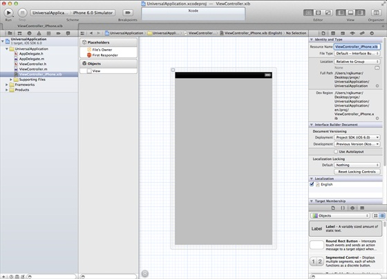
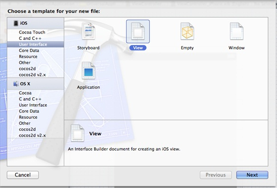
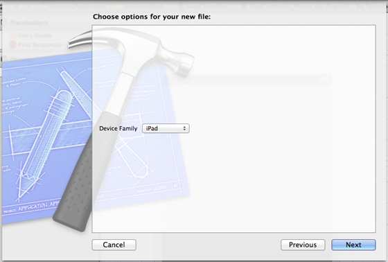
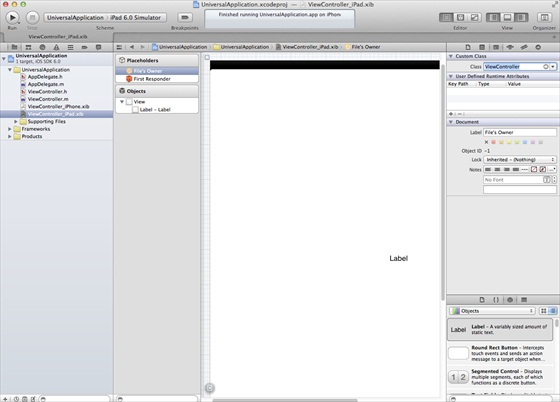
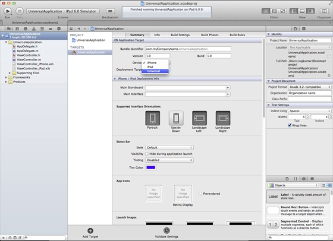
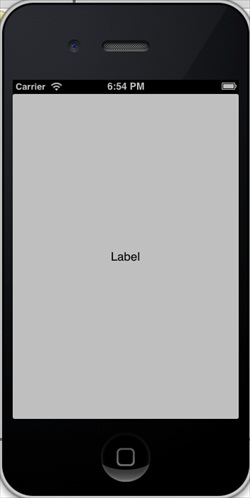

# IOS通用应用程序

## 简介

通用的应用程序是为iPhone和iPad在一个单一的二进制文件中设计的应用程序。这有助于代码重用，并能够帮助更快进行更新。

### 实例步骤

1、创建一个简单的View based application（视图应用程序）

2、在文件查看器的右边，将文件ViewController.xib的文件名称更改为ViewController_iPhone.xib，如下所示



3、选择"File -&gt; New -&gt; File... "，然后选择User Interface，再选择View，单击下一步



4、选择iPad作为设备，单击下一步:



5、将该文件另存为ViewController_iPad.xib，然后选择创建

6、在ViewController_iPhone.xib和ViewController_iPad.xibd的屏幕中心添加标签

7、在ViewController_iPhone.xib中选择identity inspector，设置custom class为ViewController



8、更新AppDelegate.m中的 application:DidFinishLaunching:withOptions方法

```
- (BOOL)application:(UIApplication *)application
  didFinishLaunchingWithOptions:(NSDictionary *)launchOptions
{
   self.window = [[UIWindow alloc] initWithFrame:[[UIScreen 
   mainScreen] bounds]];
   // Override point for customization after application launch.
   if (UI_USER_INTERFACE_IDIOM() == UIUserInterfaceIdiomPhone) {
        self.viewController = [[ViewController alloc] 
        initWithNibName:@"ViewController_iPhone" bundle:nil];
   }
   else{
        self.viewController = [[ViewController alloc] initWithNibName:
        @"ViewController_iPad" bundle:nil];
   }
   self.window.rootViewController = self.viewController;
   [self.window makeKeyAndVisible];
   return YES;
}

```

9、在项目摘要中更新设备中为universal，如下所示：



### 输出

运行该应用程序，我们会看到下面的输出



在iPad模拟器中运行应用程序,我们会得到下面的输出:


