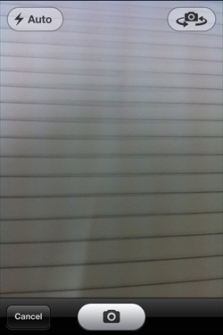

# IOS相机管理

## 相机简介

相机是移动设备的共同特点之一，我们能够使用相机拍摄图片，并在应用程序里调用它，而且相机的使用很简单。

### 实例步骤

1、创建一个简单的View based application

2、在ViewController.xib中添加一个button （按钮），并为该按钮创建IBAction

3、添加一个 image view （图像视图），并创建一个名为imageView的IBOutlet

4、ViewController.h文件代码如下所示：

```
#import <UIKit/UIKit.h>

@interface ViewController : UIViewController<UIImagePickerControllerDelegate>
{   
   UIImagePickerController *imagePicker;
   IBOutlet UIImageView *imageView;    
}
- (IBAction)showCamera:(id)sender;

@end

```

5、修改ViewController.m,如下所示：

```
#import "ViewController.h"

@interface ViewController ()

@end

@implementation ViewController

- (void)viewDidLoad
{
    [super viewDidLoad];    
}

- (void)didReceiveMemoryWarning
{
    [super didReceiveMemoryWarning];
    // Dispose of any resources that can be recreated.
}

- (IBAction)showCamera:(id)sender {
    imagePicker.allowsEditing = YES;
    if ([UIImagePickerController isSourceTypeAvailable:
        UIImagePickerControllerSourceTypeCamera])
    {
        imagePicker.sourceType = UIImagePickerControllerSourceTypeCamera;
    }
    else{
        imagePicker.sourceType = 
        UIImagePickerControllerSourceTypePhotoLibrary;
    }
    [self presentModalViewController:imagePicker animated:YES];

}
-(void)imagePickerController:(UIImagePickerController *)picker 
  didFinishPickingMediaWithInfo:(NSDictionary *)info{
    UIImage *image = [info objectForKey:UIImagePickerControllerEditedImage];
    if (image == nil) {    
        image = [info objectForKey:UIImagePickerControllerOriginalImage];
    }
    imageView.image = image;

}

-(void)imagePickerControllerDidCancel:(UIImagePickerController *)picker{
    [self dismissModalViewControllerAnimated:YES];
}

@end

```

### 输出

运行该应用程序并单击显示相机按钮时，我们就会获得下面的输出



只要拍照之后，就可以通过移动和缩放对图片进行编辑，如下所示。


