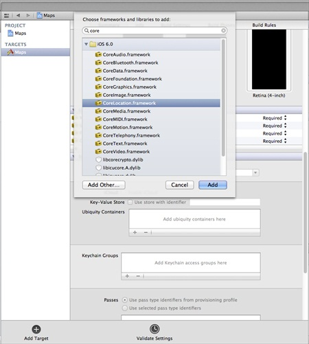
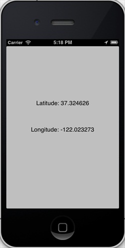

# IOS定位操作

## 简介

在IOS中通过CoreLocation定位，可以获取到用户当前位置，同时能得到装置移动信息。

### 实例步骤

1、创建一个简单的View based application（视图应用程序）。

2、择项目文件，然后选择目标，然后添加CoreLocation.framework,如下所示



3、在ViewController.xib中添加两个标签，创建ibOutlet名为latitudeLabel和longtitudeLabel的标签

4、现在通过选择" File-&gt; New -&gt; File... -&gt; "选择Objective C class 并单击下一步

5、把"sub class of"作为NSObject，将类命名为LocationHandler

6、选择创建

7、更新LocationHandler.h，如下所示

```
#import <Foundation/Foundation.h>
#import <CoreLocation/CoreLocation.h>

@protocol LocationHandlerDelegate <NSObject>

@required
-(void) didUpdateToLocation:(CLLocation*)newLocation 
 fromLocation:(CLLocation*)oldLocation;
@end

@interface LocationHandler : NSObject<CLLocationManagerDelegate>
{
    CLLocationManager *locationManager;
}
@property(nonatomic,strong) id<LocationHandlerDelegate> delegate;

+(id)getSharedInstance;
-(void)startUpdating;
-(void) stopUpdating;

@end

```

8、更新LocationHandler.m,如下所示

```
#import "LocationHandler.h"
static LocationHandler *DefaultManager = nil;

@interface LocationHandler()

-(void)initiate;

@end

@implementation LocationHandler

+(id)getSharedInstance{
    if (!DefaultManager) {
        DefaultManager = [[self allocWithZone:NULL]init];
        [DefaultManager initiate];
    }
    return DefaultManager;
}
-(void)initiate{
    locationManager = [[CLLocationManager alloc]init];
    locationManager.delegate = self;
}

-(void)startUpdating{
    [locationManager startUpdatingLocation];
}

-(void) stopUpdating{
    [locationManager stopUpdatingLocation];
}
-(void)locationManager:(CLLocationManager *)manager didUpdateToLocation:
 (CLLocation *)newLocation fromLocation:(CLLocation *)oldLocation{
    if ([self.delegate respondsToSelector:@selector
    (didUpdateToLocation:fromLocation:)]) 
    {
        [self.delegate didUpdateToLocation:oldLocation 
        fromLocation:newLocation];

    }
}

@end

```

9、更新ViewController.h,如下所示

```
#import <UIKit/UIKit.h>
#import "LocationHandler.h"
@interface ViewController : UIViewController<LocationHandlerDelegate>
{
    IBOutlet UILabel *latitudeLabel;
    IBOutlet UILabel *longitudeLabel;
}
@end

```

10、更新ViewController.m,如下所示

```
#import "ViewController.h"

@interface ViewController ()

@end

@implementation ViewController

- (void)viewDidLoad
{
    [super viewDidLoad];
    [[LocationHandler getSharedInstance]setDelegate:self];
    [[LocationHandler getSharedInstance]startUpdating];
}

- (void)didReceiveMemoryWarning
{
    [super didReceiveMemoryWarning];
    // Dispose of any resources that can be recreated.
}

-(void)didUpdateToLocation:(CLLocation *)newLocation 
 fromLocation:(CLLocation *)oldLocation{
    [latitudeLabel setText:[NSString stringWithFormat:
    @"Latitude: %f",newLocation.coordinate.latitude]];
    [longitudeLabel setText:[NSString stringWithFormat:
    @"Longitude: %f",newLocation.coordinate.longitude]];

}

@end

```

### 输出

当我们运行该应用程序，会得到如下的输出:


