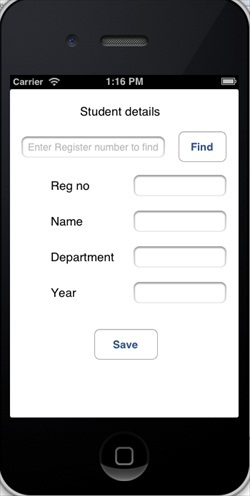

# IOS SQLite数据库

## 简介

在IOS中使用Sqlite来处理数据。如果你已经了解了SQL，那你可以很容易的掌握SQLite数据库的操作。

### 实例步骤

1、创建一个简单的View based application

2、选择项目文件，然后选择目标，添加libsqlite3.dylib库到选择框架

3、通过选择" File-&gt; New -&gt; File... -&gt; "选择 Objective C class 创建新文件，单击下一步

4、"sub class of"为NSObject"，类命名为DBManager

5、选择创建

6、更新DBManager.h,如下所示

```
#import <Foundation/Foundation.h>
#import <sqlite3.h>

@interface DBManager : NSObject
{
    NSString *databasePath;
}

+(DBManager*)getSharedInstance;
-(BOOL)createDB;
-(BOOL) saveData:(NSString*)registerNumber name:(NSString*)name 
  department:(NSString*)department year:(NSString*)year;
-(NSArray*) findByRegisterNumber:(NSString*)registerNumber;

@end

```

7、更新DBManager.m,如下所示

```
#import "DBManager.h"
static DBManager *sharedInstance = nil;
static sqlite3 *database = nil;
static sqlite3_stmt *statement = nil;

@implementation DBManager

+(DBManager*)getSharedInstance{
    if (!sharedInstance) {
        sharedInstance = [[super allocWithZone:NULL]init];
        [sharedInstance createDB];
    }
    return sharedInstance;
}

-(BOOL)createDB{
    NSString *docsDir;
    NSArray *dirPaths;    
    // Get the documents directory
    dirPaths = NSSearchPathForDirectoriesInDomains
    (NSDocumentDirectory, NSUserDomainMask, YES);    
    docsDir = dirPaths[0];
    // Build the path to the database file
    databasePath = [[NSString alloc] initWithString: 
    [docsDir stringByAppendingPathComponent: @"student.db"]];
    BOOL isSuccess = YES;
    NSFileManager *filemgr = [NSFileManager defaultManager];    
    if ([filemgr fileExistsAtPath: databasePath ] == NO)
    {
        const char *dbpath = [databasePath UTF8String];        
        if (sqlite3_open(dbpath, &database) == SQLITE_OK)
        {
            char *errMsg;
            const char *sql_stmt =
            "create table if not exists studentsDetail (regno integer 
            primary key, name text, department text, year text)";            
            if (sqlite3_exec(database, sql_stmt, NULL, NULL, &errMsg) 
               != SQLITE_OK)
            {
                isSuccess = NO;
                NSLog(@"Failed to create table");
            }
            sqlite3_close(database);
            return  isSuccess;
        }
        else {
            isSuccess = NO;
            NSLog(@"Failed to open/create database");
        }
    }    
    return isSuccess;
}

- (BOOL) saveData:(NSString*)registerNumber name:(NSString*)name 
  department:(NSString*)department year:(NSString*)year;
{
    const char *dbpath = [databasePath UTF8String];    
    if (sqlite3_open(dbpath, &database) == SQLITE_OK)
    {        
        NSString *insertSQL = [NSString stringWithFormat:@"insert into
        studentsDetail (regno,name, department, year) values
        (\"%d\",\"%@\", \"%@\", \"%@\")",[registerNumber integerValue],
        name, department, year];        
        const char *insert_stmt = [insertSQL UTF8String];
        sqlite3_prepare_v2(database, insert_stmt,-1, &statement, NULL);
        if (sqlite3_step(statement) == SQLITE_DONE)
        {
            return YES;
        } 
        else {
            return NO;
        }
        sqlite3_reset(statement);
    }
    return NO;
}

- (NSArray*) findByRegisterNumber:(NSString*)registerNumber
{
    const char *dbpath = [databasePath UTF8String];    
    if (sqlite3_open(dbpath, &database) == SQLITE_OK)
    {
        NSString *querySQL = [NSString stringWithFormat:
        @"select name, department, year from studentsDetail where 
        regno=\"%@\"",registerNumber];        
        const char *query_stmt = [querySQL UTF8String];
        NSMutableArray *resultArray = [[NSMutableArray alloc]init];
        if (sqlite3_prepare_v2(database,
           query_stmt, -1, &statement, NULL) == SQLITE_OK)
        {
            if (sqlite3_step(statement) == SQLITE_ROW)
            {                
                NSString *name = [[NSString alloc] initWithUTF8String:
                 (const char *) sqlite3_column_text(statement, 0)];
                [resultArray addObject:name];
                NSString *department = [[NSString alloc] initWithUTF8String:
                (const char *) sqlite3_column_text(statement, 1)];
                [resultArray addObject:department];
                NSString *year = [[NSString alloc]initWithUTF8String:
                (const char *) sqlite3_column_text(statement, 2)];
                [resultArray addObject:year];
                return resultArray;
            }
            else{
                NSLog(@"Not found");
                return nil;
            }
            sqlite3_reset(statement);
        }
    }
    return nil;
}

```

8、如图所示，更新ViewController.xib文件


9、为上述文本字段创建IBOutlets

10、为上述按钮创建IBAction

11、如下所示，更新ViewController.h

```
#import <UIKit/UIKit.h>
#import "DBManager.h"

@interface ViewController : UIViewController<UITextFieldDelegate>
{
    IBOutlet UITextField *regNoTextField;
    IBOutlet UITextField *nameTextField;
    IBOutlet UITextField *departmentTextField;
    IBOutlet UITextField *yearTextField;
    IBOutlet UITextField *findByRegisterNumberTextField;
    IBOutlet UIScrollView *myScrollView;
}

-(IBAction)saveData:(id)sender;
-(IBAction)findData:(id)sender;

@end

```

12、更新ViewController.m,如下所示

```
#import "ViewController.h"

@interface ViewController ()

@end

@implementation ViewController

- (id)initWithNibName:(NSString *)nibNameOrNil bundle:(NSBundle *)
  nibBundleOrNil
{
    self = [super initWithNibName:nibNameOrNil bundle:nibBundleOrNil];
    if (self) {
        // Custom initialization
    }
    return self;
}

- (void)viewDidLoad
{
    [super viewDidLoad];
    // Do any additional setup after loading the view from its nib.
}

- (void)didReceiveMemoryWarning
{
    [super didReceiveMemoryWarning];
    // Dispose of any resources that can be recreated.
}

-(IBAction)saveData:(id)sender{
    BOOL success = NO;
    NSString *alertString = @"Data Insertion failed";
    if (regNoTextField.text.length>0 &&nameTextField.text.length>0 &&
    departmentTextField.text.length>0 &&yearTextField.text.length>0 )
    {
        success = [[DBManager getSharedInstance]saveData:
        regNoTextField.text name:nameTextField.text department:
        departmentTextField.text year:yearTextField.text];
    }
    else{
        alertString = @"Enter all fields";
    }     
    if (success == NO) {
        UIAlertView *alert = [[UIAlertView alloc]initWithTitle:
        alertString message:nil
        delegate:nil cancelButtonTitle:@"OK" otherButtonTitles:nil];
        [alert show];
    }
}

-(IBAction)findData:(id)sender{
    NSArray *data = [[DBManager getSharedInstance]findByRegisterNumber:
    findByRegisterNumberTextField.text];
    if (data == nil) {
        UIAlertView *alert = [[UIAlertView alloc]initWithTitle:
        @"Data not found" message:nil delegate:nil cancelButtonTitle:
        @"OK" otherButtonTitles:nil];
        [alert show];
        regNoTextField.text = @"";
        nameTextField.text =@"";
        departmentTextField.text = @"";
        yearTextField.text =@"";
    }
    else{
        regNoTextField.text = findByRegisterNumberTextField.text;
        nameTextField.text =[data objectAtIndex:0];
        departmentTextField.text = [data objectAtIndex:1];
        yearTextField.text =[data objectAtIndex:2];
    }
}

#pragma mark - Text field delegate
-(void)textFieldDidBeginEditing:(UITextField *)textField{
    [myScrollView setFrame:CGRectMake(10, 50, 300, 200)];
    [myScrollView setContentSize:CGSizeMake(300, 350)];
}
-(void)textFieldDidEndEditing:(UITextField *)textField{
    [myScrollView setFrame:CGRectMake(10, 50, 300, 350)];

}
-(BOOL) textFieldShouldReturn:(UITextField *)textField{

    [textField resignFirstResponder];
    return YES;
}
@end

```

### 输出

现在当我们运行应用程序时，我们就会获得下面的输出，我们可以在其中添加及查找学生的详细信息


