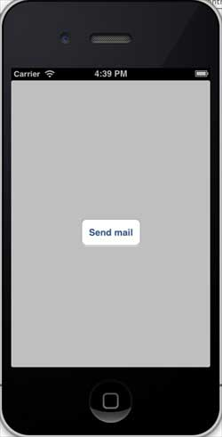
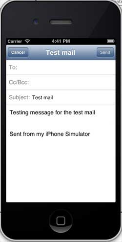

# IOS发送电子邮件

## 简介

我们可以使用IOS设备中的电子邮件应用程序发送电子邮件。

### 实例步骤

1、创建一个简单的View based application

2、选择项目文件，然后选择目标，然后添加MessageUI.framework

3、在ViewController.xib中添加一个按钮，创建用于发送电子邮件的操作（action）

4、更新ViewController.h,如下所示

```
#import <UIKit/UIKit.h>
#import <MessageUI/MessageUI.h>

@interface ViewController : UIViewController<MFMailComposeViewControllerDelegate>
{
    MFMailComposeViewController *mailComposer;
}

-(IBAction)sendMail:(id)sender;

@end

```

5、如下所示，更新ViewController.m

```
#import "ViewController.h"

@interface ViewController ()

@end

@implementation ViewController

- (void)viewDidLoad
{
    [super viewDidLoad];   
}

- (void)didReceiveMemoryWarning
{
    [super didReceiveMemoryWarning];
    // Dispose of any resources that can be recreated.
}

-(void)sendMail:(id)sender{
    mailComposer = [[MFMailComposeViewController alloc]init];
    mailComposer.mailComposeDelegate = self;
    [mailComposer setSubject:@"Test mail"];
    [mailComposer setMessageBody:@"Testing message 
    for the test mail" isHTML:NO];
    [self presentModalViewController:mailComposer animated:YES];
}

#pragma mark - mail compose delegate
-(void)mailComposeController:(MFMailComposeViewController *)controller 
 didFinishWithResult:(MFMailComposeResult)result error:(NSError *)error{
   if (result) {
        NSLog(@"Result : %d",result);
    }
    if (error) {
        NSLog(@"Error : %@",error);
    }
    [self dismissModalViewControllerAnimated:YES];

}

@end

```

### 输出

当运行该应用程序，会看如下的输出结果



当点击"send email"发送按钮后，可以看到如下结果：


