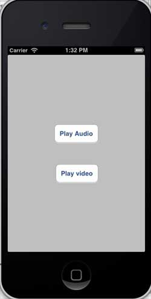
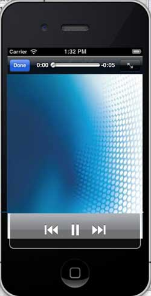

# IOS音频和视频(Audio & Video)

### 简介

音频和视频在最新的设备中颇为常见。

将iosAVFoundation.framework和MediaPlayer.framework添加到Xcode项目中，可以让IOS支持音频和视频(Audio & Video)。

### 实例步骤

1、创建一个简单的View based application

2、选择项目文件、选择目标，然后添加AVFoundation.framework和MediaPlayer.framework

3、在ViewController.xib中添加两个按钮，创建一个用于分别播放音频和视频的动作（action）

4、更新ViewController.h,如下所示

```
#import <UIKit/UIKit.h>
#import <AVFoundation/AVFoundation.h>
#import <MediaPlayer/MediaPlayer.h>

@interface ViewController : UIViewController
{
    AVAudioPlayer *audioPlayer;
    MPMoviePlayerViewController *moviePlayer;

}
-(IBAction)playAudio:(id)sender;
-(IBAction)playVideo:(id)sender;
@end

```

5、更新ViewController.m，如下所示

```
#import "ViewController.h"

@interface ViewController ()

@end

@implementation ViewController

- (void)viewDidLoad
{
    [super viewDidLoad];
}

- (void)didReceiveMemoryWarning
{
   [super didReceiveMemoryWarning];
   // Dispose of any resources that can be recreated.
}
-(IBAction)playAudio:(id)sender{
   NSString *path = [[NSBundle mainBundle]
   pathForResource:@"audioTest" ofType:@"mp3"];
   audioPlayer = [[AVAudioPlayer alloc]initWithContentsOfURL:
   [NSURL fileURLWithPath:path] error:NULL];
   [audioPlayer play];
}
-(IBAction)playVideo:(id)sender{
   NSString *path = [[NSBundle mainBundle]pathForResource:
   @"videoTest" ofType:@"mov"];
   moviePlayer = [[MPMoviePlayerViewController 
   alloc]initWithContentURL:[NSURL fileURLWithPath:path]];
   [self presentModalViewController:moviePlayer animated:NO];
}
@end

```

### 注意项

需要添加音频和视频文件，以确保获得预期的输出

### 输出

运行该程序，得到的输出结果如下



当我们点击 play video(播放视频)显示如下：


