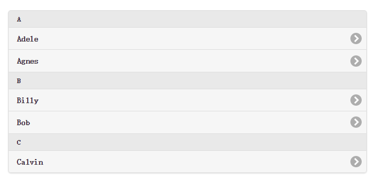

# jQuery Mobile 列表视图



## jQuery Mobile 列表视图

jQuery Mobile 中的列表视图是标准的HTML 列表; 有序(&lt;ol&gt;) 和 无序(&lt;ul&gt;).

列表视图是jQuery Mobile中功能强大的一个特性。它会使标准的无序或有序列表应用更广泛。应用方法就是在ul或ol标签中添加data-role="listview"属性。在每个项目(&lt;li&gt;)中添加链接，用户可以点击它：

## 实例

```
<ol data-role="listview">
  <li><a href="#">列表项m</a></li>
</ol>

<ul data-role="listview">
  <li><a href="#">列表项</a></li>
</ul>

```

列表样式的圆角和边缘，使用 data-inset="true" 属性设置:

## 实例

```
<ul data-role="listview" data-inset="true">

```

> 
> 默认情况下，列表项的链接会自动变成一个按钮 (不需要 data-role="button")。 |

## 列表分隔

列表项也可以转化为列表分割项，用来组织列表，使列表项成组。

指定列表分割，给列表项&lt;li&gt;元素添加 data-role="list-divider" 属性即可：

## 实例

```
<ul data-role="listview">
 <li data-role="list-divider">欧洲</li>
  <li><a href="#">法国</a></li>
  <li><a href="#">德国</a></li>
</ul>

```

如果你有一个字母顺序排列的列表，（例如一个电话簿）通过 &lt;ol&gt; 或者&lt;ul&gt; 元素的 data-autodividers="true" 属性设置可以配置为自动生成的项目的分隔:

## 实例

```
<ul data-role="listview" data-autodividers="true">
  <li><a href="#">Adele</a></li>
  <li><a href="#">Agnes</a></li>
  <li><a href="#">Billy</a></li>
  <li><a href="#">Calvin</a></li>
  ...
</ul>

```

> 
> data-autodividers="true" 可以配置为自动生成的项目的分隔。默认情况下，创建的分隔文本是列表项文本的第一个大写字母。 

## 搜索过滤

jquery Mobile提供一个非常简单的方法，实现客户端搜索功能，筛选列表的选项。只需添加 data-filter="true" 属性即可:

## 实例

```
<ul data-role="listview" data-filter="true"></ul>

```

默认情况下，搜索输入框默认的字符为 "Filter items..."。

通过设置mobileinit事件的绑定程序或者给 $.mobile.listview.prototype.options.filterPlaceholder 选项设置一个字符串，或者给列表设置 data-filter-placeholder 属性，可以设置搜索输入框的默认字符:

## 实例

```
<ul data-role="listview" data-filter="true" data-filter-placeholder="搜索姓名">

```


## 更多实例

[只读列表](/try/try.php?filename=tryjqmob_lists_readonly)
如何创建一个不带链接的列表 (不会是个按钮且不可点击)。
