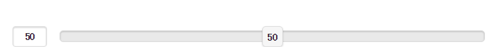

# jQuery Mobile 表单滑动条

## jQuery Mobile 滑动条控件

滑动条允许您从一个范围的数字中选择一个值：



如需创建滑动条，请使用 &lt;input type="range"&gt;：

## 实例

```
<form method="post" action="demoform.html">
<div data-role="fieldcontain">
<label for="points">Points:</label>
<input type="range" name="points" id="points" value="50" min="0" max="100">
</div>
</form>

```

使用以下属性来规定限制：

*   max - 规定允许的最大值
*   min - 规定允许的最小值
*   step - 规定合法的数字间隔
*   value - 规定默认值

**提示：**如果您想要高亮突出显示滑动条的值，请添加 data-highlight="true"：

## 实例

```
<input type="range" data-hightlight="true">

```

## 拨动开关

波动开关通常用于 on/off 或 true/false 按钮：

<iframe src="/try/demo_source/tryjqmob_switch.htm" style="margin-top:-13px;height:70px;width:100%;" scrolling="no" frameborder="0" seamless=""></iframe>

如需创建一个开关，请把 &lt;select&gt; 元素与 data-role="slider" 一起使用，并添加两个 &lt;option&gt; 元素：

## 实例

```
<form method="post" action="demoform.html">
<div data-role="fieldcontain">
<label for="switch">Toggle Switch:</label>
<select name="switch" id="switch" data-role="slider">
<option value="on">On</option>
<option value="off">Off</option>
</select>
</div>
</form>
```

**提示：**请使用 "selected" 属性来设置选项中的一个为预选中状态（高亮突出显示状态）：

## 实例

```
<option value="off" selected>Off</option>

```
