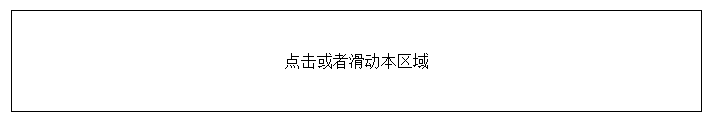

# jQuery Mobile 触摸事件

触摸事件在用户触摸屏幕（页面）时触发。



> 
> 触摸事件同样可应用与桌面电脑上：**点击或者滑动鼠标！** 

## jQuery Mobile 点击

点击事件在用户点击元素时触发。

如下实例：当点击 &lt;p&gt; 元素时，隐藏当前的 &lt;p&gt; 元素：

## 实例

```
$("p").on("tap",function(){
  $(this).hide();
});
```

## jQuery Mobile 点击不放（长按）

点击不放（长按） 事件在点击并不放（大约一秒）后触发

## 实例

```
$("p").on("taphold",function(){
  $(this).hide();
});
```

## jQuery Mobile 滑动

滑动事件是在用户一秒内水平拖拽大于30PX，或者纵向拖曳小于20px的事件发生时触发的事件：

## 实例

```
$("p").on("swipe",function(){
  $("span").text("Swipe detected!");
});
```

## jQuery Mobile 向左滑动

向左滑动事件在用户向左拖动元素大于30px时触发：

## 实例

```
$("p").on("swipeleft",function(){
  alert("You swiped left!");
});
```

## jQuery Mobile 向右滑动

向右滑动事件在用户向右拖动元素大于30px时触发：

## 实例

```
$("p").on("swiperight",function(){
  alert("You swiped right!");
});
```
