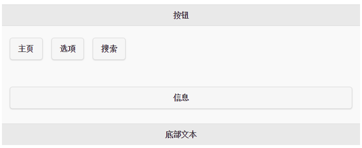

# jQuery Mobile 按钮

Mobile 应用程序是建立在您想要显示的简单的点击事物上。



## 在 jQuery Mobile 中创建按钮

在 jQuery Mobile 中，按钮可通过三种方式创建：

*   使用 &lt;button&gt; 元素
*   使用 &lt;input&gt; 元素
*   使用带有 data-role="button" 的 &lt;a&gt; 元素

## &lt;button&gt;

```
<button>按钮</button>

```

## &lt;input&gt;

```
<input type="button" value="按钮">

```

## &lt;a&gt;

```
<a href="#" data-role="button">按钮</a>

```

> 
> 在 jQuery Mobile 中，按钮会自动样式化，让它们在移动设备上更具吸引力和可用性。**我们推荐您使用带有 data-role="button" 的 &lt;a&gt; 元素在页面间进行链接，使用 &lt;input&gt; 或 &lt;button&gt; 元素进行表单提交。** 

## 导航按钮

如需通过按钮在页面间进行链接，请使用带有 data-role="button" 属性的 &lt;a&gt; 元素：

## 实例

```
<a href="#pagetwo" data-role="button">访问第二个页面</a>

```

## 内联按钮

默认情况下，按钮占满整个屏幕宽度。如果你想要一个仅是与内容一样宽的按钮，或者如果您想要并排显示两个或多个按钮，请添加 data-inline="true"：

## 实例

```
<a href="#pagetwo" data-role="button" data-inline="true">访问第二个页面</a>

```

## 组合按钮

jQuery Mobile 提供了一个简单的方法来将按钮组合在一起。

请把 data-role="controlgroup" 属性和 data-type="horizontal|vertical" 一起使用来规定是否水平或垂直组合按钮：

## 实例

```
<div data-role="controlgroup" data-type="horizontal">
<a href="#anylink" data-role="button">按钮 1</a>
<a href="#anylink" data-role="button">按钮 2</a>
<a href="#anylink" data-role="button">按钮 3</a>
</div>

```

> 
> 默认情况下，组合按钮是垂直组合，它们之间没有外边距和空间。并且只有第一个和最后一个按钮是圆角，以便它们组合在一起的时候创建一个漂亮的外观。

## 后退按钮

如需创建后退按钮，请使用 data-rel="back" 属性（这会忽略锚的 href 值）：

## 实例

```
<a href="#" data-role="button" data-rel="back">返回</a>

```

## 更多用于按钮的 data-* 属性

| 属性 | 值 | 描述 | 实例 |
| --- | --- | --- | --- |
| data-corners | true &#124; false | 规定按钮是否圆角 |
| data-mini | true &#124; false | 规定按钮是否更小 |
| data-shadow | true &#124; false | 规定按钮是否有阴影 |

如需查看所有 jQuery Mobile data-* 属性的完整参考手册，请访问我们的 [jQuery Mobile Data 属性参考手册](jquerymobile-ref-data.html)。

下一章演示如何附加图标到您的按钮上。
